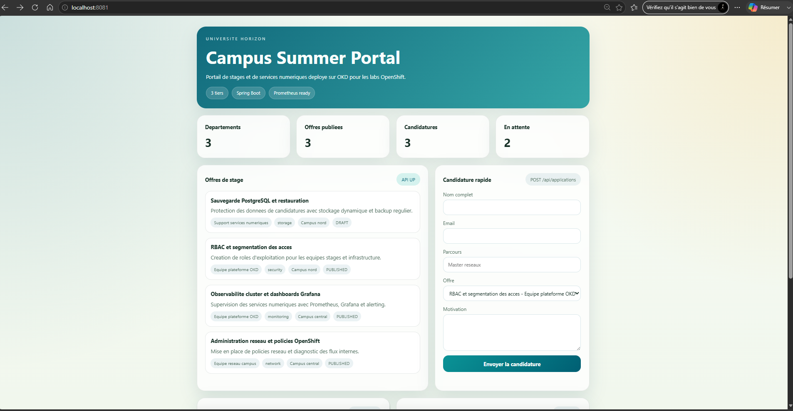
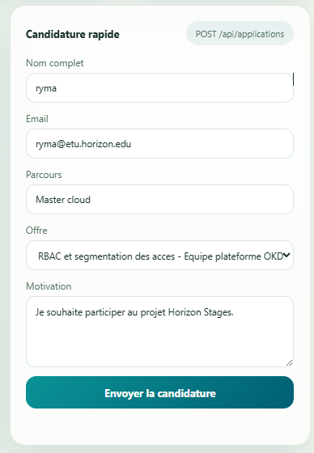
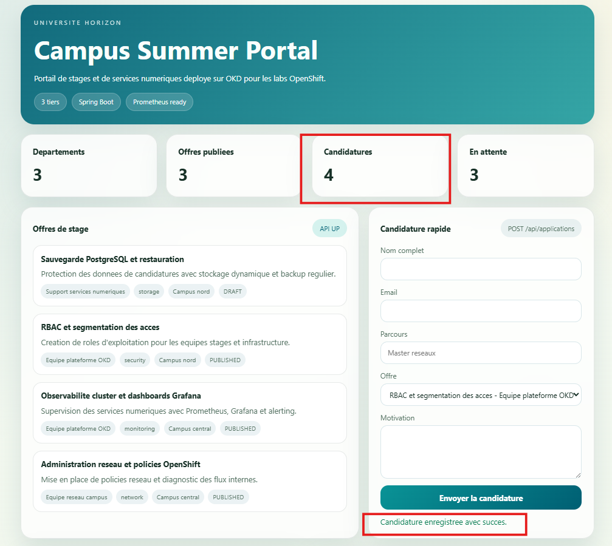
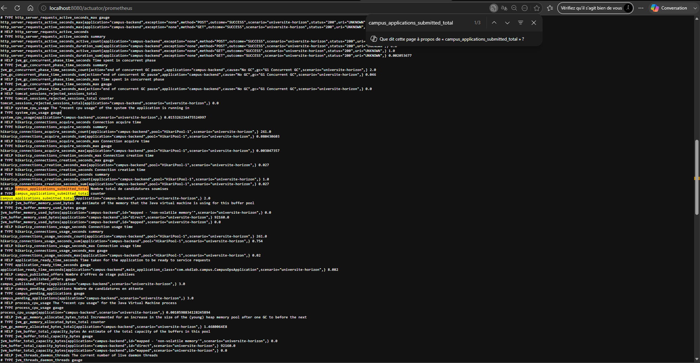
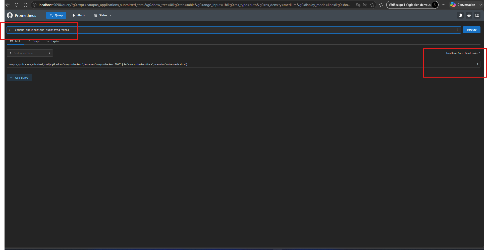

# Lab 0 - Tester l'application localement et comprendre son architecture

## Partie 1 - Comprendre l’application et son architecture

## Objectif

Avant de parler de cluster, de build ou de déploiement, vous devez comprendre **ce que fait l’application** et **comment ses briques collaborent**.

L’objectif de ce premier lab est donc très simple :

- partir du besoin métier ;
- lire le schéma d’architecture ;
- repérer les composants techniques ;
- comprendre où se trouvent déjà les points d’observabilité.

## Le fil rouge métier

L’Université Horizon gère plusieurs campus, un portail de stages d’été et des services numériques internes pour les lycées rattachés.

Elle sert à :

- publier des offres de stage ;
- présenter les départements techniques ;
- collecter des candidatures ;
- donner une vue rapide de l’activité aux équipes d’exploitation.

Cette application a volontairement une taille modeste. Elle est assez simple pour être comprise en une journée, mais assez riche pour introduire :

- le frontend ;
- une API backend ;
- une base de données ;
- les métriques applicatives ;
- le build et le déploiement OpenShift.

## Architecture applicative de référence

Aperçu du schéma :


## Lecture guidée de l’architecture

Voici le chemin principal d’une requête utilisateur :

1. le navigateur appelle le **frontend** ;
2. le frontend NGINX sert l’interface HTML, CSS et JavaScript ;
3. le frontend appelle le **backend** sur `/api/*` ;
4. le backend Spring Boot exécute la logique métier ;
5. le backend lit et écrit dans **PostgreSQL** ;
6. le backend expose aussi des endpoints d’observabilité ;
7. **Prometheus** peut interroger ces métriques via `/actuator/prometheus`.

En version locale, on observe cette chaîne avec `docker compose` et un Prometheus local.

En version OpenShift Sandbox, on retrouve la même logique applicative, mais avec :

- des `BuildConfig` ;
- des `ImageStream` ;
- des `Deployment` ;
- une `Route`.

## Correspondance métier / technique

| Composant | Nom technique | Rôle |
|---|---|---|
| Interface web | `campus-frontend` | afficher les offres, le tableau de bord et le formulaire |
| API backend | `campus-backend` | exposer les données métier et produire les métriques |
| Base de données | `campus-db` | stocker les départements, les offres et les candidatures |
| Observabilité | Prometheus + Micrometer | mesurer le comportement réel de l’application |

## Explorer l’architecture applicative

Avant de lancer quoi que ce soit, ouvrez les fichiers suivants dans le dépôt :

- [frontend/app.js](../../campus-app/frontend/app.js)
- [frontend/nginx.local.conf](../../campus-app/frontend/nginx.local.conf)
- [frontend/nginx.conf](../../campus-app/frontend/nginx.conf)
- [backend/src/main/java/com/okdlab/campus/api/CampusApiController.java](../../campus-app/backend/src/main/java/com/okdlab/campus/api/CampusApiController.java)
- [backend/src/main/java/com/okdlab/campus/service/CampusMetricsService.java](../../campus-app/backend/src/main/java/com/okdlab/campus/service/CampusMetricsService.java)
- [backend/src/main/resources/application.yml](../../campus-app/backend/src/main/resources/application.yml)

### Ce qu’il faut observer dans le frontend

Dans `app.js`, vous devez voir que le frontend consomme les endpoints suivants: :

- appelle `/api/dashboard` ;
- appelle `/api/internships` ;
- appelle `/api/departments` ;
- appelle `/api/applications` ;
- interroge aussi `/actuator/health`.

Le frontend ne porte donc pas la logique métier. Il orchestre l’affichage et consomme les services exposés par le backend.

### Ce qu’il faut observer dans le backend

Dans `CampusApiController`, vous retrouvez les endpoints métier :

- `GET /api/dashboard`
- `GET /api/departments`
- `GET /api/internships`
- `GET /api/applications`
- `POST /api/applications`

Dans le fichier `CampusMetricsService`, vous retrouvez les métriques métier utilisées par Micrometer et exposées à Prometheus:

* `campus_applications_submitted_total` : **nombre total de candidatures soumises** sur la plateforme.

* `campus_applications_by_domain_total` : **nombre total de candidatures soumises par domaine**, avec le tag `domain` pour distinguer chaque domaine de formation.

* `campus_published_offers` : **nombre actuel d’offres publiées** et disponibles à un instant donné sur la plateforme.

* `campus_pending_applications` : **nombre actuel de candidatures en attente de traitement** à un instant donné.


Ce point est très important : l’application ne produit pas seulement des métriques techniques. Elle produit aussi des **métriques métier** directement liées au cas d’usage.

## Pourquoi parler de Prometheus dès le début

D'habitude, les métriques s'intégrent dans une phase avancée du projet, comme un sujet séparé. Ici, on les introduit tôt pour une raison simple:
une application que l’on déploie sans l’observer reste partiellement invisible.

On a utilisé Prometheus qui sert à :

- mesurer l’application en temps réel ;
- voir si les appels augmentent ;
- confirmer qu’un scénario de test a bien eu lieu ;
- préparer les futurs dashboards et alertes ;
- relier le comportement métier à l’état du système.

## Pourquoi le backend utilise Micrometer

Micrometer joue le rôle d’interface standard entre l’application et le monde de la mesure (Prometheus dans notre projet).

Dans notre cas, Micrometer permet :

- d’enregistrer facilement des compteurs et des jauges ;
- de garder le code métier lisible ;
- d’exposer les données dans un format compréhensible par Prometheus ;
- de faire évoluer plus tard les tableaux de bord et les alertes sans réécrire la logique métier.

L’objectif n’est donc pas “d’avoir des métriques pour faire joli”. L’objectif est de répondre à des questions concrètes comme :

- combien de candidatures ont été déposées ?
- sur quels domaines métier ?
- combien d’offres sont publiées ?
- combien de candidatures sont encore en attente ?

# Partie 2 - Tester localement avec Docker Compose et Prometheus

## Objectif

Avant d’utiliser OpenShift, vous allez démontrer que l’application fonctionne déjà localement.

Ce lab sert à :

- valider l’application dans un environnement simple ;
- provoquer un petit scénario métier ;
- voir les métriques évoluer après plusieurs requêtes.

## Prérequis locaux

Vérifiez simplement que Docker est disponible sur votre poste.

## Étape 1 - Démarrer l’infrastructure locale minimale

Depuis la racine du dépôt :

```powershell
docker compose -f .\training\campus-app\docker-compose.local.yml up -d --build
```

Cette commande démarre :

- PostgreSQL ;
- pgAdmin ;
- Prometheus ;
- le backend Spring Boot ;
- le frontend NGINX.

Vérifiez l’état des conteneurs :

```powershell
docker ps
```

## Étape 2 - Vérifier les accès locaux

Vous pouvez maintenant ouvrir :

- frontend : `http://localhost:8081`
- backend : `http://localhost:8080`
- health : `http://localhost:8080/actuator/health`
- métriques Prometheus : `http://localhost:8080/actuator/prometheus`
- Prometheus : `http://localhost:9090`
- pgAdmin : `http://localhost:5050`


## Étape 3 - Vérifier le comportement dans le frontend

Ouvrez d’abord :

- `http://localhost:8081`



Vérifiez visuellement les points suivants :

- les cartes du tableau de bord se chargent ;
- la liste des offres apparaît ;
- la liste des départements apparaît ;
- le formulaire **Candidature rapide** est visible ;
- le badge d’état de l’API n’indique pas d’erreur.


## Étape 4 - Jouer un scénario métier simple via le formulaire

Nous voulons maintenant provoquer une vraie écriture en base et faire bouger les compteurs métier.



Dans le frontend, remplissez **une seule candidature** avec :

- votre **nom et prénom** dans `Nom complet` ;
- une adresse mail de test dans `Email` ;
- votre parcours dans `Parcours` ;
- une offre publiée dans `Offre` ;
- une phrase simple dans `Motivation`.

Exemple :

- `Nom complet` : votre prénom et votre nom
- `Email` : `prenom.nom@etu.horizon.edu`
- `Parcours` : `Master cloud`
- `Motivation` : `Je souhaite participer au projet Horizon Stages.`

Puis cliquez sur :

- `Envoyer la candidature`

Ce que vous devez observer :



- un message de succès s’affiche ;
- le compteur `Candidatures` augmente ;
- le bloc `Dernières candidatures` se met à jour ;
- la candidature apparaît avec **votre** identité de candidat.

## Étape 5 - Lire les métriques exposées par Micrometer

Vous pouvez déjà vérifier que le backend expose bien les métriques :

- `http://localhost:8080/actuator/prometheus`

Puis recherchez le motif `campus_`.



Vous devriez y retrouver des noms comme :

- `campus_applications_submitted_total`
- `campus_applications_by_domain_total`
- `campus_published_offers`
- `campus_pending_applications`

## Étape 6 - Observer le résultat dans Prometheus

Ouvrez [http://localhost:9090](http://localhost:9090).

Dans l’onglet d’exploration, testez les requêtes suivantes :



```text
campus_applications_submitted_total
```

```text
campus_applications_by_domain_total
```

```text
campus_pending_applications
```

```text
campus_published_offers
```

## Comment interpréter ce que vous voyez

Le scénario global est le suivant :

1. vous avez démarré l’application ;
2. vous avez envoyé une candidature depuis le frontend ;
3. le backend a persisté cet événement ;
4. `CampusMetricsService` a incrémenté des compteurs et recalculé des jauges ;
5. Micrometer les a exposés sur `/actuator/prometheus` ;
6. Prometheus les a récupérés ;
7. vous pouvez maintenant constater objectivement l’effet du scénario de test.


## Ce qu’il faut retenir avant de passer au Sandbox OpenShift

Ce lab vous montre une idée essentielle : OpenShift ne change pas la logique de l’application.

OpenShift va surtout vous apporter :

- le build des images dans la plateforme ;
- les objets OpenShift (`Deployment`, etc.)) ;
- Prometheus intégré dans Openshift, il suffit de le configurer.
- Networking('Service', 'Route', etc.)
## Nettoyage local

Quand vous avez terminé :

```powershell
docker compose -f .\training\campus-app\docker-compose.local.yml down
```
