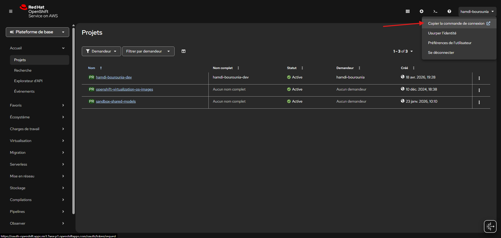
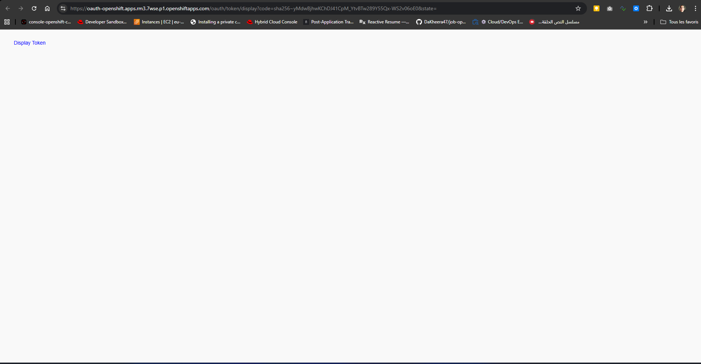
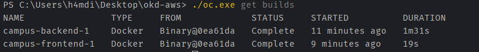
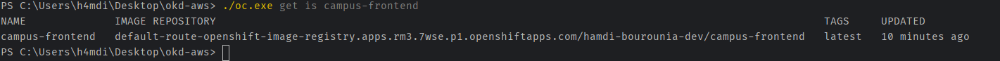
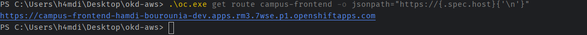

# Lab 1 - Se connecter au Developer Sandbox et developper les manifests

## Objectif

Dans ce lab, on utilise **uniquement la CLI `oc`** et **vos propres manifests**.

- vous connecter au Developer Sandbox ;
- vérifier votre projet ;
- créer un dossier de travail pour vos manifests ;
- écrire vous-même les manifests principaux ;
- lancer les builds du backend et du frontend ;
- vérifier que l’application démarre correctement.

Ici, on ne part pas d’un dépôt Git saisi dans la console.  
On reste sur un flux très direct :

- vos sources locales ;
- vos manifests ;
- la CLI `oc` ;
- les objets OpenShift de votre projet.

## Prérequis importants

Pour suivre ce lab, il faut avoir le binaire `oc` installé sur votre poste.

Sans `oc`, vous ne pourrez pas :

- faire `oc login` ;
- appliquer les manifests ;
- lancer les builds avec `oc start-build --from-dir` ;
- vérifier les pods, la route et les déploiements.

```text
oc version --client
```

Si la commande n’est pas reconnue, installez `oc` avant d’aller plus loin.

## Ce que vous allez faire dans ce lab

Le parcours complet est le suivant :

1. récupérer la commande de connexion ;
2. vous connecter avec `oc` ;
3. vérifier votre projet ;
4. comprendre la chaîne objets -> builds -> déploiements ;
5. créer votre espace de travail de manifests ;
6. écrire `kustomization.yaml` ;
7. écrire `images-builds.yaml` ;
8. écrire `database.yaml` ;
9. écrire `backend.yaml` ;
10. écrire `frontend.yaml` ;
11. prévisualiser puis appliquer vos manifests ;
12. construire l’image du backend ;
13. construire l’image du frontend ;
14. attendre que la base et les déploiements soient disponibles ;
15. récupérer l’URL publique ;
16. tester l’application ;
17. faire une vérification rapide du backend et des métriques.

## Étape 1 - Récupérer la commande `oc login`



Depuis la page d’accueil de la console web du Developer Sandbox :

1. cliquez sur votre profil en haut à droite ;
2. choisissez `Copy login command` ;
3. un nouvel onglet s’ouvre ;
4. cliquez sur `Display Token` ;
5. copiez la commande `oc login ...` proposée.



Cette commande contient votre token de connexion.

Il permet d’utiliser `oc` depuis votre machine locale.  
Ne le partagez pas.

## Étape 2 - Se connecter depuis le terminal

Dans votre terminal local :

1. collez la commande `oc login ...` ;
2. exécutez-la ;
3. vérifiez ensuite que tout est bon.

```text
oc whoami
oc project
oc status
```

Vous devez voir :

- votre utilisateur ;
- votre projet Sandbox ;
- un état de connexion normal.

## Étape 3 - Vérifier le projet cible

Le Developer Sandbox vous donne en général un seul projet utilisateur.

```text
oc project
oc get all
```

C’est dans ce projet que vous allez créer :

- les `BuildConfig` ;
- les `ImageStream` ;
- le `StatefulSet` PostgreSQL ;
- les `Deployment` backend et frontend ;
- la `Route`.

## Étape 4 - Comprendre la chaîne du lab avant d’écrire les manifests

Avant de créer des fichiers, il faut voir la logique d’ensemble.

Dans ce lab :

1. vous écrivez des fichiers YAML ;
2. `oc apply -k` crée les objets OpenShift ;
3. ces objets incluent les recettes de build et les objets d’exécution ;
4. `oc start-build --from-dir` envoie vos sources locales au cluster ;
5. OpenShift construit les images ;
6. les déploiements utilisent ensuite ces images ;
7. la `Route` permet enfin d’ouvrir le frontend.


## Étape 5 - Écrire `kustomization.yaml`

Pour garder un espace d’exercice clair, vous allez travailler dans un dossier dédié, nommé `sandbox-base`.

Commencez par le fichier qui assemble tout le dossier.

Créer sous `sandbox-base` un fichier `kustomization.yaml`, afin de référencer les manifests suivants :

- `images-builds.yaml`
- `database.yaml`
- `backend.yaml`
- `frontend.yaml`


<details>
<summary>💡 Aide - Squelette YAML pour <code>kustomization.yaml</code></summary>

Vous pouvez partir de cette trame :

```yaml
apiVersion: kustomize.config.k8s.io/v1beta1
kind: Kustomization
resources:
  - resource1.yaml
  - resource2.yaml
  - ...
```

</details>

## Étape 7 - Écrire `images-builds.yaml`

Ce fichier doit décrire la partie **construction des images**.

Vous devez y créer :

- un `ImageStream` pour `campus-backend` ;
- un `ImageStream` pour `campus-frontend` ;
- un `BuildConfig` pour `campus-backend` ;
- un `BuildConfig` pour `campus-frontend`.

Ce qu’il faut retenir :

- les deux `BuildConfig` doivent utiliser `source.type: Binary` ;
- la sortie doit pointer vers `campus-backend:latest` et `campus-frontend:latest`.

<details>
<summary>💡 Aide - Squelette YAML pour <code>images-builds.yaml</code></summary>

Vous pouvez partir de cette trame :

```yaml
apiVersion: image.openshift.io/v1
kind: ImageStream
metadata:
  name: <nom-image>
spec:
  lookupPolicy:
    local: true
---
apiVersion: build.openshift.io/v1
kind: BuildConfig
metadata:
  name: <nom-build>
spec:
  source:
    type: Binary
    binary: {}
  strategy:
    type: Docker
    dockerStrategy:
      dockerfilePath: Dockerfile
  output:
    to:
      kind: ImageStreamTag
      name: <nom-image>:latest
---
```

</details>

## Étape 8 - Écrire `database.yaml`

Ce fichier doit décrire la base PostgreSQL minimale du lab.

Vous devez y créer :

- un `Secret` pour les identifiants ;
- un `Service` ;
- un `StatefulSet` ;
- un `PersistentVolumeClaim`.


Dans cet exercice, attendez-vous à retrouver au moins les éléments suivants :

- un `Secret` nommé `campus-db-secret` ;
- la clé `username` avec la valeur `campus` ;
- la clé `password` avec la valeur `campus123` ;
- la clé `database` avec la valeur `campus` ;
- un `Service` nommé `campus-db` ;
- le port PostgreSQL `5432` côté service et côté conteneur ;
- un `StatefulSet` nommé `campus-db` ;
- l’image PostgreSQL `quay.io/sclorg/postgresql-16-c9s:latest` ;
- les variables d’environnement `POSTGRESQL_USER`, `POSTGRESQL_PASSWORD` et `POSTGRESQL_DATABASE` alimentées depuis le secret ;
- un point de montage pour les données sur `/var/lib/pgsql/data` ;
- un stockage persistant simple, par exemple `5Gi`.

<details>
<summary>💡 Aide - Squelette YAML pour <code>database.yaml</code></summary>

Vous pouvez partir de cette trame :

```yaml
apiVersion: v1
kind: Secret
metadata:
  name: <nom-secret-bdd>
type: Opaque
stringData:
  username: <utilisateur-postgresql>
  password: <mot-de-passe-postgresql>
  database: <nom-base>
---
apiVersion: v1
kind: Service
metadata:
  name: <nom-service-bdd>
spec:
  selector:
    app: <label-app-bdd>
  ports:
    - name: postgres
      port: 5432
      targetPort: 5432
---
apiVersion: apps/v1
kind: StatefulSet
metadata:
  name: <nom-statefulset-bdd>
spec:
  serviceName: <nom-service-bdd>
  replicas: 1
  selector:
    matchLabels:
      app: <label-app-bdd>
  template:
    metadata:
      labels:
        app: <label-app-bdd>
    spec:
      containers:
        - name: <nom-conteneur-postgresql>
          image: <image-postgresql>
          ports:
            - containerPort: 5432
              name: postgres
          env:
            - name: POSTGRESQL_USER
              valueFrom:
                secretKeyRef:
                  name: <nom-secret-bdd>
                  key: username
            - name: POSTGRESQL_PASSWORD
              valueFrom:
                secretKeyRef:
                  name: <nom-secret-bdd>
                  key: password
            - name: POSTGRESQL_DATABASE
              valueFrom:
                secretKeyRef:
                  name: <nom-secret-bdd>
                  key: database
          volumeMounts:
            - name: <nom-volume-bdd>
              mountPath: <point-de-montage-postgresql>
  volumeClaimTemplates:
    - metadata:
        name: <nom-volume-bdd>
      spec:
        accessModes:
          - ReadWriteOnce
        resources:
          requests:
            storage: <taille-volume>
```

À vous de choisir ensuite :

- les bons noms d’objets ;
- les bonnes valeurs du secret ;
- la bonne image PostgreSQL ;
- le bon point de montage ;
- la taille de stockage adaptée au lab.

</details>

## Étape 9 - Écrire `backend.yaml`

Ce fichier doit décrire :

- le `Deployment` du backend ;
- le `Service` du backend.

Le backend doit :

- utiliser l’image `campus-backend:latest` ;
- écouter sur le port `8080` ;
- consommer les variables de connexion PostgreSQL ;
- exposer un service nommé `campus-backend`.

Dans ce lab, ne cherchez pas encore à définir les probes.  
Leur rôle sera introduit dans le Lab 2, une fois l’application réellement déployée.


<details>
<summary>💡 Aide - Squelette YAML pour <code>backend.yaml</code></summary>

Vous pouvez partir de cette trame :

```yaml
apiVersion: apps/v1
kind: Deployment
metadata:
  name: <nom-deployment-backend>
spec:
  replicas: 1
  selector:
    matchLabels:
      app: <label-app-backend>
  template:
    metadata:
      labels:
        app: <label-app-backend>
    spec:
      containers:
        - name: <nom-conteneur-backend>
          image: <image-backend>:latest
          ports:
            - containerPort: 8080
              name: http
          env:
            - name: SPRING_DATASOURCE_URL
              value: jdbc:postgresql://<service-bdd>:5432/<nom-base>
            - name: SPRING_DATASOURCE_USERNAME
              valueFrom:
                secretKeyRef:
                  name: <nom-secret-bdd>
                  key: username
            - name: SPRING_DATASOURCE_PASSWORD
              valueFrom:
                secretKeyRef:
                  name: <nom-secret-bdd>
                  key: password
---
apiVersion: v1
kind: Service
metadata:
  name: <nom-service-backend>
spec:
  selector:
    app: <label-app-backend>
  ports:
    - name: http
      port: 8080
      targetPort: http
```

</details>

## Étape 10 - Écrire `frontend.yaml`

Ce fichier doit décrire :

- le `Deployment` du frontend ;
- le `Service` du frontend ;
- la `Route` publique.

Le frontend doit :

- utiliser l’image `campus-frontend:latest` ;
- être exposé publiquement ;
- appeler le backend via le service interne.


<details>
<summary>💡 Aide - Squelette YAML pour <code>frontend.yaml</code></summary>

Vous pouvez partir de cette trame :

```yaml
apiVersion: apps/v1
kind: Deployment
metadata:
  name: <nom-deployment-frontend>
spec:
  replicas: 1
  selector:
    matchLabels:
      app: <label-app-frontend>
  template:
    metadata:
      labels:
        app: <label-app-frontend>
    spec:
      containers:
        - name: <nom-conteneur-frontend>
          image: <image-frontend>:latest
          ports:
            - containerPort: 8080
              name: http
---
apiVersion: v1
kind: Service
metadata:
  name: <nom-service-frontend>
spec:
  selector:
    app: <label-app-frontend>
  ports:
    - name: http
      port: 8080
      targetPort: http
---
apiVersion: route.openshift.io/v1
kind: Route
metadata:
  name: <nom-route-frontend>
spec:
  to:
    kind: Service
    name: <nom-service-frontend>
  port:
    targetPort: http
```

</details>

## Étape 11 - Prévisualiser puis appliquer vos manifests

Commencez par prévisualiser la kustomization localement.

### Sous Windows

```powershell
oc kustomize manifests\sandbox-base
```

### Sous Linux

```bash
oc kustomize manifests/sandbox-base
```

Si le rendu vous semble cohérent, appliquez-le.

### Sous Windows

```powershell
oc apply -k manifests\sandbox-base
```

### Sous Linux

```bash
oc apply -k manifests/sandbox-base
```

Puis vérifiez les objets créés.

```text
oc get bc,is
oc get deploy,sts,svc,route
oc get secret campus-db-secret
oc get pvc
```

<details>
<summary>💡 Aide - Que dois-je voir après <code>oc apply -k</code> ?</summary>

Vous ne devez pas encore voir une application complètement fonctionnelle.

À ce stade, le résultat normal est :

- les objets existent ;
- les recettes de build existent ;
- la base, les services et les déploiements existent ;
- mais les images applicatives doivent encore être construites.

</details>

## Étape 12 - Construire l’image du backend

Lancez maintenant le build du backend.

### Sous Windows

```powershell
oc start-build campus-backend --from-dir=.\campus-app\backend --follow
```

### Sous Linux

```bash
oc start-build campus-backend --from-dir=./campus-app/backend --follow
```

Ce que fait cette commande :

- elle prend le contenu du dossier `campus-app/backend` ;
- elle l’envoie au `BuildConfig` `campus-backend` ;
- OpenShift construit l’image ;
- l’image est stockée dans `campus-backend:latest`.

Quand le build se termine, vous pouvez vérifier.

```text
oc get builds
oc get is campus-backend
```

<details>
<summary>💡 Aide - Si le build backend échoue</summary>

Les causes les plus fréquentes sont :

- un mauvais dossier source ;
- une erreur dans le `Dockerfile` ;
- un problème temporaire pendant le téléchargement d’une image de base.

Le premier réflexe est simple :

- relire la fin du log du build ;
- vérifier que le dossier `campus-app/backend` existe bien ;
- relancer ensuite le build si nécessaire.

</details>

## Étape 13 - Construire l’image du frontend

Lancez ensuite le build du frontend.

### Sous Windows

```powershell
oc start-build campus-frontend --from-dir=.\campus-app\frontend --follow
```

### Sous Linux

```bash
oc start-build campus-frontend --from-dir=./campus-app/frontend --follow
```

Ici aussi :

- le contenu du dossier `campus-app/frontend` est envoyé ;
- OpenShift construit l’image ;
- l’image est stockée dans `campus-frontend:latest`.

Vérifiez ensuite.

```text
oc get builds
oc get is campus-frontend
```





## Étape 14 - Attendre que les composants deviennent disponibles

Maintenant que les images existent, on attend que la base et les déploiements soient prêts.

```text
oc rollout status statefulset/campus-db
oc rollout status deployment/campus-backend
oc rollout status deployment/campus-frontend
```

Puis regardez l’état global.

```text
oc get pods
oc get deploy,sts
oc get svc,route
```

Le résultat attendu est simple :

- `campus-db` tourne ;
- `campus-backend` est `Available` ;
- `campus-frontend` est `Available` ;
- la route `campus-frontend` existe.

## Étape 15 - Récupérer l’URL publique du frontend

Récupérez l’URL de l’application.

### Sous Windows

```powershell
$routeHost = oc get route campus-frontend -o jsonpath='{.spec.host}'
"https://$routeHost"
```

### Sous Linux

```bash
route_host=$(oc get route campus-frontend -o jsonpath='{.spec.host}')
echo "https://$route_host"
```



Ouvrez ensuite cette URL dans votre navigateur.

Vous devez retrouver :

- le tableau de bord ;
- la liste des offres ;
- la liste des départements ;
- le formulaire de candidature.

## Étape 16 - Tester l’application

Le test principal se fait depuis le frontend.

Dans le navigateur :

1. ouvrez l’application ;
2. vérifiez que le tableau de bord charge ;
3. regardez les offres disponibles ;
4. remplissez le formulaire ;
5. envoyez **une candidature** avec votre nom et votre prénom.

L’objectif n’est pas de faire beaucoup d’actions.  
L’objectif est de vérifier que l’application fonctionne bien une fois déployée dans OpenShift.

Vous pouvez ensuite recharger la page et vérifier que :

- la candidature apparaît ;
- les compteurs ou les données du tableau de bord ont évolué.

## Étape 17 - Vérification technique rapide du backend

Si vous voulez vérifier le backend depuis la CLI, regardez d’abord les logs.

```text
oc logs deployment/campus-backend --tail=50
```

Puis ouvrez un port-forward.

```text
oc port-forward service/campus-backend 8080:8080
```

Dans un second terminal, testez l’endpoint de santé.

### Sous Windows

```powershell
Invoke-RestMethod -Uri http://localhost:8080/actuator/health
```

### Sous Linux

```bash
curl http://localhost:8080/actuator/health
```

Si la réponse est correcte, cela confirme que le backend répond bien.

## Étape 18 - Vérification rapide des métriques

Tant que le port-forward est actif, vous pouvez lire les métriques exposées par Micrometer.

### Sous Windows

```powershell
(Invoke-WebRequest -Uri http://localhost:8080/actuator/prometheus).Content | Select-String "campus_"
```

### Sous Linux

```bash
curl -s http://localhost:8080/actuator/prometheus | grep campus_
```

Vous devez retrouver des noms comme :

- `campus_applications_submitted_total`
- `campus_applications_by_domain_total`
- `campus_published_offers`
- `campus_pending_applications`

Ce point est important :

- les métriques n’ont pas disparu parce que l’application est dans OpenShift ;
- c’est la même application ;
- elle continue à exposer les mêmes signaux utiles.

## Ce qu’il faut retenir

Dans ce lab, vous avez fait toute la chaîne avec `oc` :

- connexion ;
- écriture des manifests ;
- création des objets ;
- build du backend ;
- build du frontend ;
- déploiement ;
- test fonctionnel ;
- vérification technique de base.

Le message à retenir est le suivant :

- OpenShift ne remplace pas votre application ;
- OpenShift la construit, la déploie et l’exécute ;
- et la CLI `oc` permet de piloter toute cette chaîne.

## Vérification

À la fin de ce lab, vous devez pouvoir expliquer simplement :

1. comment récupérer la commande `oc login` ;
2. pourquoi ce lab utilise `oc start-build --from-dir` ;
3. quels fichiers de manifests vous avez écrits ;
4. dans quel ordre vous avez créé, construit puis déployé l’application
5. comment récupérer l’URL publique du frontend ;
6. comment vérifier rapidement la santé du backend et les métriques.
