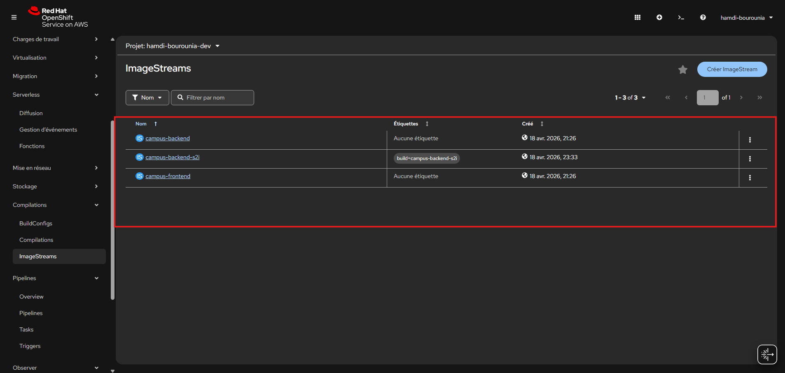

# Lab 2 - Explorer les builds, les images, les déploiements et les routes dans OpenShift

## Objectif

Le Lab 1 vous a fait **créer**, **builder** et **déployer** l’application.  
Ce lab part exactement du même projet, mais avec une autre posture : ici, vous allez surtout **lire**, **comparer** et **relier** les objets déjà présents.

Le but est de couvrir, dans un seul parcours pratique, les notions suivantes :

- la différence entre les objets Kubernetes standards et les objets spécifiques à OpenShift ;
- `ImageStream` ;
- `BuildConfig` et `Build` ;
- `Route` ;
- les probes ;
- les stratégies de build ;
- les déclencheurs ;
- Helm.

## Pourquoi ce lab vient maintenant

Ce lab suppose que le **Lab 1** est terminé et que l’application existe déjà dans votre projet Sandbox.

Vous pouvez vérifier rapidement :

```powershell
oc get deploy,sts,svc,route,is,bc
```

Si `campus-backend`, `campus-frontend` et `campus-db` n’apparaissent pas, revenez d’abord au Lab 1.

## Ce que vous allez faire dans ce lab

Le parcours complet est le suivant :

1. cartographier les objets du projet ;
2. constater l’absence de probes dans les déploiements ;
3. ajouter des probes au backend et au frontend ;
4. lire les `ImageStream` ;
5. distinguer `BuildConfig` et `Build` ;
6. rejouer un build pour revoir la chaîne complète ;
7. essayer une variante `S2I` sur le backend ;
8. lire le rôle d’une `Route` ;
9. comprendre les triggers réellement utilisés ;
10. créer et rendre une chart Helm minimale.

## Cartographier les objets du projet

Commencez par regarder les objets utiles du projet.

```powershell
oc get pods
oc get deploy,sts,svc,route
oc get is,bc,build
oc get secret,pvc
```

Dans ce lab, vous devriez retrouver en pratique :

- Kubernetes : `Pod`, `Deployment`, `StatefulSet`, `Service`, `Secret`, `PersistentVolumeClaim`
- OpenShift : `ImageStream`, `BuildConfig`, `Build`, `Route`

## Étape 1 - Constater l’absence de probes

Dans le Lab 1, vous avez volontairement déployé l’application **sans probes**.  
Avant d’en ajouter, commencez par vérifier cet état dans le cluster.

### À faire

Inspectez les deux déploiements applicatifs :

```powershell
oc describe deployment campus-backend
oc describe deployment campus-frontend
```

Si vous voulez compléter la lecture, regardez aussi l’historique des rollouts :

```powershell
oc rollout history deployment/campus-backend
oc rollout history deployment/campus-frontend
```

### Ce que vous devez trouver

- l’application fonctionne ;
- les déploiements existent bien ;
- mais aucune `readinessProbe` ni `livenessProbe` n’est encore définie ;
- OpenShift a donc moins d’informations pour piloter proprement le trafic et les redémarrages.

### Ce qu’il faut retenir

- une application peut démarrer sans probes ;
- mais ce n’est pas un très bon niveau d’exploitation ;
- la prochaine étape va justement consister à les ajouter.

<details>
<summary>💡 Aide - Où regarder dans <code>oc describe deployment</code> ?</summary>

Concentrez-vous sur la section `Containers`.

Si les probes sont absentes, vous ne verrez pas de bloc `Liveness` ou `Readiness` associé au conteneur.

</details>

## Étape 2 - Ajouter des probes au backend et au frontend

On va maintenant enrichir les manifests écrits dans le Lab 1.

### À faire

1. ouvrez `manifests/sandbox-base/backend.yaml` ;
2. ajoutez une `readinessProbe` et une `livenessProbe` au conteneur backend ;
3. ouvrez `manifests/sandbox-base/frontend.yaml` ;
4. ajoutez une `readinessProbe` et une `livenessProbe` au conteneur frontend ;
5. réappliquez ensuite la kustomization ;
6. attendez le rollout des deux déploiements ;
7. vérifiez enfin que les probes apparaissent bien dans `oc describe`.

### Sous Windows

```powershell
oc apply -k .\jour1\manifests\sandbox-base
oc rollout status deployment/campus-backend
oc rollout status deployment/campus-frontend
```

### Sous Linux

```bash
oc apply -k ./jour1/manifests/sandbox-base
oc rollout status deployment/campus-backend
oc rollout status deployment/campus-frontend
```

Puis relisez les déploiements :

```powershell
oc describe deployment campus-backend
oc describe deployment campus-frontend
```

Si vous voulez vérifier concrètement le backend, ouvrez un port-forward :

```powershell
oc port-forward service/campus-backend 8080:8080
```

Dans un second terminal :

### Sous Windows

```powershell
Invoke-RestMethod -Uri http://localhost:8080/actuator/health/readiness
Invoke-RestMethod -Uri http://localhost:8080/actuator/health/liveness
```

### Sous Linux

```bash
curl http://localhost:8080/actuator/health/readiness
curl http://localhost:8080/actuator/health/liveness
```

### Ce que vous devez trouver

- un nouveau rollout est déclenché après `oc apply -k` ;
- le backend possède maintenant une `readinessProbe` HTTP sur `/actuator/health/readiness` ;
- le backend possède maintenant une `livenessProbe` HTTP sur `/actuator/health/liveness` ;
- le frontend possède maintenant une probe de lecture simple sur `/` ;
- le frontend possède maintenant une probe de vie simple sur `/` ;
- les endpoints backend répondent avec un statut `UP`.


<details>
<summary>💡 Hint - Où placer les probes dans le YAML ?</summary>

Ajoutez-les dans le conteneur applicatif, au même niveau que :

- `image`
- `ports`
- `env`

Sous `spec.template.spec.containers[0]`.

</details>

<details>
<summary>💡 Hint - Squelette pour le backend</summary>

Vous pouvez partir de cette trame :

```yaml
readinessProbe:
  httpGet:
    path: <endpoint-readiness>
    port: http
  initialDelaySeconds: <delai-initial>
  periodSeconds: <periode>
livenessProbe:
  httpGet:
    path: <endpoint-liveness>
    port: http
  initialDelaySeconds: <delai-initial>
  periodSeconds: <periode>
```

Pour le backend Spring Boot, les bons endpoints sont :

- `/actuator/health/readiness`
- `/actuator/health/liveness`

</details>

<details>
<summary>💡 Hint - Squelette pour le frontend</summary>

Vous pouvez partir de cette trame :

```yaml
readinessProbe:
  httpGet:
    path: /
    port: http
  initialDelaySeconds: <delai-initial>
  periodSeconds: <periode>
livenessProbe:
  httpGet:
    path: /
    port: http
  initialDelaySeconds: <delai-initial>
  periodSeconds: <periode>
```

Ici, on reste volontairement simple : le frontend NGINX répond sur `/`.

</details>

<details>
<summary>💡 Hint - Valeurs raisonnables pour commencer</summary>

Vous pouvez partir sur quelque chose de simple :

- backend readiness : `initialDelaySeconds: 20`, `periodSeconds: 10`
- backend liveness : `initialDelaySeconds: 40`, `periodSeconds: 20`
- frontend readiness : `initialDelaySeconds: 10`, `periodSeconds: 10`
- frontend liveness : `initialDelaySeconds: 30`, `periodSeconds: 20`

Le but du lab n’est pas d’optimiser finement ces valeurs.  
Le but est de comprendre le mécanisme et de voir l’effet sur les déploiements.

</details>

## Étape 3 - Comprendre le rôle des ImageStreams

Listez les `ImageStream` :

```powershell
oc get is
```

Puis inspectez-les :

```powershell
oc describe is campus-backend
oc describe is campus-frontend
```

Ce qu’il faut vérifier :

- le tag `latest` existe ;
- l’image est stockée dans le registre interne OpenShift ;
- la date de mise à jour correspond à votre dernier build ;
- le déploiement consomme ensuite cette image logique, pas forcément un digest saisi à la main.

Le point important est le suivant :

- l’`ImageStream` est la référence logique d’image dans le projet ;
- le build pousse dedans ;
- le déploiement suit ensuite cette image ;
- OpenShift peut donc chaîner build et déploiement sans que vous changiez manuellement le `Deployment`.

<details>
<summary>💡 Aide - Quelle information chercher dans <code>oc describe is</code> ?</summary>

Concentrez-vous sur :

- le nom du tag, souvent `latest` ;
- le dépôt interne OpenShift ;
- les événements ou dates de mise à jour ;
- la présence de l’image construite après vos builds.

</details>

## Étape 4 - Distinguer `BuildConfig` et `Build`

Commencez par lister les recettes de build :

```powershell
oc get bc
```

Puis les exécutions concrètes :

```powershell
oc get builds
```

Inspectez les `BuildConfig` :

```powershell
oc describe bc campus-backend
oc describe bc campus-frontend
```

Puis inspectez un build réel pour chaque application.  
Prenez le dernier nom affiché par `oc get builds`.

Exemple :

```powershell
oc describe build campus-backend-1
oc describe build campus-frontend-1
```

Ce qu’il faut observer :

- `source.type: Binary`
- `strategy.type: Docker`
- la sortie vers un `ImageStreamTag`
- le statut du build
- la différence entre la recette réutilisable et une exécution datée et numérotée

Le message à retenir :

- `BuildConfig` = la recette ;
- `Build` = l’exécution concrète ;
- un même `BuildConfig` peut produire plusieurs `Build`.


## Étape 5 - Rejouer un build pour revoir la chaîne complète

Relancez par exemple le build du frontend :

### Sous Windows

```powershell
oc start-build campus-frontend --from-dir=.\campus-app\frontend --follow
```

### Sous Linux

```bash
oc start-build campus-frontend --from-dir=./campus-app/frontend --follow
```

Pendant ou juste après ce build, regardez :

```powershell
oc get builds
oc get is campus-frontend
oc rollout status deployment/campus-frontend
```

Si vous voulez voir le lien entre l’image et le déploiement, regardez aussi l’annotation de trigger :

### Sous Windows

```powershell
oc get deployment campus-frontend -o yaml | Select-String "image.openshift.io/triggers|campus-frontend:latest" -Context 0,2
```

### Sous Linux

```bash
oc get deployment campus-frontend -o yaml | grep -E "image.openshift.io/triggers|campus-frontend:latest"
```

Le but ici est de revoir la chaîne complète :

1. vous envoyez les sources locales ;
2. OpenShift construit l’image ;
3. l’image est poussée dans l’`ImageStream` ;
4. le `Deployment` détecte l’image mise à jour ;
5. un nouveau rollout est lancé.

Le point à bien retenir est le suivant :

- le build est manuel ;
- mais la mise à jour du `Deployment` peut être automatique grâce au trigger d’image.

## Étape 6 - Essayer un build S2I sur le backend

Dans ce parcours principal, nous utilisons un `Docker Build`.

Mais OpenShift sait aussi faire du `S2I` (`Source-to-Image`).

Le but de cette mini-manip est de voir la différence **en pratique** :

- avec `Docker Build`, OpenShift lit votre `Dockerfile` ;
- avec `S2I`, OpenShift part d’une image builder qui sait déjà comment construire une application Java.

Commencez par vérifier qu’un builder Java est disponible :

### Sous Windows

```powershell
oc get is -n openshift | Select-String "ubi8-openjdk-21|java"
```

### Sous Linux

```bash
oc get is -n openshift | grep -E "ubi8-openjdk-21|java"
```

Dans ce Sandbox, vous devriez retrouver un builder proche de `openshift/ubi8-openjdk-21:1.18`.

Créez maintenant un `BuildConfig` S2I temporaire :

```powershell
oc new-build --binary=true --strategy=source --image-stream=openshift/ubi8-openjdk-21:1.18 --name=campus-backend-s2i
```

Puis lancez le build à partir du même code backend :

### Sous Windows

```powershell
oc start-build campus-backend-s2i --from-dir=.\campus-app\backend --follow
```

### Sous Linux

```bash
oc start-build campus-backend-s2i --from-dir=./campus-app/backend --follow
```

Vérifiez ensuite :

### Sous Windows

```powershell
oc get bc campus-backend-s2i
oc get is campus-backend-s2i
oc get builds | Select-String "campus-backend-s2i"
```

### Sous Linux

```bash
oc get bc campus-backend-s2i
oc get is campus-backend-s2i
oc get builds | grep campus-backend-s2i
```

Ce qu’il faut observer dans les logs :

- OpenShift ne lit pas votre `Dockerfile` du projet ;
- le builder Java exécute sa logique `assemble` ;
- Maven est lancé depuis l’image builder ;
- l’image finale est poussée dans `campus-backend-s2i:latest`.

Le point important est le suivant :

- `Docker Build` = vous fournissez le `Dockerfile` ;
- `S2I` = vous fournissez surtout le code, et le builder image porte la logique de build.



Quand vous avez terminé, nettoyez cette expérience S2I temporaire :

```powershell
oc delete bc campus-backend-s2i
oc delete is campus-backend-s2i
```

<details>
<summary>💡 Aide - Si le tag du builder Java diffère dans votre cluster</summary>

Gardez le principe, pas le numéro exact.

Si `openshift/ubi8-openjdk-21:1.18` n’existe pas dans votre cluster, reprenez simplement l’un des builders Java listés par :

### Sous Windows

```powershell
oc get is -n openshift | Select-String "java|openjdk"
```

### Sous Linux

```bash
oc get is -n openshift | grep -E "java|openjdk"
```

</details>

## Étape 7 - Lire le rôle d’une Route

Listez les routes :

```powershell
oc get route
```

Puis inspectez la route du frontend :

```powershell
oc describe route campus-frontend
```

Récupérez ensuite son URL :

### Sous Windows

```powershell
$routeHost = oc get route campus-frontend -o jsonpath='{.spec.host}'
"https://$routeHost"
```

### Sous Linux

```bash
route_host=$(oc get route campus-frontend -o jsonpath='{.spec.host}')
echo "https://$route_host"
```

Testez enfin l’accès :

### Sous Windows

```powershell
Invoke-RestMethod -Uri "https://$routeHost/api/dashboard"
```

### Sous Linux

```bash
curl "https://$route_host/api/dashboard"
```

Ce qu’il faut retenir :

- une `Route` est un objet OpenShift ;
- elle expose le frontend vers l’extérieur ;
- elle s’appuie sur un `Service` ;
- dans ce projet, l’appel `/api/dashboard` passe par le frontend, puis le frontend proxyfie vers le backend.

<details>
<summary>💡 Aide - Pourquoi appeler <code>/api/dashboard</code> sur l’URL du frontend ?</summary>

Parce que le frontend NGINX joue aussi un rôle de proxy :

- les fichiers statiques sont servis par le frontend ;
- les appels `/api/*` sont relayés vers `campus-backend` ;
- vous testez donc ici toute la chaîne “Route -> Service frontend -> pod frontend -> backend”.

</details>

## Étape 8 - Comprendre les triggers réellement utilisés dans ce projet

OpenShift connaît plusieurs familles de triggers côté build :

- `Configuration Change`
- `Image Change`
- `Webhook`

Mais dans ce parcours, le comportement réel est volontairement plus simple.

Relisez d’abord les `BuildConfig` :

```powershell
oc describe bc campus-backend
oc describe bc campus-frontend
```

Puis regardez les triggers côté `Deployment` :

### Sous Windows

```powershell
oc get deployment campus-backend -o yaml | Select-String "image.openshift.io/triggers|campus-backend:latest" -Context 0,2
oc get deployment campus-frontend -o yaml | Select-String "image.openshift.io/triggers|campus-frontend:latest" -Context 0,2
```

### Sous Linux

```bash
oc get deployment campus-backend -o yaml | grep -E "image.openshift.io/triggers|campus-backend:latest"
oc get deployment campus-frontend -o yaml | grep -E "image.openshift.io/triggers|campus-frontend:latest"
```

Ce qu’il faut comprendre :

- les sources viennent de votre machine ;
- le build est de type `Binary` ;
- le build est donc déclenché **manuellement** avec `oc start-build` ;
- en revanche, le `Deployment` est lié à l’`ImageStreamTag` par une annotation de trigger ;
- cela explique pourquoi un nouveau build peut entraîner un nouveau rollout sans édition manuelle du YAML.


Voici une version complète, cohérente et directement intégrable de **l’Étape 9**, avec une introduction par use case + les hints pratiques.


# Étape 9 - Introduire Helm via un besoin réel

## Contexte

Jusqu’ici, vous avez manipulé des manifests YAML directement pour déployer votre application.

Imaginez maintenant la situation suivante :

> Votre application “campus” doit être déployée dans plusieurs environnements :
>
> * un environnement **dev** ;
> * un environnement **pré-prod (qa)** ;
> * un environnement **production**.

Très rapidement, les besoins évoluent :

* en **dev** :

    * 1 replica ;
    * configuration simple ;
* en **production** :

    * plusieurs replicas ;
    * configuration plus robuste ;
    * éventuellement une image différente.

---

## Problème

Avec les manifests actuels :

* vous devez dupliquer les fichiers YAML ;
* vous modifiez les valeurs “à la main” (image, replicas, probes…) ;
* vous risquez des incohérences ;
* la maintenance devient difficile.

---

## Besoin

Vous avez donc besoin de :

* **factoriser** vos manifests ;
* **paramétrer** facilement les valeurs variables ;
* éviter la duplication ;
* générer plusieurs variantes d’un même déploiement.

---

## Solution

C’est précisément le rôle de Helm :

* transformer vos manifests en **templates** ;
* centraliser les variables dans `values.yaml` ;
* générer du YAML adapté à chaque environnement.

---

## Objectif de cette étape

Dans cette étape, vous allez :

1. créer une chart Helm minimale ;
2. transformer vos manifests existants en templates ;
3. paramétrer les valeurs ;
4. générer le YAML avec `helm template`.

👉 Important :
On **ne déploie pas avec Helm ici**, on observe seulement le rendu.

---

## À faire

### 1. Vérifier Helm

```powershell
helm version
```

---

### 2. Créer une chart

#### Windows

```powershell
helm create .\jour1\manifests\helm\campus-sandbox
```

#### Linux

```bash
helm create ./jour1/manifests/helm/campus-sandbox
```

---

### 3. Nettoyer la chart

Supprimez les templates inutiles générés par défaut :

* `ingress.yaml`
* `hpa.yaml`
* `tests/`
* etc.

---

### 4. Créer les templates nécessaires

Vous devez avoir au minimum :

```
templates/
  backend-deployment.yaml
  backend-service.yaml
  frontend-deployment.yaml
  frontend-service.yaml
  route.yaml
```

---

### 5. Créer le fichier values.yaml

Exemple minimal :

```yaml
backend:
  name: campus-backend
  image: campus-backend:latest
  replicas: 1

frontend:
  name: campus-frontend
  image: campus-frontend:latest
  replicas: 1

route:
  name: campus-frontend
```

---

### 6. Adapter les templates

Exemple (backend-deployment) :

```yaml
apiVersion: apps/v1
kind: Deployment
metadata:
  name: {{ .Values.backend.name }}
spec:
  replicas: {{ .Values.backend.replicas }}
  selector:
    matchLabels:
      app: {{ .Values.backend.name }}
  template:
    metadata:
      labels:
        app: {{ .Values.backend.name }}
    spec:
      containers:
        - name: backend
          image: {{ .Values.backend.image }}
          ports:
            - name: http
              containerPort: 8080
```

---

### 7. Vérifier la chart

```powershell
helm lint .\jour1\manifests\helm\campus-sandbox
```

---

### 8. Générer le YAML

```powershell
helm template campus-sandbox .\jour1\manifests\helm\campus-sandbox
```

---

## Ce que vous devez observer

* Helm génère du YAML standard Kubernetes/OpenShift ;
* les valeurs viennent de `values.yaml` ;
* les templates remplacent les valeurs dynamiquement ;
* la structure est identique à vos manifests du Lab 1.

---

## Ce qu’il faut comprendre

* Helm **ne remplace pas Kubernetes/OpenShift** ;
* Helm permet de :

    * factoriser ;
    * paramétrer ;
    * versionner les manifests ;
* en production, on manipule souvent Helm plutôt que du YAML brut.

---

# 💡 Hints pratiques

## 💡 Comment réutiliser votre travail existant

Ne repartez pas de zéro.

Utilisez :

* `jour1/manifests/sandbox-base/backend.yaml`
* `jour1/manifests/sandbox-base/frontend.yaml`

Puis remplacez les valeurs fixes :

```yaml
campus-backend
```

par :

```yaml
{{ .Values.backend.name }}
```

---

## 💡 Où placer les variables Helm

Dans les templates, utilisez :

```yaml
{{ .Values.backend.image }}
{{ .Values.frontend.replicas }}
```

---

## 💡 Attention aux labels et selectors

Vérifiez que :

```yaml
selector.matchLabels == template.metadata.labels
```

Sinon le Deployment ne fonctionnera pas.

---

## 💡 Template minimal pour la Route

```yaml
apiVersion: route.openshift.io/v1
kind: Route
metadata:
  name: {{ .Values.route.name }}
spec:
  to:
    kind: Service
    name: {{ .Values.frontend.name }}
  port:
    targetPort: http
```

---

## 💡 Vérifier le rendu

Dans `helm template`, vérifiez :

* noms des objets ;
* images ;
* replicas ;
* probes ;
* services ;
* route.

---

## 💡 Astuce de debug

Si Helm ne fonctionne pas :

```bash
helm template ... --debug
```

---

## 💡 Astuce

Posez-vous toujours cette question :

> Est-ce que je pourrais changer facilement cette valeur sans modifier 5 fichiers YAML ?

Si la réponse est non → Helm apporte de la valeur.

---

## Conclusion de l’étape

Vous venez de passer de :

* manifests statiques
  ➡️ à
* templates paramétrables
