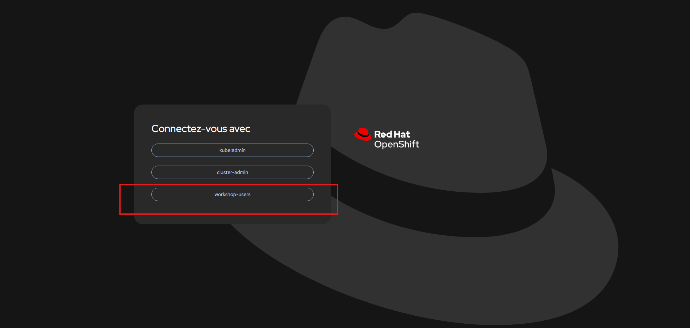
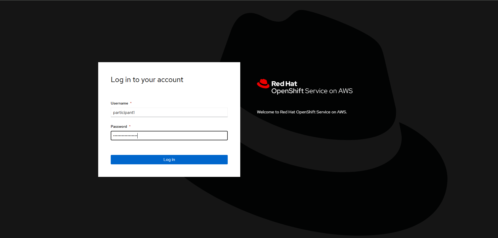
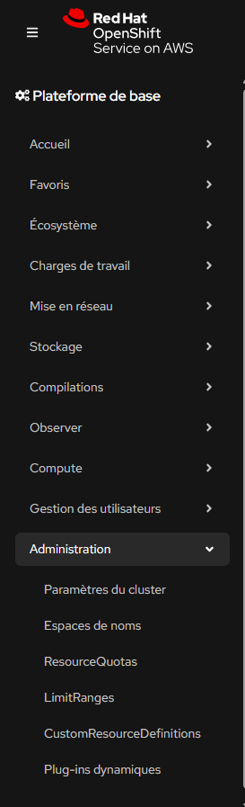
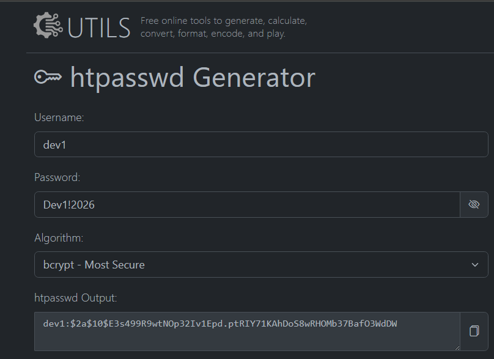
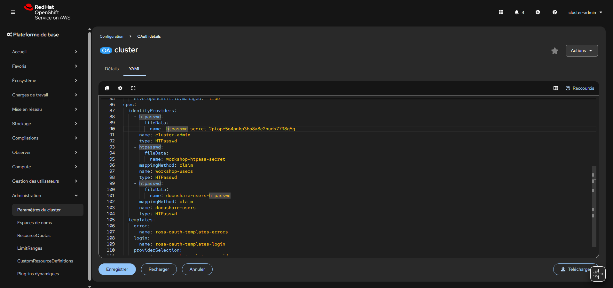
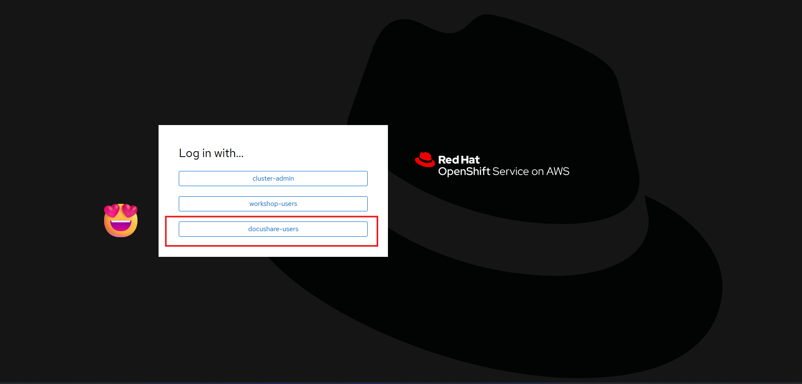
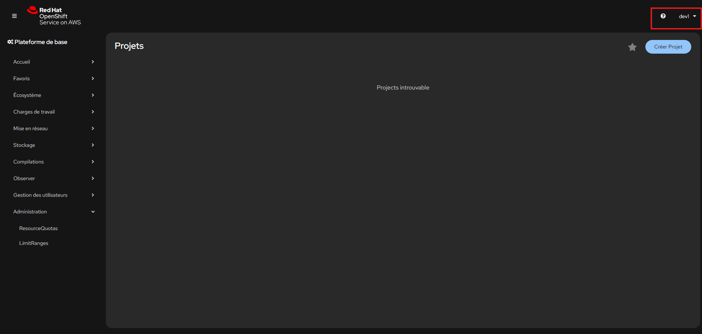

# Lab 01 - Préparer l’accès à la plateforme DocuShare

Votre équipe plateforme OpenShift doit héberger une nouvelle application interne nommée **DocuShare**

Cette application permet :

- de stocker des documents internes ;
- de partager des fichiers entre plusieurs instances applicatives ;
- de conserver les données métier dans PostgreSQL ;
- de sécuriser les évolutions grâce aux snapshots.

Votre mission consiste à mettre en place une première version fonctionnelle de la plateforme.

---
Jusqu’à présent, seuls deux comptes administrateurs temporaires existent :

## Participant 1

* login : `participant1`
* password : `participant1!2026`

## Participant 2

* login : `participant2`
* password : `participant2!2026`



L’équipe sécurité impose désormais une nouvelle exigence :

- les comptes administrateurs initiaux ne doivent plus être utilisés au quotidien ;
- chaque équipe doit disposer de comptes dédiés ;
- l’authentification doit être centralisée ;
- les futurs rôles RBAC seront attribués à de vrais utilisateurs internes.

Votre première mission consiste à mettre en place un provider d’authentification interne pour les équipes DocuShare.

---

# Contexte

Vous disposez actuellement d’un accès administrateur au cluster ROSA.

Comptes de départ :

- `participant1`
- `participant2`

Ces comptes disposent des privilèges nécessaires pour préparer la future gouvernance de la plateforme.


---

# Objectifs

À travers ce lab, vous allez manipuler :

- la configuration d’un provider d’identité OpenShift ;
- la création d’un secret dans `openshift-config` ;
- l’ajout d’un provider `HTPasswd` ;
- la préparation de futurs utilisateurs internes ;
- la gouvernance initiale d’un cluster OpenShift.

---

# Résultat attendu

À la fin du lab :

- les comptes DocuShare existent ;
- OpenShift propose un nouveau mode de connexion ;
- la plateforme est prête pour les prochains labs RBAC.


---

# Étape 1 - Se connecter au cluster

Connectez-vous à OpenShift avec :

- `participant1` (ou `participant2)`



Vérifiez que vous etes en full admin, passez en perspective `Administrator`



---

# Étape 2 - Créer le secret HTPasswd

## Mission

Le provider HTPasswd s’appuie sur un fichier contenant les utilisateurs et leurs mots de passe chiffrés.

Vous devez créer ce secret dans :

```text
openshift-config
```

---

## Étapes

1. Ouvrez :

```text
Workloads → Secrets
```

2. Changez de namespace :

```text
openshift-config
```

3. Cliquez :

```text
Create → From YAML
```

4. Créez un secret nommé :

```text
docushare-users-htpasswd
```

Utilisez par exemple le site `https://htpasswd.utils.com` pour générer les mots de passe chiffrés.

# Comptes internes à préparer

Créer un provider permettant les connexions suivantes :

| Utilisateur | Mot de passe |
|---|---|
| `dev1` | `Dev1!2026` |
| `dev2` | `Dev2!2026` |
| `ops1` | `Ops1!2026` |
| `auditor1` | `Audit1!2026` |



---

## Validation attendue

Vous devez retrouver :

* un secret `docushare-users-htpasswd`
* namespace `openshift-config`
* le champ `stringData` avec les utilisateurs et les mots de passe chiffrés sous `htpasswd`.
---

<details>
<summary>💡 Hint - YAML du Secret</summary>

```yaml
apiVersion: v1
kind: Secret
metadata:
  name: docushare-users-htpasswd
  namespace: openshift-config
type: Opaque
stringData:
  htpasswd: |
    dev1:$2a$10$E3s499R9wtNOp32Iv1Epd.ptRIY71KAhDoS8wRHOMb37BafO3WdDW
    ...
    ...
```

</details>

---

# Étape 3 - Ajouter le provider HTPasswd

## Mission

Vous allez déclarer un nouveau provider d’identité dans la configuration OAuth du cluster.

---

## Étapes

1. Ouvrez :

```text
Administration → CustomResourceDefinitions
````

2. Recherchez :

```text
oauths.config.openshift.io
```

3. Ouvrez la CRD :

```text
OAuth
```

4. Allez dans l’onglet :

```text
Instances
```

5. Ouvrez l’instance :

```text
cluster
```

6. Allez dans l’onglet :

```text
YAML
```

7. Dans `spec.identityProviders`, ajoutez un second provider sans supprimer le provider existant `cluster-admin`.

---

## Bloc à ajouter

Ajoutez ce bloc sous le provider existant :

```yaml
- htpasswd:
    fileData:
      name: docushare-users-htpasswd
  mappingMethod: claim
  name: docushare-users
  type: HTPasswd
```
## Exemple attendu

Vous devez obtenir une structure similaire à celle-ci :

```yaml
spec:
  identityProviders:
    - htpasswd:
        fileData:
          name: <secret-admin-existant>
      name: cluster-admin
      type: HTPasswd
    - htpasswd:
        fileData:
          name: workshop-htpass-secret
      mappingMethod: claim
      name: workshop-users
      type: HTPasswd
    - htpasswd:
        fileData:
          name: docushare-users-htpasswd
      mappingMethod: claim
      name: docushare-users
      type: HTPasswd
```

Gardez le reste de la configuration inchangé, notamment :

```yaml
templates:
tokenConfig:
```



---

## Validation attendue

Après sauvegarde :

* l’opérateur d’authentification ne doit pas être en erreur ;
* la page de connexion doit proposer le provider `docushare-users`.



---

<details>
<summary>💡 Hint - Point important</summary>

Ne supprimez pas le provider existant `cluster-admin`.

Il sert à conserver l’accès administrateur initial.

Vous devez uniquement ajouter un nouveau provider HTPasswd pour les utilisateurs DocuShare.

</details>

---

# Étape 4 - Vérifier la page de connexion

## Mission

Vous devez vérifier que les nouveaux utilisateurs peuvent maintenant se connecter.

---

## Étapes

1. Ouvrez une fenêtre privée / navigation privée.
2. Accédez à la page de login OpenShift.
3. Vérifiez qu’un provider nommé :

```text
docushare-users
```

apparaît.

---

## Validation attendue

Le provider est visible sur la page de connexion.

---

# Étape 5 - Tester un compte utilisateur

## Mission

Testez un premier utilisateur métier.

---

## Exemple

Connectez-vous avec :

* utilisateur : `dev1`
* mot de passe : `Dev1!2026`




---

## Validation attendue

Connexion possible.

⚠️ À ce stade, aucun rôle RBAC n’a encore été attribué.

L’utilisateur peut se connecter mais n’aura que peu d’accès.

---

# Ce qu’il faut retenir

## Gouvernance

Le provider HTPasswd est une première étape de gouvernance.

## Séparation des usages

Les comptes bootstrap admin ne servent plus à l’exploitation quotidienne.

## Préparation des prochains labs

Les utilisateurs suivants existent désormais :

* dev1
* dev2
* ops1
* auditor1

Ils seront utilisés pour :

* RBAC
* groupes
* quotas
* rôles custom

---

# Démonstration finale attendue

Montrez :

* le secret dans `openshift-config`
* le provider `docushare-users`
* la page de login mise à jour
* une connexion avec `dev1`

---

# Variantes avancées

## Variante 1

Ajoutez un utilisateur supplémentaire :

```text
support1
```

## Variante 2

Changez le nom du provider.

## Variante 3

Supprimez le provider puis recréez-le.

---

# Nettoyage

Ne supprimez rien.

Ces comptes seront réutilisés dans les labs suivants.

---

# Résultat métier final

La plateforme DocuShare dispose maintenant :

* d’un annuaire interne simple ;
* de comptes dédiés ;
* d’une base saine pour déléguer les accès ;
* d’une gouvernance prête pour la suite.

