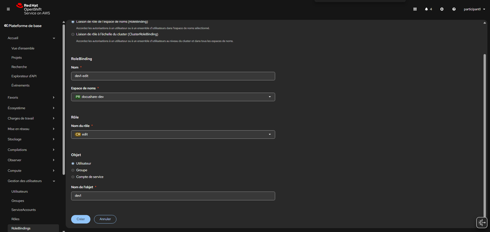

# Lab 02 - Déléguer les accès sur le projet DocuShare

## Contexte

Les utilisateurs internes existent maintenant.

Il faut leur donner un premier niveau d'accès sur le projet de développement DocuShare.

## Objectif

Revenez comme admin sur l'un des deux comptes ( participant1/participant2) et Créer le projet :

- `docushare-dev`

Puis attribuer :

- `dev1` = `edit`
- `ops1` = `admin`
- `auditor1` = `view`


## 1. Donner accès edit à dev1

Dans RoleBindings, **Créer une liaison** avec les informations suivantes :
```text
Nom : dev1-edit
Espace de noms : docushare-dev
Nom du rôle : edit
Objet : Utilisateur
Nom de l’objet : dev1
```



Puis **Create**

---

## 2. Donner accès admin à ops1

```text
Nom : ops1-admin
Espace de noms : docushare-dev
Nom du rôle : admin
Objet : Utilisateur
Nom de l’objet : ops1
```

Puis **Create**

---

## 3. Donner accès view à auditor1

```text
Nom : auditor1-view
Espace de noms : docushare-dev
Nom du rôle : view
Objet : Utilisateur
Nom de l’objet : auditor1
```

Puis **Create**

## Ce que ça signifie

* `dev1` : peut déployer, modifier app, PVC, services
* `ops1` : admin du projet
* `auditor1` : lecture seule

---

## Validation attendue

Dans `RoleBindings`, retrouver :

```text
dev1-edit
ops1-admin
auditor1-view
```

## Validation attendue

Vous devez voir :

- `dev1` avec `edit`
- `ops1` avec `admin`
- `auditor1` avec `view`

## Ce qu'il faut retenir

- la delegation namespaced permet de ne pas donner `cluster-admin` a tout le monde ;
- `edit`, `admin` et `view` n'ont pas le meme niveau de pouvoir ;
- un projet bien gere commence par des acces clairs et explicites.
