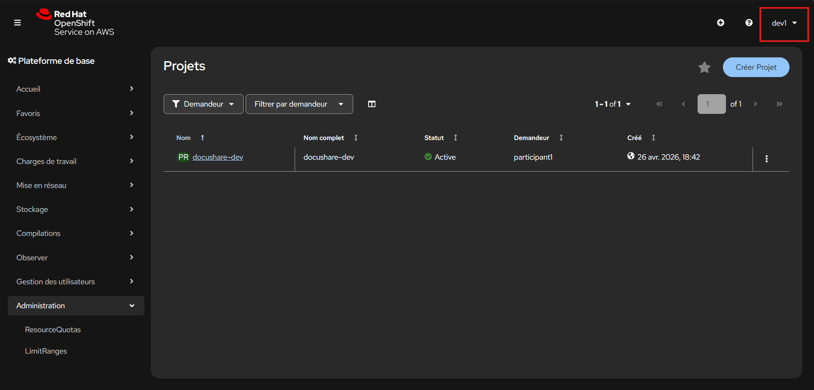

# Lab 03 - Industrialiser les accès avec des groupes

---

# Contexte

Les accès directs utilisateur par utilisateur fonctionnent, mais ils deviennent difficiles à maintenir.

L’équipe DocuShare grandit :

- nouveaux développeurs ;
- rotation exploitation ;
- audits réguliers ;
- changements d’équipe.

Vous devez maintenant industrialiser la gouvernance via des **Groupes OpenShift**.

---

# Objectif

Créer les groupes suivants :

- `docushare-developers`
- `docushare-ops`
- `docushare-auditors`

Puis :

- ajouter les utilisateurs dans les bons groupes ;
- donner les accès au projet `docushare-dev` via les groupes ;
- supprimer les accès individuels du lab précédent.

---

# Répartition attendue

## docushare-developers

- dev1
- dev2

## docushare-ops

- ops1

## docushare-auditors

- auditor1

---

# Cible de gouvernance

Dans le projet `docushare-dev` :

- `docushare-developers` → `admin`
- `docushare-ops` → `admin`
- `docushare-auditors` → `admin`

---

# Étape 1 - Créer les groupes

Ouvrez :

```text
Gestion des utilisateurs → Groupes
````

Cliquez sur :

```text
Créer Groupe
```

Créez les trois groupes via YAML.

---

# Étape 2 - Ajouter les membres dans les groupes

Pour chaque groupe créé, ajoutez les utilisateurs attendus.

Vous pouvez le faire de deux façons :

## Méthode A - Directement à la création via YAML

En renseignant la section :

```yaml
users:
````

## Méthode B - Après création

1. Ouvrez le groupe créé
2. Onglet `YAML`
3. Ajoutez les utilisateurs dans :

```yaml
users:
```

Puis enregistrez.

## Répartition attendue

### docushare-developers

```yaml
users:
- dev1
- dev2
```

### docushare-ops

```yaml
users:
- ops1
```

### docushare-auditors

```yaml
users:
- auditor1
```
---

## Ajouter un vrai point de contrôle

Ajoute ensuite :

## Validation intermédiaire

Ouvrez chaque groupe et vérifiez que la section `users:` contient bien les membres attendus.


# Étape 3 - Donner les accès projet

Ouvrez :

```text
Home → Projects → docushare-dev → RoleBindings
```

Créez trois liaisons de rôle basées sur les groupes.


<details>
<summary>💡 Hint - YAML groupe développeurs</summary>

```yaml
apiVersion: user.openshift.io/v1
kind: Group
metadata:
  name: docushare-developers
users:
  - dev1
  - dev2
```

</details>

---

<details>
<summary>💡 Hint - YAML groupe exploitation</summary>

```yaml
apiVersion: user.openshift.io/v1
kind: Group
metadata:
  name: docushare-ops
users:
  - ops1
```

</details>

---

<details>
<summary>💡 Hint - YAML groupe audit</summary>

```yaml
apiVersion: user.openshift.io/v1
kind: Group
metadata:
  name: docushare-auditors
users:
  - auditor1
```

</details>

---

<details>
<summary>💡 Hint - RoleBinding groupe développeurs</summary>

Dans :

```text
docushare-dev → RoleBindings → Créer une liaison
```

Utilisez :

```text
Nom : developers-admin
Rôle : admin
Objet : Groupe
Nom de l’objet : docushare-developers
```

</details>

---

<details>
<summary>💡 Hint - RoleBinding groupe ops</summary>

```text
Nom : ops-admin
Rôle : admin
Objet : Groupe
Nom de l’objet : docushare-ops
```

</details>

---

<details>
<summary>💡 Hint - RoleBinding groupe audit</summary>

```text
Nom : auditors-admin
Rôle : admin
Objet : Groupe
Nom de l’objet : docushare-auditors
```

</details>

---

# Validation attendue

Vous devez obtenir :

* 3 groupes créés ;
* bons membres dans chaque groupe ;
* accès au projet via groupes ;
* plus de dépendance aux utilisateurs individuels.

---

# Ce qu'il faut retenir

* on attribue les droits aux groupes ;
* on ajoute les personnes dans les groupes ;
* l’arrivée ou départ d’un collaborateur devient simple ;
* le RBAC devient maintenable.

## Retestez les accès avec les utilisateurs pour valider que tout fonctionne via les groupes.




# Étape 4 - Nettoyer les accès directs

Supprimez les anciens bindings :

* dev1-admin
* ops1-admin
* auditor1-admin

(si créés au lab précédent)
---
<details>
<summary>💡 Hint - Nettoyage final</summary>

Supprimez les anciens RoleBindings liés directement à :

* dev1
* ops1
* auditor1

Ne garder que les bindings de groupes.

</details>

