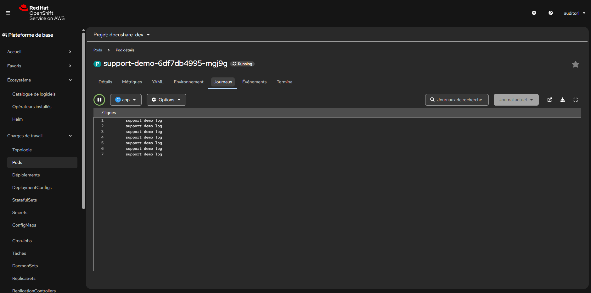
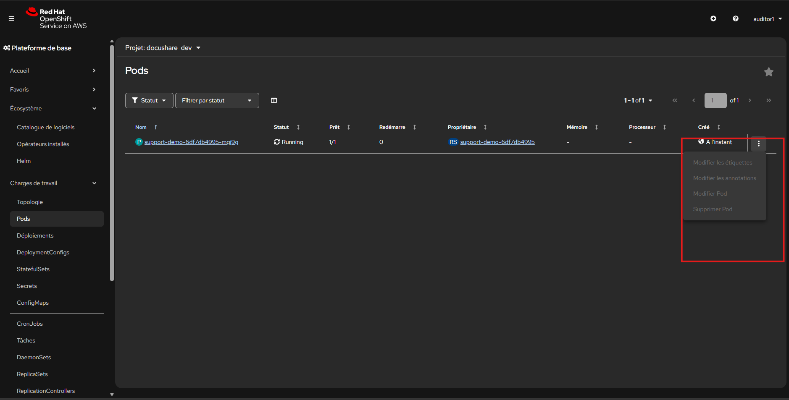
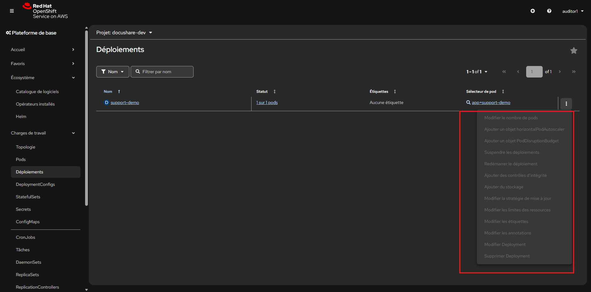

# Lab 04 - Créer un role custom securité

## Contexte

L'équipe a besoin d'un role d'audit simple pour le support.

Ce role doit permettre de :

- lire les pods
- lire les logs
- lire les events

Mais il ne doit pas permettre de supprimer des ressources.

## Etapes

1. Basculez sur le projet `docushare-dev`.
2. Ouvrez `Gestion des utilisateurs` -> `Rôles`.
3. Créez le role `support-reader`.
4. Toujours dans `Gestion des utilisateurs`, créez un `RoleBinding` de type `Utilisateur` nommé `support-reader-auditor1`.
5. Associez ce role a `auditor1`.
6. Ouvrez `Administration -> Roles` pour verifier le role.
7. Ouvrez `RoleBindings` pour verifier le binding.


dans le projet :

- `docushare-dev`

## Contraintes

Le role doit autoriser uniquement :

- `get`
- `list`
- `watch`

sur :

- `pods`
- `pods/log`
- `events`

## Validation attendue

Vous devez retrouver :

- un role `support-reader`
- un binding de ce role vers `auditor1`
- aucune permission de suppression dans la definition du role

## Ce qu'il faut retenir

- `view` n'est pas toujours suffisant pour le support ;
- un role custom permet de donner juste ce qu'il faut ;
- la gouvernance mature repose aussi sur des roles metier precis.

<details>
<summary>Hint - Squelette du Role</summary>

```yaml
apiVersion: rbac.authorization.k8s.io/v1
kind: Role
metadata:
  name: support-reader
rules:
  - apiGroups:
      - ""
    resources:
      - pods
      - pods/log
      - events
    verbs:
      - get
      - list
      - watch
```

</details>

<details>
<summary>Hint - Squelette du RoleBinding</summary>

```yaml
apiVersion: rbac.authorization.k8s.io/v1
kind: RoleBinding
metadata:
  name: support-reader-auditor1
subjects:
  - kind: User
    name: auditor1
    apiGroup: rbac.authorization.k8s.io
roleRef:
  apiGroup: rbac.authorization.k8s.io
  kind: Role
  name: support-reader
```

</details>

<details>
<summary>Hint - Point de verification</summary>

Dans le role, vous ne devez pas voir :

- `delete`
- `patch`
- `update`

Le role doit rester en lecture seulement.

</details>

# Tester le rôle avec auditor1

Vous devez vérifier que le rôle `support-reader` donne bien les droits attendus, sans donner de droits dangereux.

L’utilisateur `auditor1` doit pouvoir :

- voir les pods ;
- consulter les logs ;
- consulter les events.

Mais il ne doit pas pouvoir :

- supprimer un pod ;
- modifier un déploiement ;
- créer une ressource.

---

## Test 1 - Connexion avec auditor1

# Préparer une application de test

Avant de tester le rôle `support-reader`, il faut disposer d’au moins un pod dans le projet `docushare-dev`.

Connectez-vous avec `participant1` ou un utilisateur ayant le droit de créer des workloads dans `docushare-dev`.

Créez un petit deployment de test nommé : `support-demo`

Image recommandée :
```text
registry.access.redhat.com/ubi9/ubi-minimal:latest
```

Le conteneur doit rester actif et produire quelques logs.
---
<details>
<summary>💡 Hint - Squelette du Deployment de test</summary>

```yaml
apiVersion: apps/v1
kind: Deployment
metadata:
  name: support-demo
spec:
  replicas: 1
  selector:
    matchLabels:
      app: support-demo
  template:
    metadata:
      labels:
        app: support-demo
    spec:
      containers:
        - name: app
          image: registry.access.redhat.com/ubi9/ubi-minimal:latest
          command:
            - /bin/sh
            - -c
            - while true; do echo "support demo log"; sleep 10; done
```
</details>

## Validation attendue

Depuis `participant1`, vérifiez que :

* le deployment `support-demo` existe ;
* un pod est en `Running` ;
* des logs sont visibles.

---

Ouvrez une fenêtre privée puis connectez-vous avec :

- provider : `docushare-users`
- utilisateur : `auditor1`
- mot de passe : `Audit1!2026`

Sélectionnez le projet :

```text
docushare-dev
````

---

## Test 2 - Vérifier la lecture des pods

Depuis la console, ouvrez :

```text
Charges de travail → Pods
```

Résultat attendu :

* la liste des pods est visible.

---

## Test 3 - Vérifier la lecture des logs

Ouvrez un pod existant, puis allez dans :

```text
Journaux
```



Résultat attendu :

* les logs sont visibles.

---

## Test 4 - Vérifier la lecture des événements

Ouvrez depuis le projet :

```text
Pod détails → événements
```

Résultat attendu :

* les événements du projet sont visibles.

---

## Test 5 - Vérifier que la suppression est interdite

Essayez de supprimer un pod depuis la console.

Résultat attendu :

* l’action est absente ;



---

## Test 6 - Vérifier que la modification est interdite

Essayez d’ouvrir un Deployment et de modifier son YAML.

Résultat attendu :

* l’édition est absente ;



---

# Validation finale

Le test est réussi si `auditor1` peut :

* lire les pods ;
* lire les logs ;
* lire les events ;

et ne peut pas :

* supprimer ;
* modifier ;
* créer des ressources.

---

<details>
<summary>💡 Hint - Vérification attendue</summary>

Le rôle `support-reader` doit permettre uniquement :

```text
get
list
watch
```

Il ne doit pas permettre :

```text
create
update
patch
delete
```

</details>
