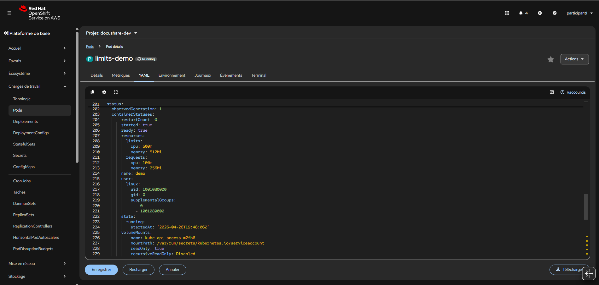

# Lab 05 - Standardiser les déploiements DocuShare avec LimitRange

## Contexte

Le quota du projet `docushare-dev` est désormais en place.

Cependant, l’équipe plateforme constate un nouveau problème :

* certains développeurs créent des pods sans `requests` ;
* d’autres oublient les `limits` ;
* certains manifests sont incomplets ;
* le scheduler manque d’informations fiables ;
* les comportements deviennent incohérents d’une équipe à l’autre.

Le cluster est protégé globalement grâce au `ResourceQuota`, mais les workloads restent hétérogènes.

L’équipe plateforme décide donc d’imposer automatiquement des valeurs par défaut à chaque nouveau pod créé dans :

```text
docushare-dev
```

---

## Objectif

Créer un `LimitRange` afin que tout pod créé sans ressources récupère automatiquement :

* `requests.cpu = 100m`
* `requests.memory = 256Mi`
* `limits.cpu = 500m`
* `limits.memory = 512Mi`

Puis valider ce comportement avec un pod de test.

---

## Mission

Vous êtes administrateur du projet `docushare-dev`. (se connecter avec `participant1` ou `participant2`)

Votre mission est de fiabiliser les futurs déploiements DocuShare en imposant un cadre standard à tous les workloads.

---

## Étapes

1. Ouvrez le projet `docushare-dev`.
2. Accédez à :

```text
Administration → LimitRanges
```

3. Créez un `LimitRange` nommé :

```text
docushare-defaults
```

4. Ensuite créez un pod de test : `limits-demo` sans bloc `resources`.

Il doit :
- démarrer rapidement ;
- rester actif ;
- consommer peu de ressources ;
- ne contenir aucun bloc resources ;
- utiliser une image standard disponible publiquement.

5. Vérifiez que les valeurs ont été injectées automatiquement.

---

<details>
<summary>💡 Hint - YAML du LimitRange</summary>

```yaml
apiVersion: v1
kind: LimitRange
metadata:
  name: docushare-defaults
  namespace: docushare-dev
spec:
  limits:
    - type: Container
      defaultRequest:
        cpu: 100m
        memory: 256Mi
      default:
        cpu: 500m
        memory: 512Mi
```

</details>


<details>
<summary>💡 Hint - Squelette du pod de test</summary>

Utilisez par exemple :

```yaml
apiVersion: v1
kind: Pod
metadata:
  name: limits-demo
  namespace: docushare-dev
spec:
  containers:
    - name: demo
      image: registry.access.redhat.com/ubi9/ubi-minimal:latest
      command:
        - /bin/sh
        - -c
        - sleep 3600
```

Explication :

* `ubi9/ubi-minimal` : image Red Hat légère et fiable ;
* `sleep 3600` : garde le pod vivant pendant 1 heure ;
* absence de `resources:` : permet au `LimitRange` d’injecter les valeurs automatiquement.

</details>

## Validation attendue

Vous devez retrouver :

* un `LimitRange` actif ;
* un pod `limits-demo` ;
* des `requests` injectés ;
* des `limits` injectés.



---

## Ce qu'il faut retenir

* `ResourceQuota` limite globalement ;
* `LimitRange` encadre chaque workload ;
* les deux se complètent ;
* cela professionnalise un namespace.


---

<details>
<summary>💡 Hint - Résultat attendu du pod</summary>

Après création :

* le pod doit passer en `Running` ;
* un conteneur doit être présent ;
* le YAML du pod doit contenir automatiquement :

```yaml
resources:
  requests:
    cpu: 100m
    memory: 256Mi
  limits:
    cpu: 500m
    memory: 512Mi
```

Si ces valeurs apparaissent, le `LimitRange` fonctionne correctement.

</details>
