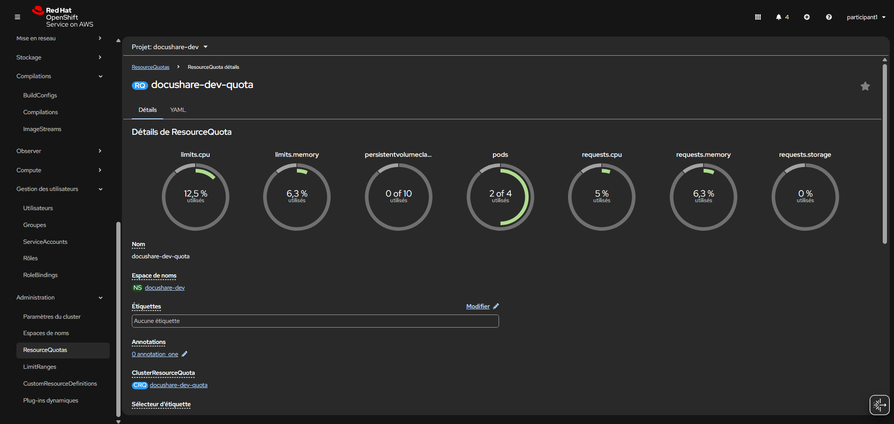
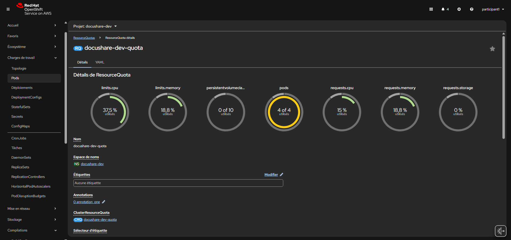
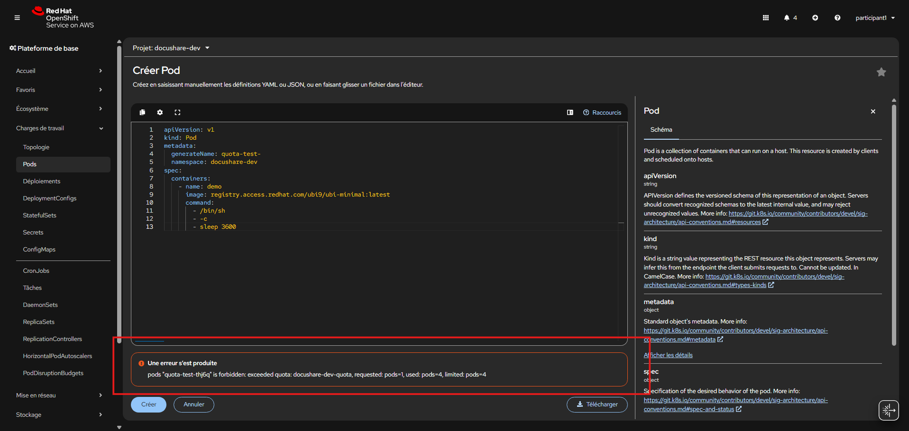

# Lab 05 - Contrôler la consommation du projet DocuShare

## Contexte

La plateforme **DocuShare** entre en phase d’industrialisation.

Le projet `docushare-dev` est désormais utilisé par plusieurs profils :

* développeurs ;
* équipe QA ;
* support ;
* automatisation CI/CD ;
* tests temporaires.

Les administrateurs constatent plusieurs risques :

* trop de pods lancés simultanément ;
* demandes CPU excessives ;
* surconsommation mémoire ;
* multiplication des volumes persistants ;
* saturation possible du cluster partagé.

L’équipe plateforme demande donc la mise en place de garde-fous sur le namespace :`docushare-dev`

---

## Objectif

Créer un `ResourceQuota` pour encadrer la consommation maximale du projet.

Limiter :

* CPU
* mémoire
* nombre de pods
* nombre de PVC
* stockage total demandé

---

## Valeurs attendues

Utilisez :

* `requests.cpu = 2`
* `limits.cpu = 4`
* `requests.memory = 4Gi`
* `limits.memory = 8Gi`
* `persistentvolumeclaims = 10`
* `requests.storage = 50Gi`
* `pods = 4`

---

## Mission

Vous êtes administrateur du projet `docushare-dev`.

Votre mission est d’empêcher qu’un usage excessif de DocuShare impacte les autres projets du cluster ROSA.

---

## Étapes

1. Basculez sur le projet :

```text
docushare-dev
```

2. Ouvrez :

```text
Administration → ResourceQuotas
```

3. Cliquez sur :

```text
Créer un quota de ressources
```

4. Créez un quota nommé :

```text
docushare-dev-quota
```

ayant les valeurs suivantes :

- requests.cpu = 2
- limits.cpu = 4
- requests.memory = 4Gi
- limits.memory = 8Gi
- persistentvolumeclaims = 10
- requests.storage = 50Gi
- pods = 4


---

<details>
<summary>💡 Hint - YAML attendu</summary>

```yaml id="8p3vx7"
apiVersion: v1
kind: ResourceQuota
metadata:
  name: docushare-dev-quota
  namespace: docushare-dev
spec:
  hard:
    requests.cpu: "2"
    limits.cpu: "4"
    requests.memory: 4Gi
    limits.memory: 8Gi
    persistentvolumeclaims: "10"
    requests.storage: 50Gi
    pods: "4"
```

</details>

## Validation attendue

Après création, ouvrez :

```text"
Administration → ResourceQuotas
```

Vous devez retrouver :

* un quota actif `docushare-dev-quota`
* limites CPU visibles
* limites mémoire visibles
* quota pods
* quota PVC
* quota stockage


---

## Ce qu’il faut retenir

* un namespace sans quota peut déséquilibrer un cluster ;
* les quotas protègent les environnements partagés ;
* c’est une brique de gouvernance essentielle.

---

## Test rapid

Le quota limite sur les pods est défini avec: `pods = 4`

Le projet possède déjà **2 pods en cours d’exécution**.

Il ne reste donc que `2 pods disponibles`

Créez deux pods de test supplémentaires : ils seront acceptés.

Puis tentez un troisième pod supplémentaire : il sera refusé.

Utilisez ce YAML :

```yaml
apiVersion: v1
kind: Pod
metadata:
  generateName: quota-test-
  namespace: docushare-dev
spec:
  containers:
    - name: demo
      image: registry.access.redhat.com/ubi9/ubi-minimal:latest
      command:
        - /bin/sh
        - -c
        - sleep 3600
```

Résultat attendu :





* pod test n°1 : accepté
* pod test n°2 : accepté
* pod test n°3 : refusé

avec le message d’erreur suivant:

```text
pods "quota-test-thj6q" is forbidden: exceeded quota: docushare-dev-quota, requested: pods=1, used: pods=4, limited: pods=4

```
