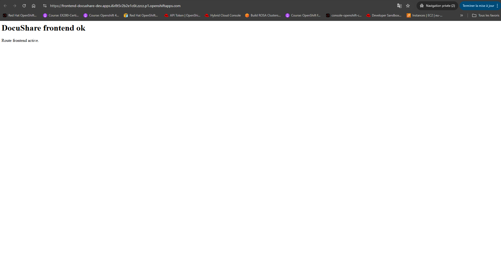

# Lab 07 - Sécuriser une application 3-tiers avec NetworkPolicy

## Contexte

L’équipe DocuShare modernise son application vers une architecture **3-tiers** hébergée sur OpenShift.

L’application contient :

* un frontend web ;
* une API backend ;
* une base PostgreSQL.

Les administrateurs sécurité imposent désormais une règle claire :

* le frontend peut parler au backend ;
* le backend peut parler à la base ;
* aucun autre flux interne ne doit être autorisé.

Vous devez mettre en place cette micro-segmentation réseau via `NetworkPolicy`.

---

## Architecture cible

```text id="yr84hz"
frontend  --> backend --> postgres
```

Flux interdits :

```text id="x5g5mw"
frontend --> postgres
pod inconnu --> postgres
frontend --> backend autres ports
```

---

## Objectif

Déployer une mini application 3-tiers puis sécuriser les communications réseau.

---

## Namespace cible

```text
docushare-dev
```

---

# Étape 1 - Déployer le frontend

Créer un Deployment via ce fichier YAML:

```yaml
apiVersion: apps/v1
kind: Deployment
metadata:
  name: frontend
  namespace: docushare-dev
spec:
  replicas: 1
  selector:
    matchLabels:
      app: frontend
      tier: frontend
  template:
    metadata:
      labels:
        app: frontend
        tier: frontend
    spec:
      containers:
        - name: frontend
          image: registry.redhat.io/ubi9/nodejs-20
          command:
            - /bin/bash
            - -c
          args:
            - |
              echo "const http=require('http');
              console.log('frontend listening on 8080');
              http.createServer((req,res)=>{
                res.writeHead(200, {'Content-Type':'text/html; charset=utf-8'});
                res.end('<html><body><h1>DocuShare frontend ok</h1><p>Route frontend active.</p></body></html>');
              }).listen(8080,'0.0.0.0');" > app.js;
              node app.js
          ports:
            - containerPort: 8080
```

---

# Étape 2 - Déployer le backend

Créer un Deployment à paertir de ce YAML:

```yaml
apiVersion: apps/v1
kind: Deployment
metadata:
  name: backend
  namespace: docushare-dev
spec:
  replicas: 1
  selector:
    matchLabels:
      app: backend
      tier: backend
  template:
    metadata:
      labels:
        app: backend
        tier: backend
    spec:
      containers:
        - name: backend
          image: registry.redhat.io/ubi9/nodejs-20
          command:
            - /bin/bash
            - -c
          args:
            - |
              echo "const http=require('http');
              http.createServer((req,res)=>res.end('backend ok')).listen(8080,'0.0.0.0');" > app.js;
              node app.js
          ports:
            - containerPort: 8080
```

---

# Étape 3 - Déployer PostgreSQL

Créer un Deployment Postgres à partir de ce YAML: 

```yaml
apiVersion: apps/v1
kind: Deployment
metadata:
  name: database
  namespace: docushare-dev
spec:
  replicas: 1
  selector:
    matchLabels:
      app: database
      tier: database
  template:
    metadata:
      labels:
        app: database
        tier: database
    spec:
      containers:
        - name: database
          image: registry.redhat.io/rhel9/postgresql-16
          ports:
            - containerPort: 5432
          env:
            - name: POSTGRESQL_USER
              value: docu
            - name: POSTGRESQL_PASSWORD
              value: Docu123!
            - name: POSTGRESQL_DATABASE
              value: docushare
          resources:
            requests:
              cpu: 100m
              memory: 256Mi
            limits:
              cpu: 500m
              memory: 512Mi
```

---

# Étape 4 - Exposer les services internes

Créer les Services :

* frontend
* backend
* database


```yaml
apiVersion: v1
kind: Service
metadata:
  name: frontend
  namespace: docushare-dev
spec:
  selector:
    app: frontend
  ports:
    - name: http
      port: 8080
      targetPort: 8080
```

```yaml
apiVersion: v1
kind: Service
metadata:
  name: backend
  namespace: docushare-dev
spec:
  selector:
    app: backend
  ports:
    - port: 8080
      targetPort: 8080
```

```yaml
apiVersion: v1
kind: Service
metadata:
  name: database
  namespace: docushare-dev
spec:
  selector:
    app: database
  ports:
    - port: 5432
      targetPort: 5432
```

Et une Route pour le frontend :

```yaml
apiVersion: route.openshift.io/v1
kind: Route
metadata:
  name: frontend
  namespace: docushare-dev
spec:
  to:
    kind: Service
    name: frontend
  port:
    targetPort: http
  tls:
    termination: edge
```    

Testez l’accès au frontend depuis votre navigateur.



---

# Étape 5 - Créer la NetworkPolicy base de données

Autoriser uniquement :

```text
backend --> database:5432
```

---

<details>
<summary>💡 Hint - YAML NetworkPolicy DB</summary>

```yaml
apiVersion: networking.k8s.io/v1
kind: NetworkPolicy
metadata:
  name: allow-backend-to-db
  namespace: docushare-dev
spec:
  podSelector:
    matchLabels:
      tier: database
  policyTypes:
    - Ingress
  ingress:
    - from:
        - podSelector:
            matchLabels:
              tier: backend
      ports:
        - protocol: TCP
          port: 5432
```

</details>

---

# Étape 6 - Créer la NetworkPolicy backend

Autoriser uniquement :

```text
frontend --> backend:8080
```

---

<details>
<summary>💡 Hint - YAML NetworkPolicy backend</summary>

```yaml
apiVersion: networking.k8s.io/v1
kind: NetworkPolicy
metadata:
  name: allow-frontend-to-backend
  namespace: docushare-dev
spec:
  podSelector:
    matchLabels:
      tier: backend
  policyTypes:
    - Ingress
  ingress:
    - from:
        - podSelector:
            matchLabels:
              tier: frontend
      ports:
        - protocol: TCP
          port: 8080
```

</details>

---

# Validation attendue

Vous devez obtenir :

* frontend atteint backend ;
* backend atteint database ;
* frontend n’atteint pas database ;
* pod inconnu n’atteint pas database.

---

# Test recommandé

Créer un pod debug :

```yaml
apiVersion: v1
kind: Pod
metadata:
  name: debug
  namespace: docushare-dev
spec:
  containers:
    - name: debug
      image: registry.access.redhat.com/ubi9/ubi-minimal
      command:
        - /bin/sh
        - -c
        - sleep 3600
```

Puis tester les flux interdits depuis debug :

```text
curl backend:8080
```
Résultat attendu : timeout,

À retenir : `curl backend:8080` car seul `tier=frontend` est autorisé vers le backend.

---

# Ce qu’il faut retenir

* RBAC protège l’API Kubernetes ;
* NetworkPolicy protège les flux entre pods ;
* c’est indispensable en environnement multi-tenant ;
* principe Zero Trust interne.

```text
Humains = RBAC
Pods = NetworkPolicy
```
