# Lab 00 - Installer ODF et explorer Ceph sur ROSA Classic

## Objectif

Le but de ce lab est de couvrir, dans un seul parcours pratique, les notions suivantes :

- le role de `OpenShift Data Foundation` sur AWS ;
- la difference entre le stockage AWS de base et les classes exposees par Ceph ;
- l'installation de l'operateur ODF ;
- le deploiement du cluster de stockage ODF ;
- la lecture des objets `StorageCluster`, `CephCluster`, `CephBlockPool`, `CephFilesystem` ;
- un exercice `RBD / ReadWriteOnce` ;
- un exercice `CephFS / ReadWriteMany` ;
- la lecture du cycle `PVC -> PV -> pod` ;

## Ce qu'il faut comprendre avant de commencer

Sur ce cluster, Ceph n'est pas deploye sur des disques locaux comme sur certaines variantes bare metal.

Ici, le schema est :

1. AWS fournit une classe de stockage de base, par exemple `gp3-csi`.
2. ODF utilise cette classe pour provisionner son stockage interne.
3. Ceph tourne dans le cluster.
4. Ceph expose ensuite de nouvelles classes de stockage aux applications.

## Prérequis

Ce lab suppose que :

- le cluster ROSA Classic est en etat `ready` ;
- vous êtes connecté au cluster avec des comptes full admin
- vous pouvez utiliser un client `oc` depuis votre poste ;
- le cluster dispose d'au moins trois noeuds worker ou infra éligibles pour ODF ;
- la classe AWS `gp3-csi` ou `gp2-csi` existe deja ;


## Ce que vous allez faire dans ce lab

Le parcours complet est le suivant :

1. vérifier le cluster et les classes de stockage AWS disponibles ;
2. vérifier les prérequis ODF sur le cluster ;
3. installer l'opérateur ODF ;
4. deployer le cluster de stockage ODF ;
5. verifier la sante des composants ODF / Ceph ;
6. lire les nouvelles `StorageClass` ;
7. réaliser un exercice `RBD / RWO` ;
8. vérifier la persistance apres recreation d'un pod ;
9. réaliser un exercice `CephFS / RWX` ;
10. relire `PVC`, `PV`, `StorageClass` et objets Ceph ;
11. nettoyer le namespace applicatif du lab.

## Etape 1 - Verifier le cluster et le stockage de base AWS

### A faire


Faire un oc login au cluster, puis lancer ces commandes 

```powershell
oc whoami
oc config current-context
oc get nodes -o wide
oc get sc
```

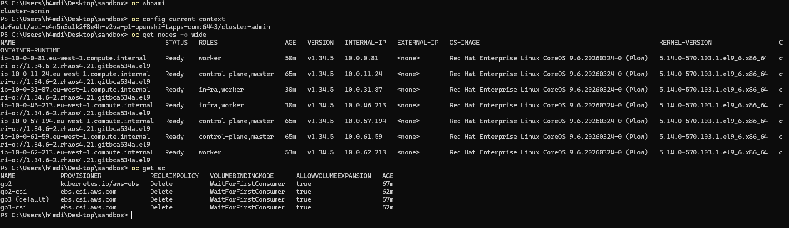

Puis reperez la classe AWS de base.

Windows / PowerShell :

```powershell
oc get sc | Select-String "gp2|gp3|ebs"
```

Linux / bash :

```bash
oc get sc | grep -E "gp2|gp3|ebs"
```

### Ce que vous devez trouver

- vous etes connecte au bon cluster ;
- vous voyez les noeuds du cluster ;
- vous avez au moins une classe de stockage AWS, souvent `gp3-csi` ;
- a ce stade, vous n'avez pas encore les classes Ceph de type `ocs-*`.

### Ce qu'il faut retenir

- avant ODF, le cluster expose seulement le stockage AWS de base ;
- Ceph n'est pas encore visible ;
- vous allez maintenant ajouter cette couche de stockage au cluster.

## Etape 2 - Verifier les prerequis ODF

### A faire

Commencez par verifier le nombre de noeuds disponibles :

```powershell
oc get nodes -L node-role.kubernetes.io/worker,node-role.kubernetes.io/infra
```

Regardez ensuite si ODF ou Ceph sont deja presents.

Windows / PowerShell :

```powershell
oc get csv -A | Select-String "odf|ocs|rook|noobaa"
oc get storagecluster -A
oc get cephcluster -A
```

Linux / bash :

```bash
oc get csv -A | grep -E "odf|ocs|rook|noobaa"
oc get storagecluster -A
oc get cephcluster -A
```

### Ce que vous devez trouver

- au moins trois noeuds exploitables pour ODF ;
- aucun `StorageCluster` si vous partez d'un cluster vierge ;
- aucun `CephCluster` si ODF n'est pas encore installe.

### Ce qu'il faut retenir

- ODF demande une vraie base de cluster, pas un cluster minimal trop serre ;
- si vous voyez deja un `StorageCluster`, ne relancez pas le lab a l'aveugle ;
- il faut d'abord comprendre l'etat existant.

## Etape 3 - Installer l'operateur OpenShift Data Foundation

### A faire

Installez l'opérateur depuis la console OpenShift.

Parcours :

1. ouvrez la console du cluster ;
2. allez dans `Ecosystem -> Software Catalog` ;
3. cherchez `OpenShift Data Foundation` ;
4. cliquez sur `Install` ;
5. choisissez :
   - `Update channel` : `stable-4.21`
   - `Installation mode` : `A specific namespace on the cluster`
   - `Installed namespace` : `openshift-storage`
   - `Approval strategy` : `Manual`
6. si la console affiche l'avertissement `Cluster en mode STS`, renseignez un `Role ARN` ;
7. pour ce cluster, recuperez l'ARN avec :
   - Windows / PowerShell : `& terraform.exe '-chdir=./terraform-rosa-classic' output -raw odf_sts_role_arn`
   - Linux / bash : `terraform -chdir=./terraform-rosa-classic output -raw odf_sts_role_arn`
   - exemple attendu : `arn:aws:iam::809747278553:role/tf-rosa-classic/atelier-rosa-classic-odf-operator-role`
8. laissez activee l'option `Console plugin` ;
9. cliquez sur `Install`.

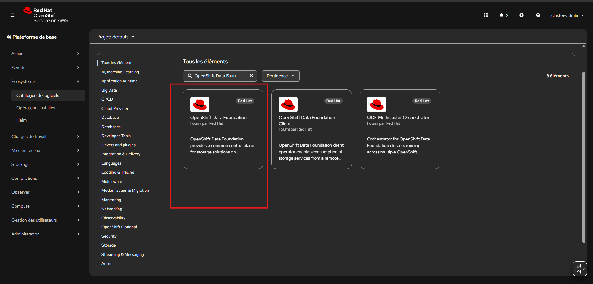

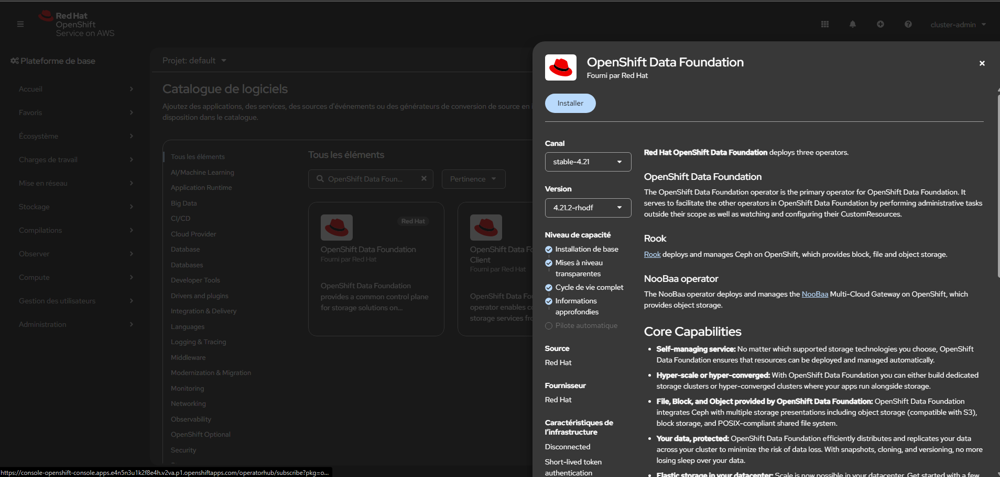

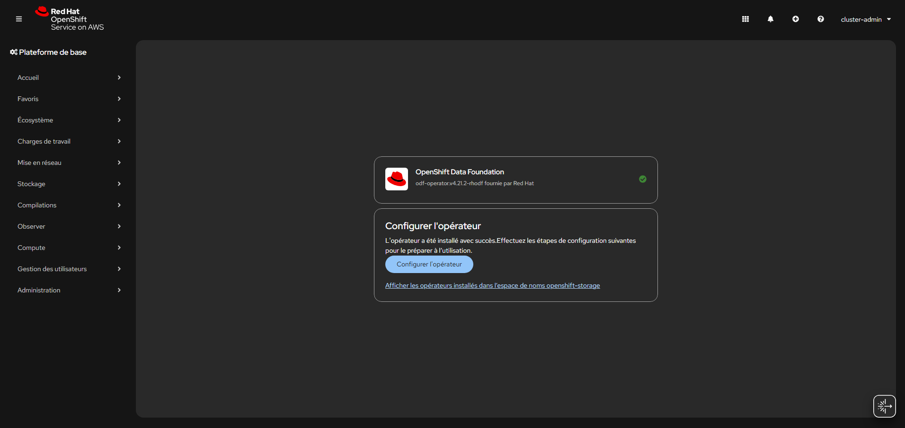

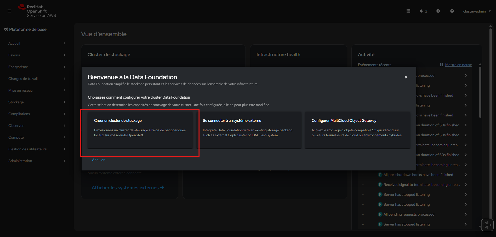

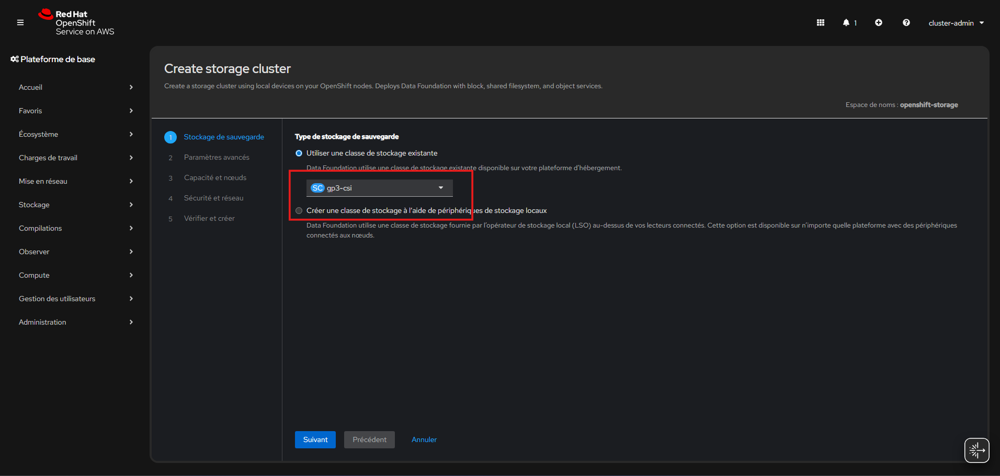

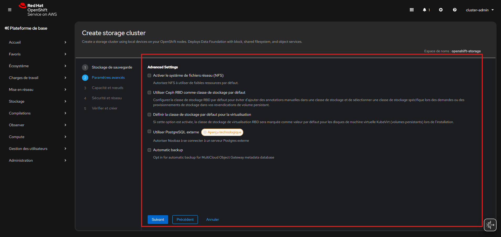

Pour recuperer l'ARN :

```powershell
& terraform.exe '-chdir=./terraform-rosa-classic' output -raw odf_sts_role_arn
```

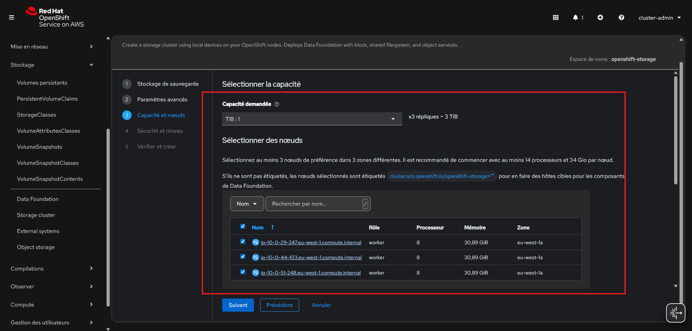

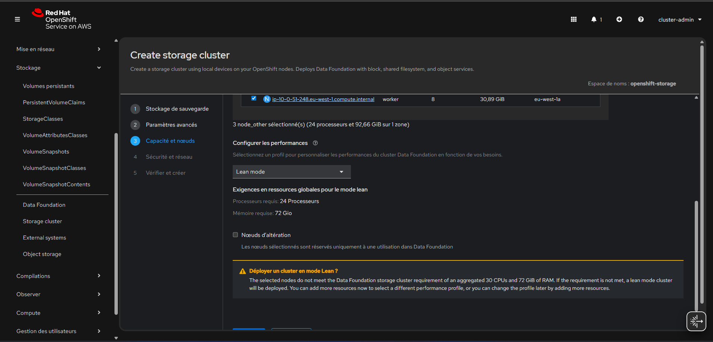

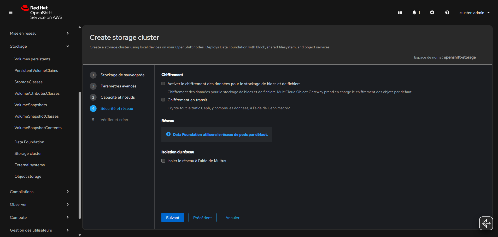

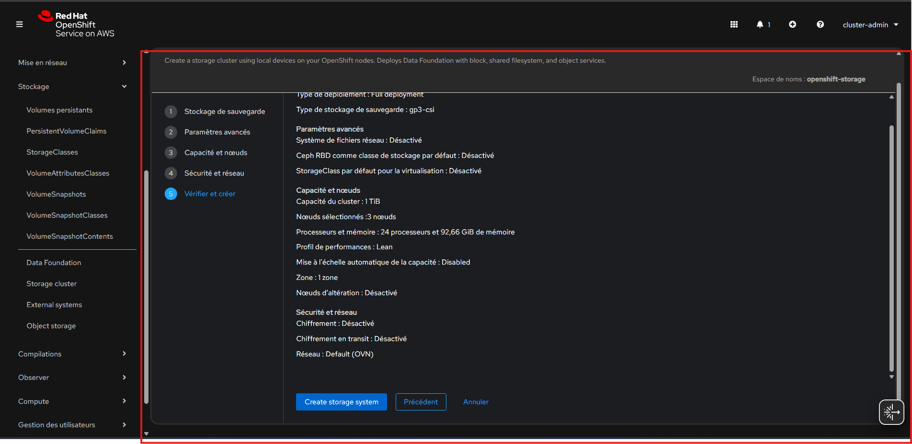

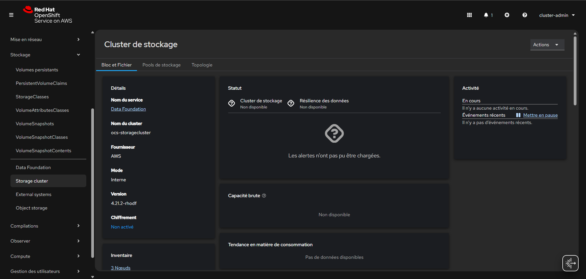

### Ce que vous devez trouver

- l'operateur ODF apparait dans `Installed Operators` ;
- le namespace `openshift-storage` existe ;
- le menu `Storage -> Data Foundation` devient disponible ;
- si le cluster est en mode STS, l'installation ne reste pas bloquee a cause d'un `Role ARN` manquant.

### Ce qu'il faut retenir

- l'operateur ne fournit pas encore le stockage ;
- il installe la logique de gestion ODF ;
- sur ROSA STS, il faut aussi lui donner un role IAM adapte.

## Etape 4 - Deployer le cluster de stockage ODF

### A faire

Depuis `Storage -> Data Foundation`, lancez l'assistant de creation du cluster de stockage.

Choix recommandes pour ce lab :

- `Create storage cluster`
- backing storage class : `gp3-csi`
- options avancees : laissez les options facultatives desactivees
- capacite demandee : `1 TiB`
- selection des noeuds : choisissez les trois workers
- profil : `Lean mode`
- chiffrement et options reseau avancees : laissez desactive pour le lab

Choix pratiques a retenir :

- mettez `1 TiB` pour le lab ;
- selectionnez les 3 workers ;
- laissez les options de dedicace / alteration desactivees.

Pendant le deploiement, vous verrez souvent des evenements attendus comme :

- `Pulling image`
- `AttachVolume`
- `Add eth0`
- `requeuing Ceph`

Cela veut dire que le cluster est en train de :

- creer les pods ODF/Ceph ;
- attacher les volumes EBS ;
- demarrer les composants Ceph ;
- rejouer des reconciliations cote operateurs.

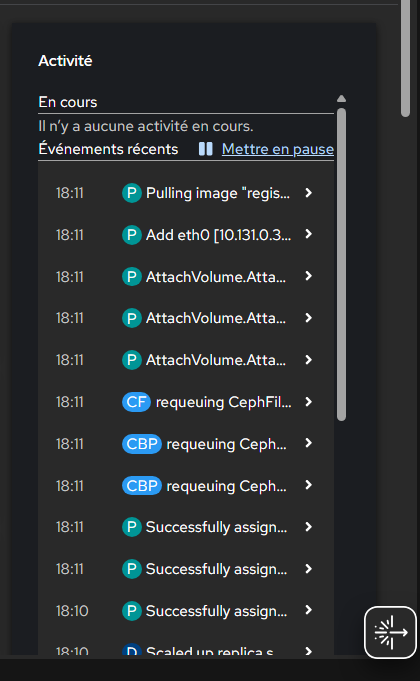

Attendez ensuite :

- la creation du `CephCluster` ;
- la creation du `CephBlockPool` ;
- la creation du `CephFilesystem` ;
- l'apparition des `StorageClass` `ocs-storagecluster-ceph-rbd` et `ocs-storagecluster-cephfs`.

Apres quelques minutes, le cluster de stockage devient exploitable :

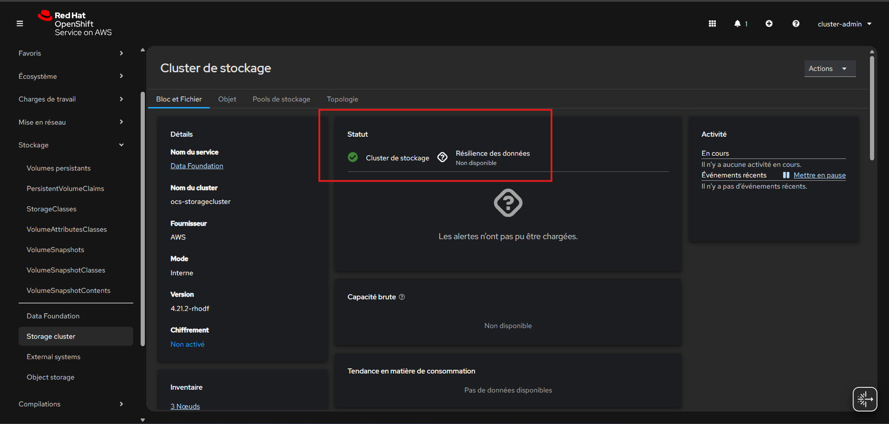

Il est recommande d'attendre jusqu'a voir un evenement du type :

`successfully configured CephCluster "openshift-storage/ocs-storagecluster-cephcluster"`

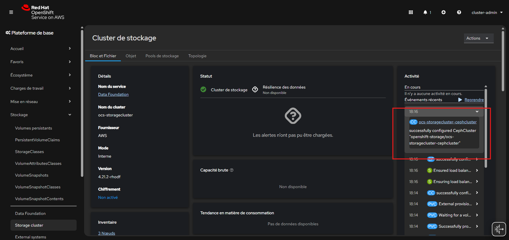

Puis de verifier l'apparition des `StorageClass` ODF/Ceph :

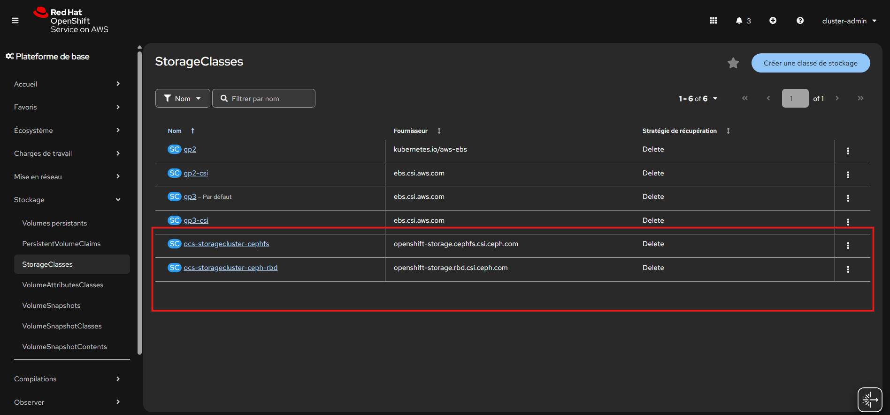

### Ce que vous devez trouver

- un `StorageCluster` en cours de reconciliation ;
- un `CephCluster` qui passe ensuite en `Ready` ;
- les classes `ocs-storagecluster-ceph-rbd` et `ocs-storagecluster-cephfs`.

### Ce qu'il faut retenir

- a cette etape, ODF ne se contente plus d'installer un operateur ;
- il deploie le vrai plan de stockage qui sera consomme par les applications.

## Etape 5 - Verifier la sante de ODF et de Ceph

### A faire

Observez maintenant les composants deployes :

Vue console :

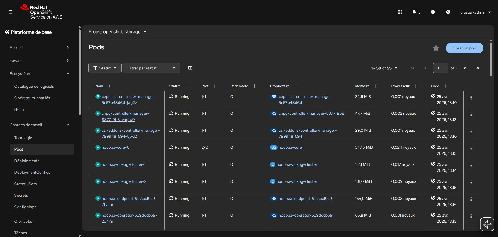

```powershell
oc get pods -n openshift-storage
oc get storagecluster -n openshift-storage
oc get cephcluster -n openshift-storage
oc get cephblockpool -n openshift-storage
oc get cephfilesystem -n openshift-storage
```

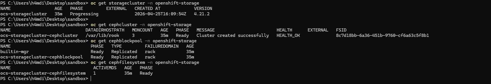

Si besoin, detaillez :

```powershell
oc describe storagecluster ocs-storagecluster -n openshift-storage
oc describe cephcluster ocs-storagecluster-cephcluster -n openshift-storage
```

### Ce que vous devez trouver

- des pods ODF, Rook-Ceph et NooBaa en cours de creation puis `Running` ;
- un `StorageCluster` en phase `Ready` ou equivalente ;
- un `CephCluster` sain ;
- un `CephBlockPool` et un `CephFilesystem`.

### Ce qu'il faut retenir

- le plan stockage n'est pas magique ;
- il est porte par des operateurs, des pods et des CRD ;
- si le stockage ne marche pas, c'est souvent ici que le diagnostic commence.

## Etape 6 - Lire les nouvelles StorageClass exposees aux applications

### A faire

Listez de nouveau les classes de stockage :

```powershell
oc get sc
```

Reperez ensuite les classes ODF / Ceph.

Windows / PowerShell :

```powershell
oc get sc | Select-String "ocs|ceph|noobaa"
```

Linux / bash :

```bash
oc get sc | grep -E "ocs|ceph|noobaa"
```

### Ce que vous devez trouver

Au minimum, vous devez retrouver des classes du type :

- `ocs-storagecluster-ceph-rbd`
- `ocs-storagecluster-cephfs`
- `openshift-storage.noobaa.io`

### Ce qu'il faut retenir

- `ceph-rbd` correspond a du bloc, donc tres adapte a `RWO` ;
- `cephfs` correspond a du fichier partage, donc adapte a `RWX` ;
- NooBaa couvre la partie objet, qui n'est pas le coeur de ce lab.

## Etape 7 - Créer un PVC RBD et un pod consommateur

### A faire

Travaillez maintenant avec votre compte participant dans la console OpenShift.

1. connectez-vous avec votre identifiant et votre mot de passe ;
2. choisissez le provider `workshop-users` ;
3. créer votre projet (`p1-lab` pour participant1 ou `p2-lab` pour participant2) ;
4. ouvrez `+Add -> Import YAML`.

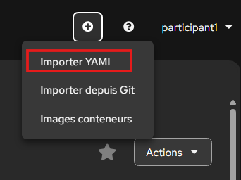

Collez d'abord ce `PVC` bloc `RWO` :

```yaml
apiVersion: v1
kind: PersistentVolumeClaim
metadata:
  name: rbd-demo
spec:
  accessModes:
    - ReadWriteOnce
  storageClassName: ocs-storagecluster-ceph-rbd
  resources:
    requests:
      storage: 1Gi
```

Cliquez sur `Create`.

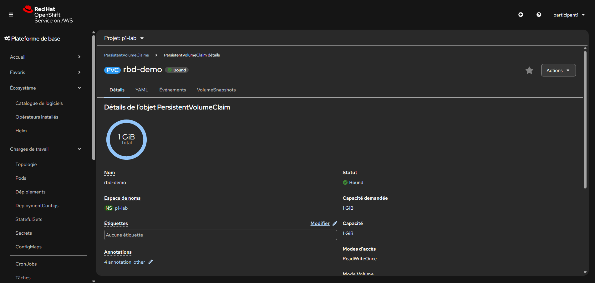

Revenez ensuite dans `+Add -> Import YAML` et collez ce pod :

```yaml
apiVersion: v1
kind: Pod
metadata:
  name: rbd-writer
spec:
  restartPolicy: Never
  containers:
    - name: writer
      image: registry.access.redhat.com/ubi9/ubi-minimal:latest
      command:
        - /bin/sh
        - -c
        - echo ceph-rbd-rosa > /data/marker.txt && sleep 3600
      volumeMounts:
        - name: data
          mountPath: /data
  volumes:
    - name: data
      persistentVolumeClaim:
        claimName: rbd-demo
```

Pour verifier depuis la console :

1. allez dans `Storage -> PersistentVolumeClaims` ;
2. verifiez que `rbd-demo` passe en `Bound` ;
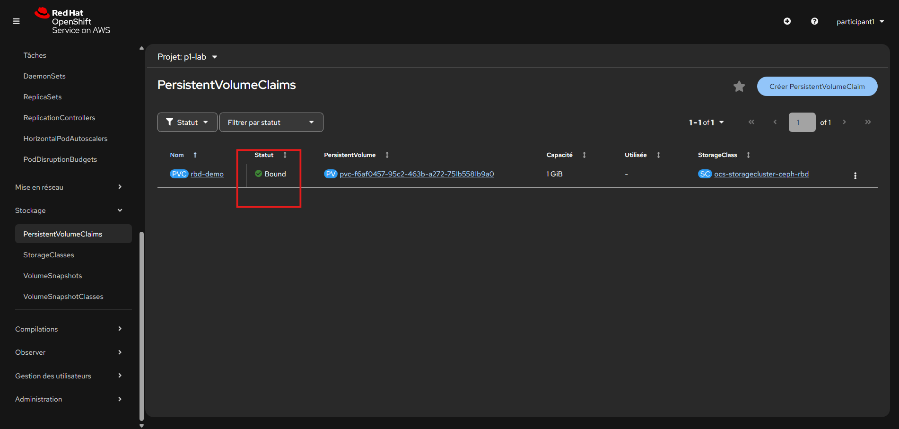
3. allez dans `Workloads -> Pods` ;
4. verifiez que `rbd-writer` passe en `Running` ;
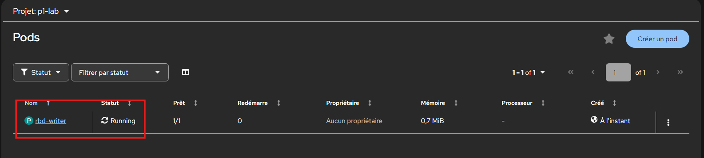
5. ouvrez le pod `rbd-writer` ;
6. ouvrez l'onglet `Terminal` ;
7. lancez :

```sh
cat /data/marker.txt
```

Vous devez lire `ceph-rbd-rosa`.

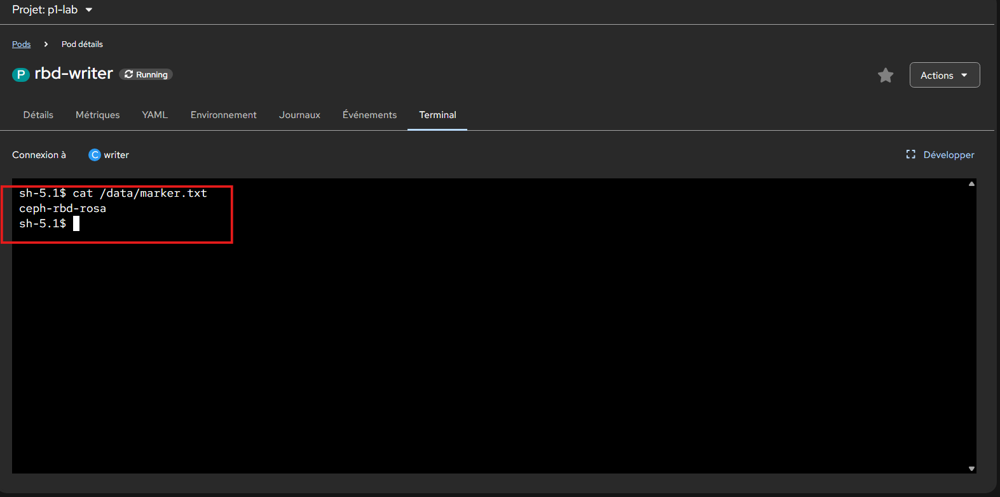


### Ce que vous devez trouver

- le `PVC` passe en `Bound` ;
- un `PV` est cree dynamiquement ;
- le pod devient `Running` ;
- le fichier `marker.txt` existe.

### Ce qu'il faut retenir

- le `PVC` est la demande ;
- le `PV` est la ressource reelle ;
- la `StorageClass` Ceph pilote le provisionnement ;
- le pod consomme le `PVC`, pas directement la classe ;
- si deux participants executent cet exercice en parallele, chacun provisionne dans son propre namespace sans collision avec l'autre.

## Etape 8 - Recréer un pod et relire la donnee

### A faire

Dans `Workloads -> Pods`, supprimez `rbd-writer` avec le menu `Actions -> Delete Pod`.

Revenez ensuite dans `+Add -> Import YAML` et collez ce second pod :

```yaml
apiVersion: v1
kind: Pod
metadata:
  name: rbd-reader
spec:
  restartPolicy: Never
  containers:
    - name: reader
      image: registry.access.redhat.com/ubi9/ubi-minimal:latest
      command:
        - /bin/sh
        - -c
        - sleep 3600
      volumeMounts:
        - name: data
          mountPath: /data
  volumes:
    - name: data
      persistentVolumeClaim:
        claimName: rbd-demo
```

Quand `rbd-reader` est `Running` :

1. ouvrez son detail ;
2. ouvrez l'onglet `Terminal` ;
3. lancez :

```sh
cat /data/marker.txt
```

<details>
<summary>Hint - Que prouve cette étape ?</summary>

Vous avez supprime le pod, pas le volume.

Donc :

- le pod a disparu ;
- le `PVC` est reste present ;
- la donnee écrite avant la suppression du pod est toujours lisible.

</details>

### Ce que vous devez trouver

- le pod repart avec le meme `PVC` ;
- le fichier precedemment ecrit est toujours la ;
- la persistance est donc portée par le volume.

### Ce qu'il faut retenir

- supprimer le pod ne supprime pas la donnee persistante ;
- c'est exactement ce que vous cherchez pour une base de donnees.

## Etape 9 - Exercice partage : tester CephFS en ReadWriteMany

### A faire

Revenez dans `+Add -> Import YAML` et collez ce `PVC` partage `RWX` :

```yaml
apiVersion: v1
kind: PersistentVolumeClaim
metadata:
  name: cephfs-demo
spec:
  accessModes:
    - ReadWriteMany
  storageClassName: ocs-storagecluster-cephfs
  resources:
    requests:
      storage: 1Gi
```

Puis creez un pod ecrivain :

```yaml
apiVersion: v1
kind: Pod
metadata:
  name: cephfs-writer
spec:
  restartPolicy: Never
  containers:
    - name: writer
      image: registry.access.redhat.com/ubi9/ubi-minimal:latest
      command:
        - /bin/sh
        - -c
        - echo cephfs-shared-rosa > /shared/hello.txt && sleep 3600
      volumeMounts:
        - name: shared
          mountPath: /shared
  volumes:
    - name: shared
      persistentVolumeClaim:
        claimName: cephfs-demo
```

Puis un pod lecteur :

```yaml
apiVersion: v1
kind: Pod
metadata:
  name: cephfs-reader
spec:
  restartPolicy: Never
  containers:
    - name: reader
      image: registry.access.redhat.com/ubi9/ubi-minimal:latest
      command:
        - /bin/sh
        - -c
        - sleep 3600
      volumeMounts:
        - name: shared
          mountPath: /shared
  volumes:
    - name: shared
      persistentVolumeClaim:
        claimName: cephfs-demo
```

Pour verifier le partage depuis la console :

1. allez dans `Storage -> PersistentVolumeClaims` ;
2. verifiez que `cephfs-demo` est `Bound` ;
3. allez dans `Workloads -> Pods` ;
4. verifiez que `cephfs-writer` et `cephfs-reader` sont `Running` ;
5. ouvrez `cephfs-reader` ;
6. dans l'onglet `Terminal`, lancez :

```sh
cat /shared/hello.txt
```

Vous devez lire `cephfs-shared-rosa`.

<details>
<summary>Hint - Quel est le vrai point a observer ici ?</summary>

Le point cle n'est pas seulement que le fichier existe.

Le vrai signal est :

- un meme `PVC` ;
- monte dans deux pods differents ;
- avec une ecriture lisible depuis le second pod.

C'est ce qui demontre le comportement `ReadWriteMany`.

</details>

### Ce que vous devez trouver

- le `PVC` `RWX` est monte par deux pods ;
- le second pod lit le fichier ecrit par le premier ;
- vous avez donc un vrai cas de stockage partage.

### Ce qu'il faut retenir

- `RBD` couvre bien le besoin bloc ;
- `CephFS` couvre bien le besoin fichier partage ;
- le bon choix depend du workload ;
