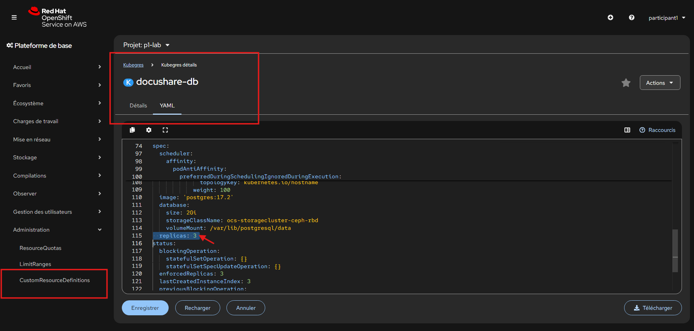
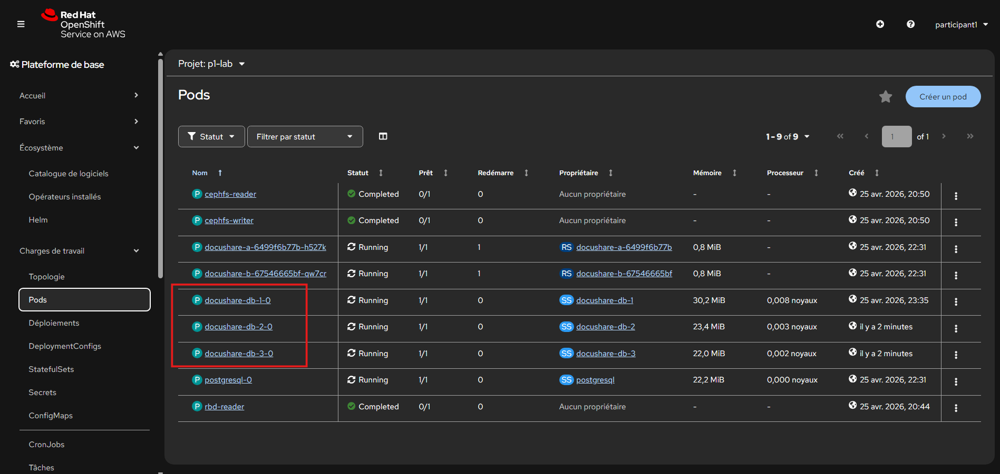
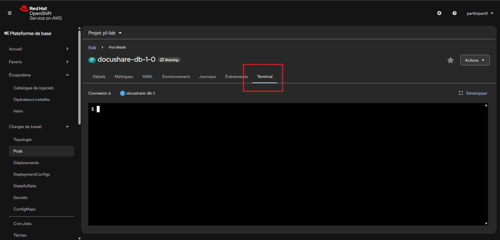
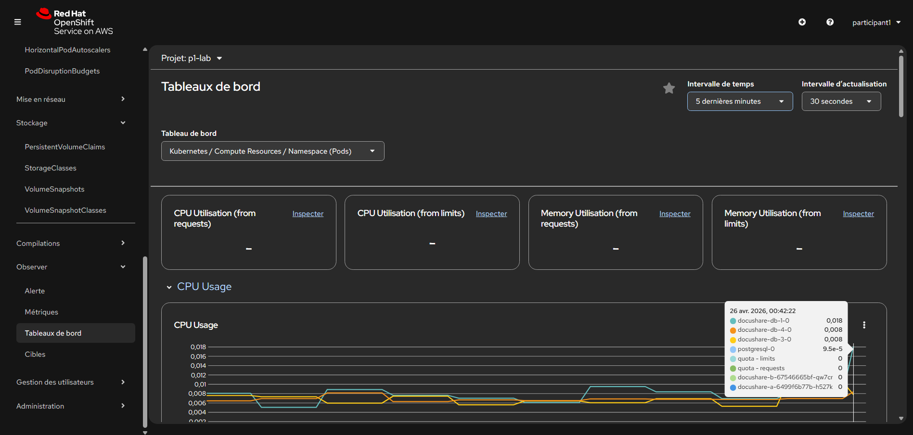

# Lab 02 - Industrialiser la base PostgreSQL de DocuShare avec Kubegres sur ROSA

---

# Contexte

La première version de **DocuShare** est en production.

Vous avez déjà mis en place :

- une base PostgreSQL déployée manuellement ;
- un stockage Ceph persistant ;
- un espace documentaire partagé ;
- des snapshots CSI.

L’équipe plateforme souhaite maintenant industrialiser la gestion de la base de données.

Les objectifs sont :

- simplifier l’exploitation ;
- automatiser la haute disponibilité ;
- faciliter les mises à jour ;
- standardiser les déploiements ;
- préparer les sauvegardes.

Pour cela, l’équipe a déjà installé **Kubegres** sur le cluster.
Votre mission consiste à migrer DocuShare vers une base PostgreSQL pilotée par Kubegres.

---

# Objectifs

À travers ce lab, vous allez manipuler :

- un Kubernetes Operator ;
- PostgreSQL via Kubegres ;
- la persistance sur Ceph ;
- la réplication PostgreSQL ;
- la reprise automatique ;
- la montée en charge ;
---

# Prérequis

Les éléments suivants sont déjà disponibles :

- console OpenShift ;

| Utilisateur | Namespace |
|---|---|
| participant1 | p1-lab |
| participant2 | p2-lab |

- Classes disponibles :
  - `ocs-storagecluster-ceph-rbd`
  - `ocs-storagecluster-cephfs`

- Kubegres installé

---

# Étape 1 - Se connecter au namespace

Connectez-vous à OpenShift puis sélectionnez votre namespace :

* `p1-lab`
* `p2-lab`

---

# Étape 2 - Déployer PostgreSQL DocuShare via Kubegres

## Mission

Vous allez remplacer la base PostgreSQL artisanale par une base gérée via Kubegres.

---

## Contraintes attendues

Créer :

### Secret PostgreSQL

Un Secret nommé `docushare-db-secret` contenant deux champs sous `stringData` :
- superUserPassword:DocuShare123!
- replicationUserPassword: ReplicaDocu123!

### Ressource Kubegres

Configurer :

* nom : `docushare-db`
* utilisateur : `docushare`
* stockage persistant `2Gi`
* `StorageClassName` : `ocs-storagecluster-ceph-rbd`
* 1 instance pour commencer
* reference au Secret `docushare-db-secret`

---

## Validation attendue

Montrez :

* la ressource Kubegres créée ;
* un pod PostgreSQL ;
* un PVC créé automatiquement ;
* un service PostgreSQL.

---


<details>
<summary>💡 Hint - Squelette du Secret</summary>

```yaml
apiVersion: v1
kind: Secret
metadata:
  name: ...
type: Opaque
stringData:
  superUserPassword: ...
  replicationUserPassword: ...
```

</details>

---

<details>
<summary>💡 Hint - Squelette Kubegres</summary>

```yaml
apiVersion: kubegres.reactive-tech.io/v1
kind: Kubegres
metadata:
  name: docushare-db
spec:
  replicas: 1
  image: postgres:17.2
  port: 5432
  database:
    size: 2Gi
    storageClassName: ocs-storagecluster-ceph-rbd
  env:
    - name: POSTGRES_PASSWORD
      valueFrom:
        secretKeyRef:
          name: ....
          key: superUserPassword
    - name: POSTGRES_REPLICATION_PASSWORD
      valueFrom:
        secretKeyRef:
          name: ...
          key: replicationUserPassword
    - name: POSTGRES_USER
      value: docushare
    - name: POSTGRES_DB
      value: docushare

```

</details>

---

# Étape 4 - Vérifier les objets générés automatiquement

## Mission

Kubegres crée plusieurs objets Kubernetes.

Listez les ressources du namespace, retrouvez :

* pod PostgreSQL ;
* PVC ;
* service ;
* secret ;
* ressources Kubegres.

---

# Étape 5 - Activer la haute disponibilité

## Mission

L’équipe exploitation souhaite une meilleure résilience.

Modifiez la ressource Kubegres pour passer à :

```text
3 replicas
```



---

## Résultat attendu

Kubegres doit créer :

* 1 primaire ;
* 2 replicas.



---

## Validation attendue

Montrez la liste des pods, vous devez retrouver plusieurs pods PostgreSQL.

---

<details>
<summary>💡 Hint</summary>

Cherchez le champ :

```yaml
replicas:
```

dans la ressource Kubegres.

</details>

---

# Étape 6 - Simuler une panne

## Mission

Supprimez manuellement un pod PostgreSQL pour simuler une panne, montrez :

* recréation automatique ;
* ou maintien du service ;
* plateforme toujours opérationnelle.

---

# Étape 7 - Tester la persistance

## Mission

Même après suppression d’un pod, les données doivent rester conservées.

Vérifiez que :

* les PVC sont toujours présents ;
* les pods redémarrent sans perte.

---

# Étape 8 - Réintégrer DocuShare

## Mission

L’application DocuShare doit maintenant utiliser cette nouvelle base managée.

Identifiez :

* le service PostgreSQL créé ;
* le port ;
* les credentials stockés en Secret.

---

## Validation attendue

Montrez que l’application pourrait se connecter à :

```text
docushare-db
```

ou au service généré par Kubegres.

---

# Démonstration finale attendue

Présentez la nouvelle architecture DocuShare :

## Avant

* StatefulSet manuel

## Après

* PostgreSQL géré par Kubegres

## Gains

* haute disponibilité ;
* simplification opérations ;
* standardisation ;
* meilleure maintenabilité.

---

# Étape 9 - Observer la plateforme en fonctionnement

L’équipe exploitation souhaite maintenant vérifier que la nouvelle base PostgreSQL managée fonctionne correctement en production.

Vous allez utiliser les dashboards natifs OpenShift pour observer :

- la consommation CPU ;
- la mémoire ;
- l’activité réseau ;
- les pods PostgreSQL ;
- les réplicas Kubegres.

---

## Accès au monitoring

Depuis la console OpenShift :

```text
Observe → Dashboards
````

Sélectionnez :

```text
Kubernetes / Compute Resources / Namespace (Pods)
```

Puis choisissez votre namespace :

* `p1-lab`
* `p2-lab`

---

## Ce que vous devez observer

Observer les échanges entre les instances PostgreSQL et, à l’aide des graphiques ainsi que de la liste des pods, identifiez le pod primaire PostgreSQL.

---

<details>
<summary>💡 Hint - Comment reconnaître le pod primaire</summary>

Dans une architecture PostgreSQL répliquée :

### Le pod primaire reçoit généralement :

- les connexions applicatives en écriture ;
- les opérations `INSERT` ;
- les `UPDATE` ;
- les `DELETE` ;
- davantage d’activité CPU ;
- plus de trafic réseau sortant vers les replicas.

### Les pods replicas reçoivent généralement :

- les flux de réplication ;
- moins d’écritures directes ;
- une activité CPU plus faible ;
- un trafic réseau lié à la synchronisation.

### Ce que vous pouvez observer dans les dashboards

#### CPU

Le pod primaire est souvent celui qui consomme le plus lors d’insertions.

#### Réseau

Le pod primaire envoie des données aux replicas.

#### Mémoire

Le pod primaire peut avoir plus de buffers actifs.

### Méthode simple

1. Lancez des insertions SQL.
2. Rafraîchissez les dashboards.
3. Comparez les pods `docushare-db-*`.
4. Le pod le plus actif est généralement le primaire.

### Étape 1 - Se connecter dans un pod PostgreSQL



---

### Étape 2 - Créer une table de test


```bash
PGPASSWORD='DocuShare123!' psql -U docushare -d docushare -c "create table demo(id serial primary key, label text, created_at timestamp default now());"
```

### Étape 3 - Générer des écritures massives

```bash
PGPASSWORD='DocuShare123!' psql -U docushare -d docushare -c "insert into demo(label) select md5(random()::text) from generate_series(1,50000);"
```

Vous pouvez relancer plusieurs fois la commande.

---

### Étape 4 - Générer des lectures

```bash
PGPASSWORD='DocuShare123!' psql -U docushare -d docushare -c "select count(*) from demo;"
```

```bash
PGPASSWORD='DocuShare123!' psql -U docushare -d docushare -c "select * from demo order by id desc limit 20;"
```

### Étape 5 - Observer les dashboards

Retournez dans :

```text
Observe → Dashboards
Kubernetes / Compute Resources / Namespace (Pods)
```

Puis observez :

* CPU Usage
* Memory Usage
* Network Usage

Le pod le plus actif pendant les insertions est généralement le primaire.




</details>
