# Lab0 - Recréer Campus depuis la console sur un cluster OKD ROSA

## Objectif 

Dans ce lab, vous allez recréer l'application **Campus** depuis la **console OpenShift**, sans vous appuyer sur le client `oc` fait dans le lab de Sandbox.

Le but est de refaire calmement toute la chaîne :

- `ImageStream` ;
- `BuildConfig` ;
- `Build` ;
- `Deployment` ;
- `Service` ;
- `Route`.

## Ce que vous allez créer

Vous allez créer :

- `campus-backend` avec un `ImageStream`, un `BuildConfig`, un `Deployment` et un `Service`
- `campus-frontend` avec un `ImageStream`, un `BuildConfig`, un `Deployment`, un `Service` et une `Route`
- `campus-db` avec un `Secret`, un `Service` et un `StatefulSet`

## Prérequis

Avant de commencer :

- le cluster OKD doit être opérationnel ;
- vous devez pouvoir ouvrir la console web utilisant votre compte `participant1` ou `participant2` ;
- créer un projet `campus-p1` ou `campus-p2` selon votre utilisateur ;
- Avoir un dépôt Git distant, exemple Gitlab, public, contenant le code source de Campus. 

exemple: `https://mon-repo/campus-lab.git`

NB. Pour des raisons de droits d’accès, il est préférable que ce dépôt soit public. Vous pouvez aussi utiliser un dépôt privé, mais il faudra alors configurer les accès dans OpenShift.

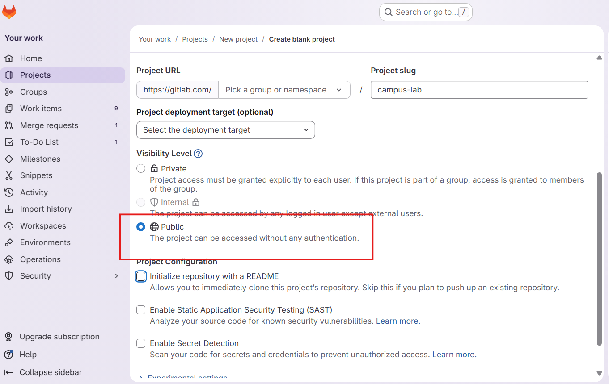

le repo doit avoir la structure suivante :

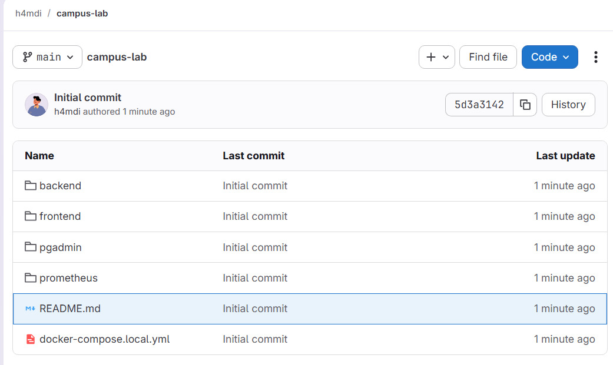


## Point important sur la stratégie de build

Le backend Campus est un projet Spring Boot Java 21.

Pour rester cohérents avec le code source du dépôt, nous utilisons donc :

- un `BuildConfig` de type `Docker` pour le backend ;
- un `BuildConfig` de type `Docker` pour le frontend.

Le backend et le frontend sont donc construits à partir de leurs `Dockerfile` respectifs présents dans le dépôt Git.

## Étape 1 - Créer le projet et le dépôt source

Dans la console :

1. Créer un projet `campus-p1` ou bien `campus-p2` selon votre utilisateur :

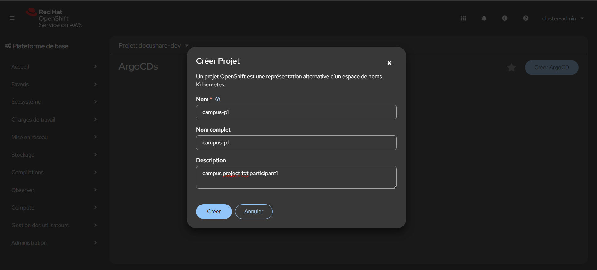

2. Une fois le projet crée, cliquer sur `Workloads` puis `Add Page` :

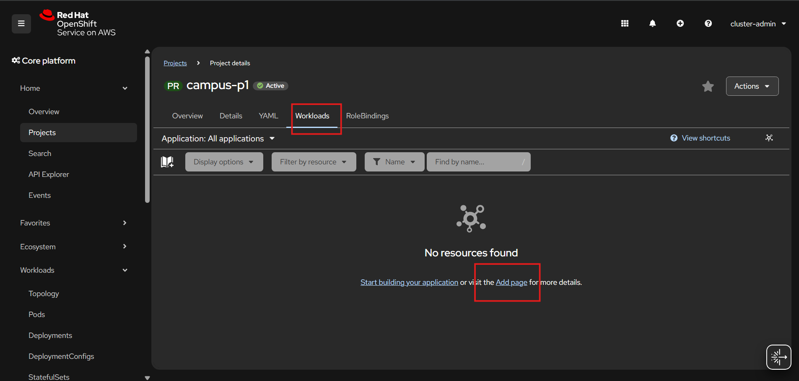

3. Depuis la section `Git Repository`, cliquez sur `Import From Git` :


Un formulaire s'ouvre alors pour configurer la source de votre build.

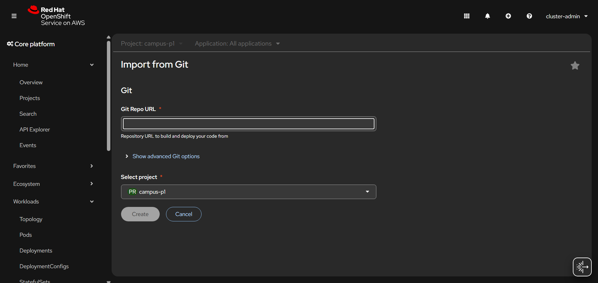


### Champs à remplir

| Champ            | Valeur                                   |
| ---------------- | ---------------------------------------- |
| Git Repo URL     | `https://mon-repo/campus-lab.git` |
| Git reference    | `main`                                   |
| Context dir      | `backend`                                |
| Source Secret    | laisser vide                             |
| Project          | `campus-p1`                              |
| Builder Image    | ne pas utiliser                          |
| Strategy         | `Dockerfile`                  |
| Dockerfile path  | `Dockerfile`                             |
| Application name | `campus`                                 |
| Name             | `campus-backend`                         |
| Resource type    | `Deployment`                             |
| Target port      | `8080`                                   |
| Create a Route   | optionnel pour backend                   |

Point important

Même si OpenShift détecte une image builder Java, il faut choisir l’option basée sur le Dockerfile.

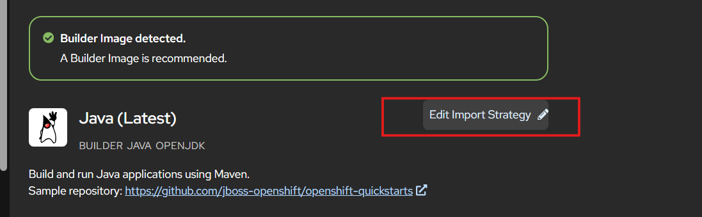

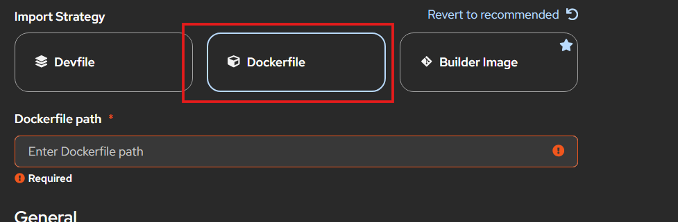


Une fois le backend créée, vous pouvez aller au top-bar, puis cliquez sur `+` -> `Import from Git`.

Et configurer le frontend de la même manière que le backend, en adaptant les champs necessaries.

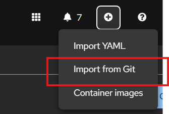

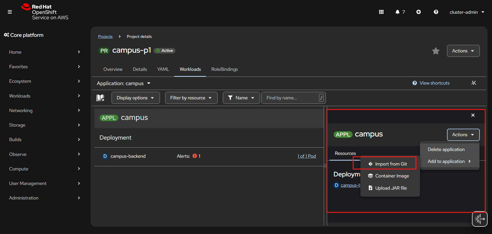

Une fois le frontend créé, vous devez avoir les builds et les image streams liés à votre projet, campus-backend et campus-frontend.


> **Note importante**
>
> Lors de l’utilisation de **Import from Git**, OpenShift génère automatiquement les `Deployment` et les ressources (services, routes,.. ) du frontend et du backend à partir des paramètres détectés.
>
> Ces ressources permettent un démarrage rapide, mais ils restent génériques.
>
> Nous allons les supprimer et les recréer manuellement pour mieux contrôler leur configuration, notamment les probes, les ressources, les variables d’environnement, etc.

Lors de suppression des deployments, il faut bien veiller à ne pas supprimer les `BuildConfig` et les `ImageStream` associés, sinon il faudra tout recréer.

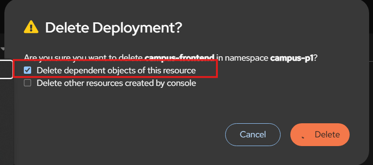

## Étape 5 - Créer PostgreSQL

Dans `Importer un YAML`, créez d'abord le secret.

### Secret PostgreSQL

```yaml
apiVersion: v1
kind: Secret
metadata:
  name: campus-db-secret
type: Opaque
stringData:
  username: campus
  password: campus123
  database: campus
```

Créez ensuite le service.

### Service PostgreSQL

```yaml
apiVersion: v1
kind: Service
metadata:
  name: campus-db
spec:
  ports:
    - name: postgres
      port: 5432
      targetPort: 5432
  selector:
    app: campus-db
```

Créez enfin le `StatefulSet`.

### StatefulSet PostgreSQL

```yaml
apiVersion: apps/v1
kind: StatefulSet
metadata:
  name: campus-db
spec:
  serviceName: campus-db
  replicas: 1
  selector:
    matchLabels:
      app: campus-db
  template:
    metadata:
      labels:
        app: campus-db
        tier: database
    spec:
      containers:
        - name: postgres
          image: quay.io/sclorg/postgresql-16-c9s:latest
          ports:
            - containerPort: 5432
              name: postgres
          env:
            - name: POSTGRESQL_USER
              valueFrom:
                secretKeyRef:
                  name: campus-db-secret
                  key: username
            - name: POSTGRESQL_PASSWORD
              valueFrom:
                secretKeyRef:
                  name: campus-db-secret
                  key: password
            - name: POSTGRESQL_DATABASE
              valueFrom:
                secretKeyRef:
                  name: campus-db-secret
                  key: database
          readinessProbe:
            tcpSocket:
              port: 5432
            initialDelaySeconds: 10
            periodSeconds: 10
          livenessProbe:
            tcpSocket:
              port: 5432
            initialDelaySeconds: 30
            periodSeconds: 20
          volumeMounts:
            - name: campus-db-data
              mountPath: /var/lib/pgsql/data
  volumeClaimTemplates:
    - metadata:
        name: campus-db-data
      spec:
        accessModes:
          - ReadWriteOnce
        resources:
          requests:
            storage: 5Gi
```

Vérifiez ensuite qu'un pod `campus-db-0` démarre correctement.

## Étape 6 - Déployer le backend

Dans `Importer un YAML`, créez ensuite le backend.

```yaml
apiVersion: apps/v1
kind: Deployment
metadata:
  name: campus-backend
  annotations:
    image.openshift.io/triggers: >-
      [{"from":{"kind":"ImageStreamTag","name":"campus-backend:latest"},"fieldPath":"spec.template.spec.containers[?(@.name==\"backend\")].image","paused":false}]
spec:
  replicas: 1
  selector:
    matchLabels:
      app: campus-backend
  template:
    metadata:
      labels:
        app: campus-backend
        tier: backend
    spec:
      containers:
        - name: backend
          image: image-registry.openshift-image-registry.svc:5000/campus/campus-backend:latest
          imagePullPolicy: Always
          ports:
            - containerPort: 8080
              name: http
          env:
            - name: SPRING_DATASOURCE_URL
              value: jdbc:postgresql://campus-db:5432/campus
            - name: SPRING_DATASOURCE_USERNAME
              valueFrom:
                secretKeyRef:
                  name: campus-db-secret
                  key: username
            - name: SPRING_DATASOURCE_PASSWORD
              valueFrom:
                secretKeyRef:
                  name: campus-db-secret
                  key: password
          readinessProbe:
            httpGet:
              path: /actuator/health/readiness
              port: http
            initialDelaySeconds: 20
            periodSeconds: 10
          livenessProbe:
            httpGet:
              path: /actuator/health/liveness
              port: http
            initialDelaySeconds: 40
            periodSeconds: 20
          resources:
            requests:
              cpu: 100m
              memory: 256Mi
            limits:
              cpu: 500m
              memory: 768Mi
---
apiVersion: v1
kind: Service
metadata:
  name: campus-backend
  labels:
    app: campus-backend
spec:
  selector:
    app: campus-backend
  ports:
    - name: http
      port: 8080
      targetPort: http
```

Vérifiez ensuite :

- que `campus-backend` devient `Available` ;
- que le pod backend passe en `Running` ;
- que les probes HTTP sont bien configurées.

## Étape 7 - Déployer le frontend

Dans `Importer un YAML`, créez ensuite le frontend.

```yaml
apiVersion: apps/v1
kind: Deployment
metadata:
  name: campus-frontend
  annotations:
    image.openshift.io/triggers: >-
      [{"from":{"kind":"ImageStreamTag","name":"campus-frontend:latest"},"fieldPath":"spec.template.spec.containers[?(@.name==\"frontend\")].image","paused":false}]
spec:
  replicas: 1
  selector:
    matchLabels:
      app: campus-frontend
  template:
    metadata:
      labels:
        app: campus-frontend
        tier: frontend
    spec:
      containers:
        - name: frontend
          image: image-registry.openshift-image-registry.svc:5000/campus/campus-frontend:latest
          imagePullPolicy: Always
          ports:
            - containerPort: 8080
              name: http
          readinessProbe:
            httpGet:
              path: /
              port: http
            initialDelaySeconds: 10
            periodSeconds: 10
          livenessProbe:
            httpGet:
              path: /
              port: http
            initialDelaySeconds: 30
            periodSeconds: 20
          resources:
            requests:
              cpu: 50m
              memory: 96Mi
            limits:
              cpu: 300m
              memory: 256Mi
---
apiVersion: v1
kind: Service
metadata:
  name: campus-frontend
spec:
  selector:
    app: campus-frontend
  ports:
    - name: http
      port: 8080
      targetPort: http
---
apiVersion: route.openshift.io/v1
kind: Route
metadata:
  name: campus-frontend
spec:
  to:
    kind: Service
    name: campus-frontend
  port:
    targetPort: http
  tls:
    termination: edge
```

## Étape 8 - Valider le fonctionnement de l'application

Dans la console :

1. ouvrez la `Route` du frontend ;
2. vérifiez que la page se charge ;
3. remplissez le formulaire avec votre nom et votre prénom ;
4. validez la candidature ;
5. revenez dans la console pour observer les pods, les deployments, les builds et les image streams.

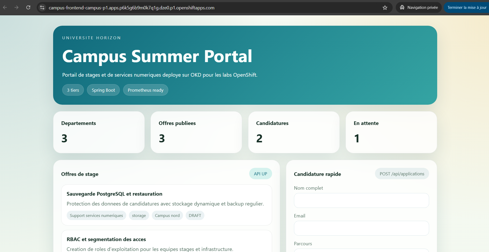

## Étape 9 - Limites du déploiement manuel et transition vers GitOps

### Contexte réel

L’application Campus fonctionne désormais sur OpenShift.

Une correction urgente doit être appliquée sur le frontend.  
Un administrateur se connecte à la console OpenShift et modifie directement le `Deployment`.

Quelques jours plus tard :

- un autre administrateur modifie les replicas ;
- une variable d’environnement est changée manuellement ;
- l’environnement de recette ne correspond plus à la production ;
- personne ne sait exactement quel état est le bon.

```text
Git contient une version
Le cluster exécute une autre version
````

On parle alors de dérive de configuration.

---

### Ce qu’OpenShift permet déjà avec Git

OpenShift permet déjà de consommer un dépôt Git.

Par exemple :

#### Import applicatif depuis Git

Depuis la console :

```text
+Add -> Import from Git
```

Cela permet de créer automatiquement :

* BuildConfig
* ImageStream
* Deployment
* Service
* Route

#### Déploiement de manifests depuis Git

Via CLI :

```bash
oc apply -f https://mon-repo/app.yaml
```

#### Support natif d’outils déclaratifs

OpenShift supporte également :

* Helm Charts
* Operators
* Templates

---

### Mais cela ne suffit pas toujours

Ces mécanismes sont utiles pour déployer, mais ils ne garantissent pas que le cluster reste aligné avec Git dans le temps.

Sans approche GitOps dédiée, il manque souvent :

* surveillance continue du dépôt Git ;
* comparaison entre état Git et état réel ;
* détection automatique des dérives ;
* correction automatique (`self-heal`) ;
* synchronisation continue ;
* rollback piloté par Git ;
* gestion claire des environnements `dev`, `test`, `prod`.

---

### Pourquoi introduire GitOps

L’objectif devient alors :

```text
Git = source de vérité
Cluster = état synchronisé automatiquement
```

Chaque changement passe par Git :

* commit ;
* merge request ;
* validation ;
* synchronisation vers le cluster.

---

### Conclusion

OpenShift sait déjà déployer depuis Git.

Mais lorsque l’on veut que Git pilote durablement l’état du cluster, on introduit GitOps avec Argo CD.
