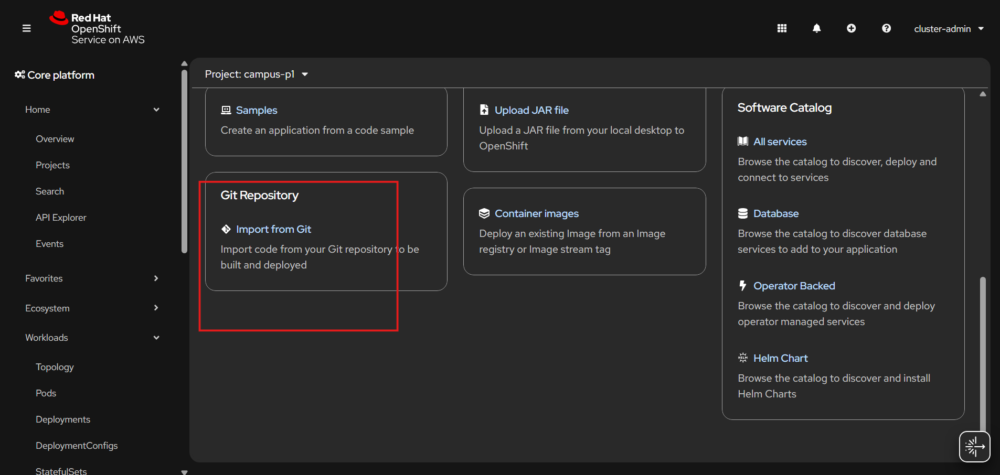
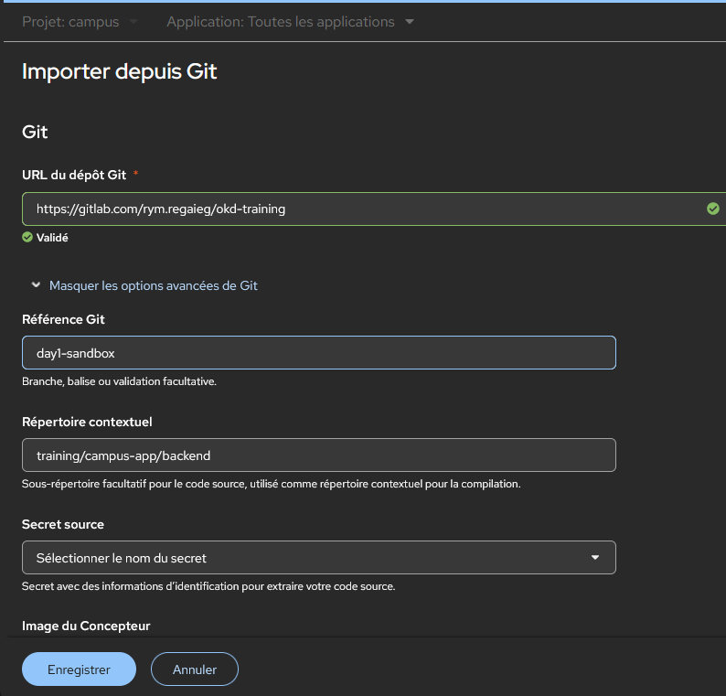
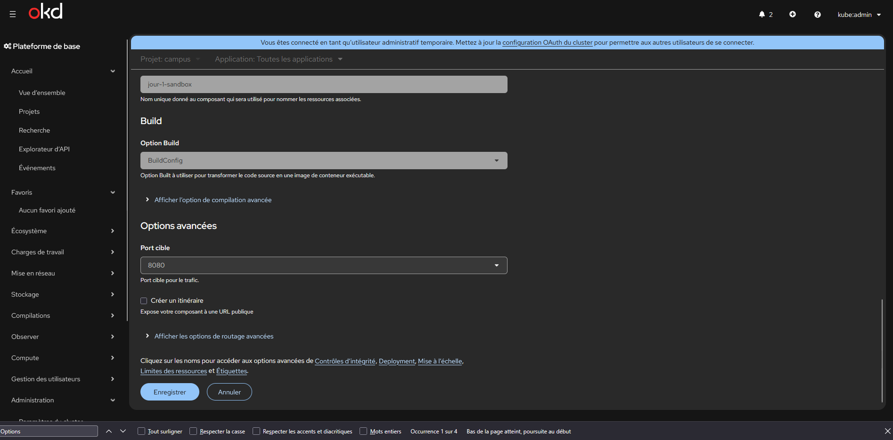

# Lab - Recréer Campus depuis la console sur un cluster OKD

## Objectif 

Dans ce lab, vous allez recréer l'application **Campus** depuis la **console OpenShift**, sans vous appuyer sur le client `oc`.

Le but est de refaire calmement toute la chaîne :

- `ImageStream` ;
- `BuildConfig` ;
- `Build` ;
- `Deployment` ;
- `Service` ;
- `Route`.

## Ce que vous allez créer

Vous allez créer :

- `campus-backend` avec un `ImageStream`, un `BuildConfig`, un `Deployment` et un `Service`
- `campus-frontend` avec un `ImageStream`, un `BuildConfig`, un `Deployment`, un `Service` et une `Route`
- `campus-db` avec un `Secret`, un `Service` et un `StatefulSet`

## Prérequis

Avant de commencer :

- le cluster OKD doit être opérationnel ;
- vous devez pouvoir ouvrir la console web utilisant votre compte `participant1` ou `participant2` ;
- créer un projet `campus-p1` ou `campus-p2` selon votre utilisateur ;
- Avoir un dépôt Git distant, exemple Gitlab, public, contenant le code source de Campus. 

exemple: `https://gitlab.com/rym.regaieg/okd-training.git`


## Point important sur la stratégie de build

Le backend Campus est un projet Spring Boot Java 21.

Pour rester cohérents avec le code source du dépôt, nous utilisons donc :

- un `BuildConfig` de type `Docker` pour le backend ;
- un `BuildConfig` de type `Docker` pour le frontend.

Le backend et le frontend sont donc construits à partir de leurs `Dockerfile` respectifs présents dans le dépôt Git.

## Étape 1 - Créer le projet et le dépôt source

Dans la console :

1. Créer un projet `campus` selon votre utilisateur :


2. Une fois le projet crée, cliquer sur `Workloads` puis `Add Page` :


3. Depuis la section `Git Repository`, cliquez sur `Import From Git` :



Un formulaire s'ouvre alors pour configurer la source de votre build.


4. gardez comme dépôt source : exemple: `https://gitlab.com/rym.regaieg/okd-training.git`


3. gardez comme branche : `main`

Les deux répertoires contextuels utiles sont :

- backend :

```text
campus-app/backend
```

- frontend :

```text
campus-app/frontend
```






## Étape 2 - Créer les ImageStreams

Dans `ImageStreams`, créez d'abord l'image stream du backend.

### ImageStream backend

```yaml
apiVersion: image.openshift.io/v1
kind: ImageStream
metadata:
  name: campus-backend
spec:
  lookupPolicy:
    local: true
```

Créez ensuite l'image stream du frontend.

### ImageStream frontend

```yaml
apiVersion: image.openshift.io/v1
kind: ImageStream
metadata:
  name: campus-frontend
spec:
  lookupPolicy:
    local: true
```

## Étape 3 - Créer les BuildConfigs depuis la console

Dans `BuildConfigs`, utilisez de préférence la **Vue YAML**. Cela reste bien un travail depuis la console, mais vous gardez la main sur les paramètres importants.

### BuildConfig backend

```yaml
apiVersion: build.openshift.io/v1
kind: BuildConfig
metadata:
  name: campus-backend
spec:
  source:
    type: Git
    git:
      uri: https://gitlab.com/rym.regaieg/okd-training.git
      ref: day1-sandbox
    contextDir: training/campus-app/backend
  strategy:
    type: Docker
    dockerStrategy:
      dockerfilePath: Dockerfile
  output:
    to:
      kind: ImageStreamTag
      name: campus-backend:latest
```

### BuildConfig frontend

```yaml
apiVersion: build.openshift.io/v1
kind: BuildConfig
metadata:
  name: campus-frontend
spec:
  source:
    type: Git
    git:
      uri: https://gitlab.com/rym.regaieg/okd-training.git
      ref: day1-sandbox
    contextDir: training/campus-app/frontend
  strategy:
    type: Docker
    dockerStrategy:
      dockerfilePath: Dockerfile
  output:
    to:
      kind: ImageStreamTag
      name: campus-frontend:latest
```

## Étape 4 - Lancer les builds

Dans `BuildConfigs` :

1. ouvrez `campus-backend` ;
2. lancez `Start Build` ;
3. ouvrez `campus-frontend` ;
4. lancez `Start Build`.

Ensuite, dans `Compilations`, vérifiez que :

- le build backend passe en `Complete` ;
- le build frontend passe en `Complete`.

Dans `ImageStreams`, vérifiez ensuite que les tags suivants existent :

- `campus-backend:latest`
- `campus-frontend:latest`

Tant que ces images n'existent pas, il ne faut pas passer au `Deployment`.

## Étape 5 - Créer PostgreSQL

Dans `Importer un YAML`, créez d'abord le secret.

### Secret PostgreSQL

```yaml
apiVersion: v1
kind: Secret
metadata:
  name: campus-db-secret
type: Opaque
stringData:
  username: campus
  password: campus123
  database: campus
```

Créez ensuite le service.

### Service PostgreSQL

```yaml
apiVersion: v1
kind: Service
metadata:
  name: campus-db
spec:
  ports:
    - name: postgres
      port: 5432
      targetPort: 5432
  selector:
    app: campus-db
```

Créez enfin le `StatefulSet`.

### StatefulSet PostgreSQL

```yaml
apiVersion: apps/v1
kind: StatefulSet
metadata:
  name: campus-db
spec:
  serviceName: campus-db
  replicas: 1
  selector:
    matchLabels:
      app: campus-db
  template:
    metadata:
      labels:
        app: campus-db
        tier: database
    spec:
      containers:
        - name: postgres
          image: quay.io/sclorg/postgresql-16-c9s:latest
          ports:
            - containerPort: 5432
              name: postgres
          env:
            - name: POSTGRESQL_USER
              valueFrom:
                secretKeyRef:
                  name: campus-db-secret
                  key: username
            - name: POSTGRESQL_PASSWORD
              valueFrom:
                secretKeyRef:
                  name: campus-db-secret
                  key: password
            - name: POSTGRESQL_DATABASE
              valueFrom:
                secretKeyRef:
                  name: campus-db-secret
                  key: database
          readinessProbe:
            tcpSocket:
              port: 5432
            initialDelaySeconds: 10
            periodSeconds: 10
          livenessProbe:
            tcpSocket:
              port: 5432
            initialDelaySeconds: 30
            periodSeconds: 20
          volumeMounts:
            - name: campus-db-data
              mountPath: /var/lib/pgsql/data
  volumeClaimTemplates:
    - metadata:
        name: campus-db-data
      spec:
        accessModes:
          - ReadWriteOnce
        resources:
          requests:
            storage: 5Gi
```

Vérifiez ensuite qu'un pod `campus-db-0` démarre correctement.

## Étape 6 - Déployer le backend

Dans `Importer un YAML`, créez ensuite le backend.

```yaml
apiVersion: apps/v1
kind: Deployment
metadata:
  name: campus-backend
  annotations:
    image.openshift.io/triggers: >-
      [{"from":{"kind":"ImageStreamTag","name":"campus-backend:latest"},"fieldPath":"spec.template.spec.containers[?(@.name==\"backend\")].image","paused":false}]
spec:
  replicas: 1
  selector:
    matchLabels:
      app: campus-backend
  template:
    metadata:
      labels:
        app: campus-backend
        tier: backend
    spec:
      containers:
        - name: backend
          image: image-registry.openshift-image-registry.svc:5000/campus/campus-backend:latest
          imagePullPolicy: Always
          ports:
            - containerPort: 8080
              name: http
          env:
            - name: SPRING_DATASOURCE_URL
              value: jdbc:postgresql://campus-db:5432/campus
            - name: SPRING_DATASOURCE_USERNAME
              valueFrom:
                secretKeyRef:
                  name: campus-db-secret
                  key: username
            - name: SPRING_DATASOURCE_PASSWORD
              valueFrom:
                secretKeyRef:
                  name: campus-db-secret
                  key: password
          readinessProbe:
            httpGet:
              path: /actuator/health/readiness
              port: http
            initialDelaySeconds: 20
            periodSeconds: 10
          livenessProbe:
            httpGet:
              path: /actuator/health/liveness
              port: http
            initialDelaySeconds: 40
            periodSeconds: 20
          resources:
            requests:
              cpu: 100m
              memory: 256Mi
            limits:
              cpu: 500m
              memory: 768Mi
---
apiVersion: v1
kind: Service
metadata:
  name: campus-backend
  labels:
    app: campus-backend
spec:
  selector:
    app: campus-backend
  ports:
    - name: http
      port: 8080
      targetPort: http
```

Vérifiez ensuite :

- que `campus-backend` devient `Available` ;
- que le pod backend passe en `Running` ;
- que les probes HTTP sont bien configurées.

## Étape 7 - Déployer le frontend

Dans `Importer un YAML`, créez ensuite le frontend.

```yaml
apiVersion: apps/v1
kind: Deployment
metadata:
  name: campus-frontend
  annotations:
    image.openshift.io/triggers: >-
      [{"from":{"kind":"ImageStreamTag","name":"campus-frontend:latest"},"fieldPath":"spec.template.spec.containers[?(@.name==\"frontend\")].image","paused":false}]
spec:
  replicas: 1
  selector:
    matchLabels:
      app: campus-frontend
  template:
    metadata:
      labels:
        app: campus-frontend
        tier: frontend
    spec:
      containers:
        - name: frontend
          image: image-registry.openshift-image-registry.svc:5000/campus/campus-frontend:latest
          imagePullPolicy: Always
          ports:
            - containerPort: 8080
              name: http
          readinessProbe:
            httpGet:
              path: /
              port: http
            initialDelaySeconds: 10
            periodSeconds: 10
          livenessProbe:
            httpGet:
              path: /
              port: http
            initialDelaySeconds: 30
            periodSeconds: 20
          resources:
            requests:
              cpu: 50m
              memory: 96Mi
            limits:
              cpu: 300m
              memory: 256Mi
---
apiVersion: v1
kind: Service
metadata:
  name: campus-frontend
spec:
  selector:
    app: campus-frontend
  ports:
    - name: http
      port: 8080
      targetPort: http
---
apiVersion: route.openshift.io/v1
kind: Route
metadata:
  name: campus-frontend
spec:
  to:
    kind: Service
    name: campus-frontend
  port:
    targetPort: http
```

## Étape 8 - Valider le fonctionnement de l'application

Dans la console :

1. ouvrez la `Route` du frontend ;
2. vérifiez que la page se charge ;
3. remplissez le formulaire avec votre nom et votre prénom ;
4. validez la candidature ;
5. revenez dans la console pour observer les pods, les deployments, les builds et les image streams.

## Ce qu'il faut retenir

Dans ce lab, vous avez volontairement séparé :

- la construction des images ;
- le déploiement des workloads ;
- l'exposition du frontend.

C'est cette séparation qui vous permet de comprendre plus clairement le rôle de chaque objet OpenShift.

## Vérification

À la fin de ce lab, vous devez pouvoir expliquer :

1. pourquoi on crée un `ImageStream` avant un `BuildConfig` ;
2. ce que produit un `BuildConfig` ;
3. pourquoi on attend l'image avant d'appliquer le `Deployment` ;
4. comment le backend parle à PostgreSQL ;
5. pourquoi seule la partie frontend est exposée par une `Route`.
