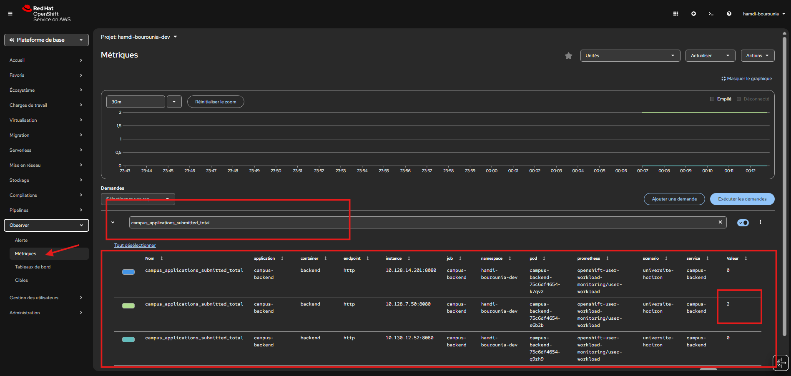

# Lab 1 - Connecter Campus au monitoring OpenShift

## Objectif

Dans ce lab, vous allez distinguer :

- les métriques cluster déjà collectées par OpenShift ;
- les métriques applicatives déjà exposées par Campus ;
- les métriques métier que le backend publie lui-même.

## Schéma d’architecture observabilité


### 1. OpenShift fournit déjà un monitoring intégré

Le cluster collecte déjà un ensemble de métriques sur :

- les nœuds ;
- les pods ;
- l’usage CPU et mémoire ;
- l’état des workloads ;
- les événements et la santé générale de la plateforme.

Autrement dit :

- pour les métriques de plateforme, vous ne partez pas de zéro ;
- Prometheus fait déjà partie de la pile fournie par OpenShift.

### 2. L’application Campus ( déja manipulé dans le jour1 sur sandbox)  expose déjà ses métriques

Le backend Spring Boot expose l’endpoint :

- `/actuator/prometheus`

Cet endpoint contient déjà :

- des métriques applicatives techniques ;
- des métriques Spring Boot / JVM (java virtual machine);
- des métriques métier propres à Campus.

Exemples de métriques métier déjà présentes :

- `campus_applications_submitted_total`
- `campus_applications_by_domain_total`
- `campus_published_offers`
- `campus_pending_applications`

### 3. Prometheus ne devine pas tout seul qu’il faut scraper Campus

Le backend expose les métriques, mais il faut encore dire au monitoring OpenShift :

- quel service surveiller ;
- sur quel port ;
- sur quel chemin HTTP.

C’est exactement le rôle du `ServiceMonitor`.

### 4. L’interface Observe permet de lire les métriques

Une fois la collecte en place :

- vous ouvrez `Observe > Metrics` ;
- vous saisissez des requêtes PromQL ;
- vous pouvez afficher à la fois des métriques cluster et des métriques Campus.

## Ce qu’il faut retenir sur Prometheus dans OpenShift

- **Prometheus intégré** sert à la collecte des métriques ;
- **Micrometer** dépendance installée dans le projet backend, sert à instrumenter l’application Java ;
- **ServiceMonitor** sert à relier le service applicatif à la collecte ;
- **Observe > Metrics** sert à visualiser et interroger les données.

Dans ce lab, vous allez faire le lien concret entre :

- l’endpoint de métriques déjà exposé par Campus ;
- le `Service` OpenShift du backend ;
- le `ServiceMonitor` qui permet à Prometheus de le scraper.

## Prérequis

L’application doit déjà être déployée dans votre projet Sandbox.

Vérifiez :

```powershell
oc get deploy,svc,route
```

Vous devez retrouver au minimum :

- `campus-backend`
- `campus-frontend`
- `campus-db`

## Étape 1 - Vérifier que le backend expose déjà ses métriques

Commencez par ouvrir un port-forward :

```powershell
oc port-forward service/campus-backend 8080:8080
```

Dans un second terminal, testez :

```powershell
Invoke-WebRequest -Uri http://localhost:8080/actuator/prometheus
```

Puis recherchez le motif `campus_` :

```powershell
(Invoke-WebRequest -Uri http://localhost:8080/actuator/prometheus).Content | Select-String "campus_"
```

Ce que vous devez constater :

- l’endpoint répond ;
- les métriques métier Campus sont déjà présentes ;
- le problème n’est donc pas l’application ;
- le vrai sujet est la **collecte** par OpenShift.

Quand c’est bon, arrêtez le port-forward.

## Étape 2 - Vérifier que `ServiceMonitor` est disponible

Vérifiez que le type de ressource existe dans votre cluster :

```powershell
oc api-resources | Select-String servicemonitor
```

Le résultat attendu est simple :

- vous devez voir `ServiceMonitor` dans la liste.

## Étape 3 - Lire le manifest de monitoring Sandbox

Ouvrez le manifest prévu pour le backend Campus :

- [campus-backend-servicemonitor.yaml](/C:/Users/h4mdi/Desktop/okd-aws/training/manifests/sandbox-monitoring/campus-backend-servicemonitor.yaml)

Ce qu’il faut observer :

- le `selector` cible le service `campus-backend` via son label ;
- le port ciblé est `http` ;
- le chemin scrappé est `/actuator/prometheus`.

## Étape 4 - Créer le `ServiceMonitor`

Appliquez maintenant le dossier de monitoring Sandbox :

```powershell
oc apply -k .\training\manifests\sandbox-monitoring
```

Vérifiez ensuite :

```powershell
oc get servicemonitor
oc describe servicemonitor campus-backend
```

Le résultat attendu :

- le `ServiceMonitor` `campus-backend` existe ;
- il vise le service `campus-backend` ;
- Prometheus sait maintenant où chercher les métriques.

## Étape 5 - Générer un peu d’activité métier

Ouvrez la route du frontend :

```powershell
$routeHost = oc get route campus-frontend -o jsonpath='{.spec.host}'
"https://$routeHost"
```

Dans le navigateur :

1. ouvrez l’application ;
2. remplissez le formulaire ;
3. envoyez une candidature avec votre nom et votre prénom.

Attendez ensuite environ :

- 30 à 60 secondes

Cela laisse le temps à Prometheus de scraper à nouveau le backend.



## Ce qu’il faut retenir

Le cœur du lab tient en une phrase :

- le backend **expose** déjà les métriques ;
- le `ServiceMonitor` permet à OpenShift de **les collecter**.

## Vérification

À la fin de ce lab, vous devez pouvoir expliquer :

1. pourquoi `/actuator/prometheus` ne suffit pas à lui seul ;
2. à quoi sert le `ServiceMonitor` ;
3. quel service est surveillé ;
4. pourquoi il faut générer un peu de trafic avant de lire les courbes.
