# Lab02 - GitOps et Argo CD sur OpenShift

# Contexte

Dans le cadre d’une démonstration destinée aux équipes internes, les administrateurs de la plateforme souhaitent réaliser un **POC** (*Proof of Concept*) autour de **GitOps** avec **Argo CD** sur OpenShift.

L’objectif de ce POC est de montrer concrètement :

- comment une application peut être déployée depuis un dépôt Git ;
- comment Git devient la source de vérité de la plateforme ;
- comment Argo CD compare en permanence l’état attendu et l’état réel ;
- comment une dérive manuelle peut être détectée puis corrigée automatiquement ;
- comment une modification dans Git peut être propagée vers le cluster sans manipulation manuelle directe.

---

## Application utilisée pour ce lab

Pour ce POC, vous allez déployer **Podinfo**, une petite application web de démonstration souvent utilisée dans les environnements Kubernetes et GitOps.

Podinfo permet de visualiser rapidement :

- qu’un déploiement fonctionne ;
- qu’un changement Git est bien pris en compte ;
- qu’un changement manuel dans le cluster provoque un état `OutOfSync` ;
- qu’Argo CD peut réconcilier automatiquement l’état réel avec l’état défini dans Git.

# Principe GitOps

```text
Git = source de vérité
Argo CD = contrôleur de synchronisation
Cluster = état réel
```

---

# Architecture cible

```text
Git Repository
      ↓
 Argo CD
      ↓
OpenShift Project
```

---

# Prérequis

* accès console OpenShift avec droits suffisants pour installer un Operator et créer un RoleBinding;
* projet personnel
* dépôt Git contenant des manifests Kubernetes/OpenShift.

---

# Étape 1 - Installer Argo CD depuis la console

## Mission

Depuis la console OpenShift :

```text
Software Catalog -> Rechercher : Red Hat OpenShift GitOps
```

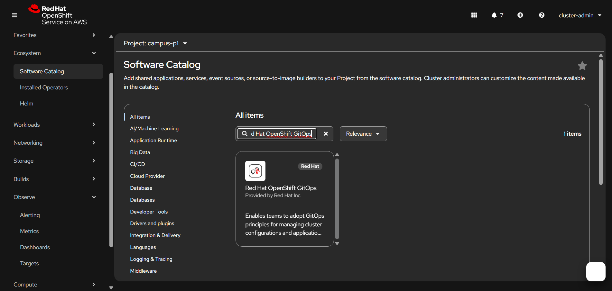

Puis cliquer sur `Install` et suivre l’assistant d’installation.

> NB.
> ne changez rien aux options recommandées dans l’assistant d’installation,
> gardez :
> - latest
> - All namespaces on the cluster
> - openshift-gitops-operator
> - Update approval: Automatic
> - Console plugin: Enable
---

Et attendre la fin de l’installation.

# Étape 2 - Vérifier l’installation

Aller dans :

```text
Installed Operators -> OpenShift GitOps
```

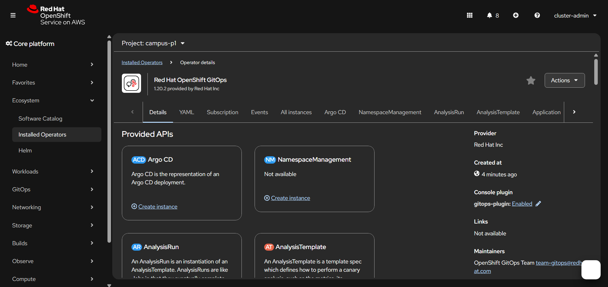

Vérifier que l’Operator est `Succeeded`.

> À ce stade, vous utilisez l’instance Argo CD par défaut créée par OpenShift GitOps dans le namespace `openshift-gitops`.

Aller vers Routes, ouvrir la route `openshift-gitops-server` et accéder à l’interface web d’Argo CD.

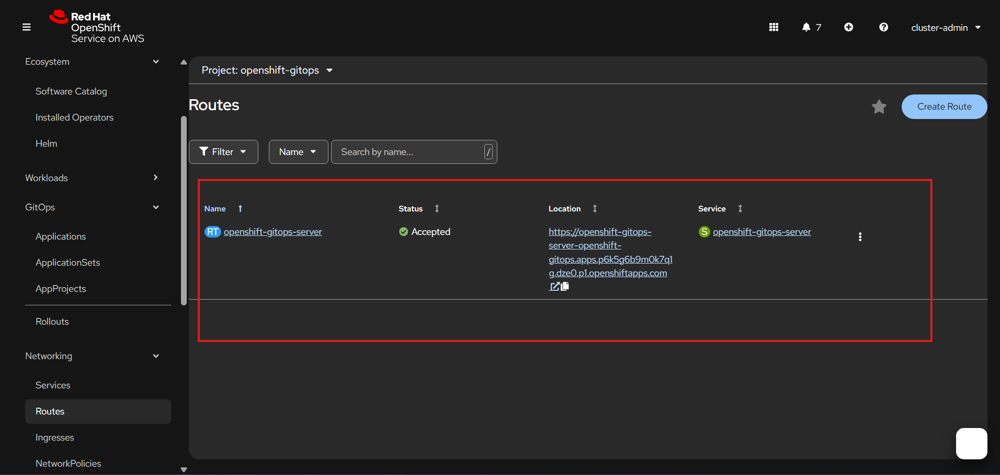

Se connecter à l’interface web avec le compte admin.

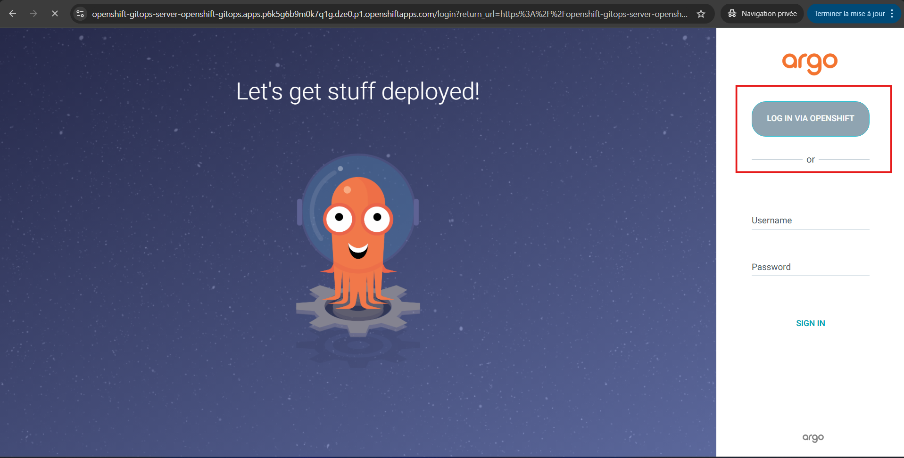

Si on vous demande les permissions pour accéder au compte `cluster-admin` cliquez sur `Allow`.

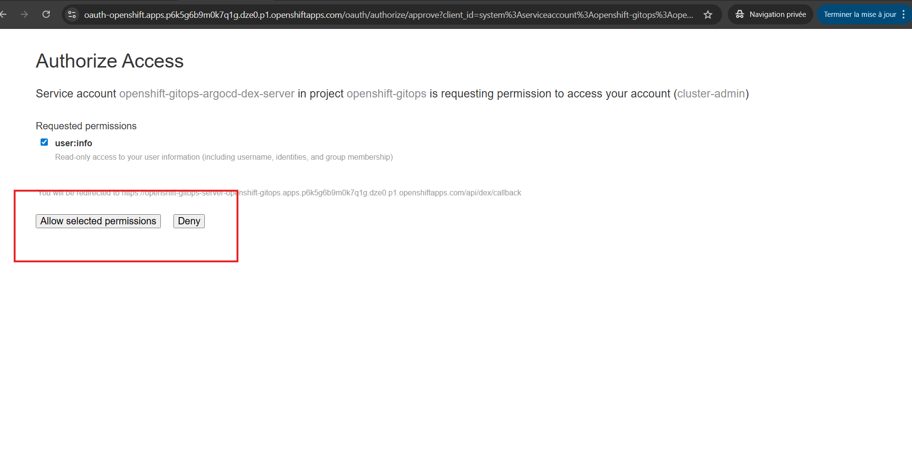

Et vous voilà dans l’interface d’Argo CD.

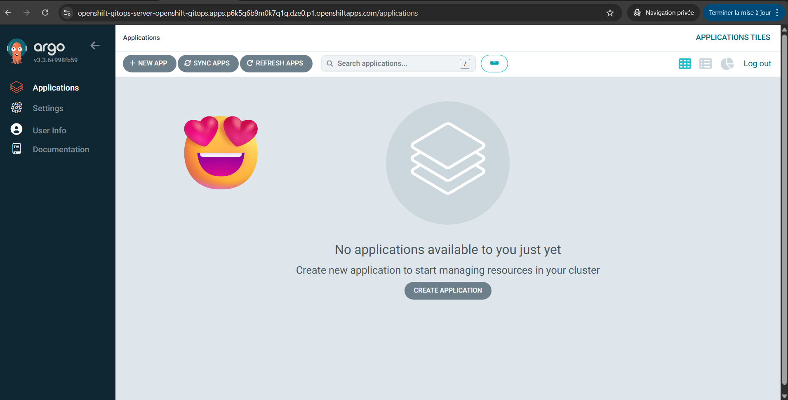


> **Remarque**
>
> L’instance Argo CD par défaut s’exécute dans le namespace `openshift-gitops`.
> Si vous déployez une application dans un autre namespace, par exemple `poc-gitops-p1`, Argo CD doit disposer des autorisations nécessaires sur ce projet.
>
> Sans cela, la synchronisation échoue avec des erreurs de type :
>
> - `deployments.apps is forbidden`
> - `services is forbidden`
> - `routes.route.openshift.io is forbidden`
>
> Pour un lab, le plus simple est d’accorder le rôle `admin` au contrôleur Argo CD sur le namespace cible :
>
> ```powershell
> oc adm policy add-role-to-user admin system:serviceaccount:openshift-gitops:openshift-gitops-argocd-application-controller -n poc-gitops-p1
> ```
>
# Étape 5 - Préparer un repo Git simple

Créer un dossier dans votre dépôt Git contenant :

**Arborescence**
```text
poc-gitops-p1/
├── namespace.yaml
├── deployment.yaml
├── service.yaml
├── route.yaml
└── kustomization.yaml
```

**`namespace.yaml`**
```yaml
apiVersion: v1
kind: Namespace
metadata:
  name: poc-gitops-p1
  labels:
    app.kubernetes.io/part-of: poc-gitops
```

**`deployment.yaml`**
```yaml
apiVersion: apps/v1
kind: Deployment
metadata:
  name: podinfo
  namespace: poc-gitops-p1
  labels:
    app: podinfo
spec:
  replicas: 1
  selector:
    matchLabels:
      app: podinfo
  template:
    metadata:
      labels:
        app: podinfo
    spec:
      containers:
        - name: podinfo
          image: ghcr.io/stefanprodan/podinfo:6.7.1
          ports:
            - name: http
              containerPort: 9898
          env:
            - name: PODINFO_UI_MESSAGE
              value: "POC GitOps avec Argo CD sur OpenShift"
            - name: PODINFO_UI_COLOR
              value: "#0f766e"
          readinessProbe:
            httpGet:
              path: /
              port: http
            initialDelaySeconds: 5
            periodSeconds: 10
          livenessProbe:
            httpGet:
              path: /
              port: http
            initialDelaySeconds: 15
            periodSeconds: 20
```

**`service.yaml`**
```yaml
apiVersion: v1
kind: Service
metadata:
  name: podinfo
  namespace: poc-gitops-p1
spec:
  selector:
    app: podinfo
  ports:
    - name: http
      port: 9898
      targetPort: http
```

**`route.yaml`**
```yaml
apiVersion: route.openshift.io/v1
kind: Route
metadata:
  name: podinfo
  namespace: poc-gitops-p1
spec:
  to:
    kind: Service
    name: podinfo
  port:
    targetPort: http
  tls:
    termination: edge
```

**`kustomization.yaml`**
```yaml
apiVersion: kustomize.config.k8s.io/v1beta1
kind: Kustomization
resources:
  - namespace.yaml
  - deployment.yaml
  - service.yaml
  - route.yaml
```

# Étape 6 - Créer l’application Argo CD

Depuis la console Argo CD

```text
Applications -> + New App
```

Remplir :

```text
Application Name: poc-gitops-p1
Project Name: default
Repository URL: https://mon-repo/campus-lab.git
revision: main
Path: poc-gitops-p1
Cluster-url: https://kubernetes.default.svc
Namespace: poc-gitops-p1
```

Sync policy :

```text
Automatic
Prune enabled
Self Heal enabled
```

Puis cliquer sur `Create`.

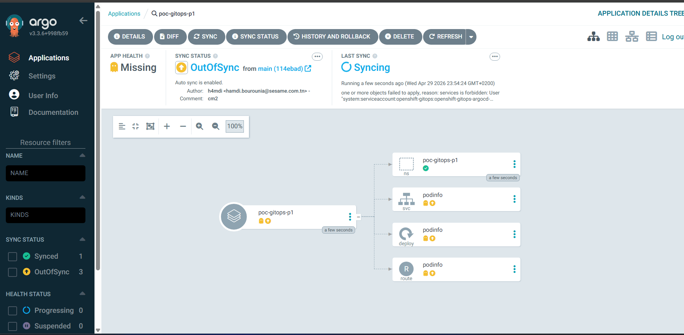

---

> Argo CD applique automatiquement les manifests.


Vérifier dans OpenShift :

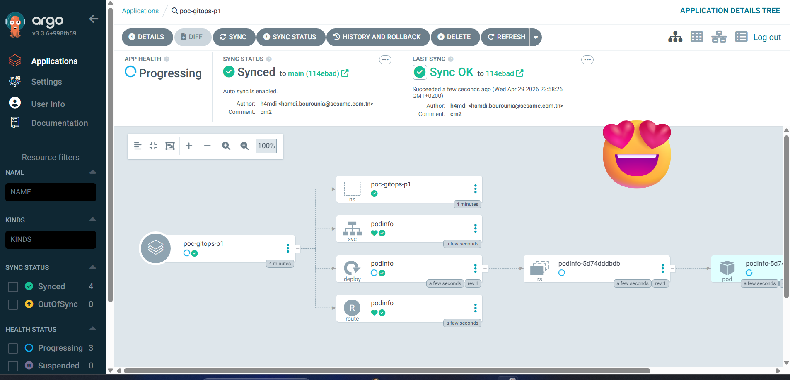

* Deployments créés
* Pods Running
* Services présents
* Routes présentes

Exemple vérifie la route :
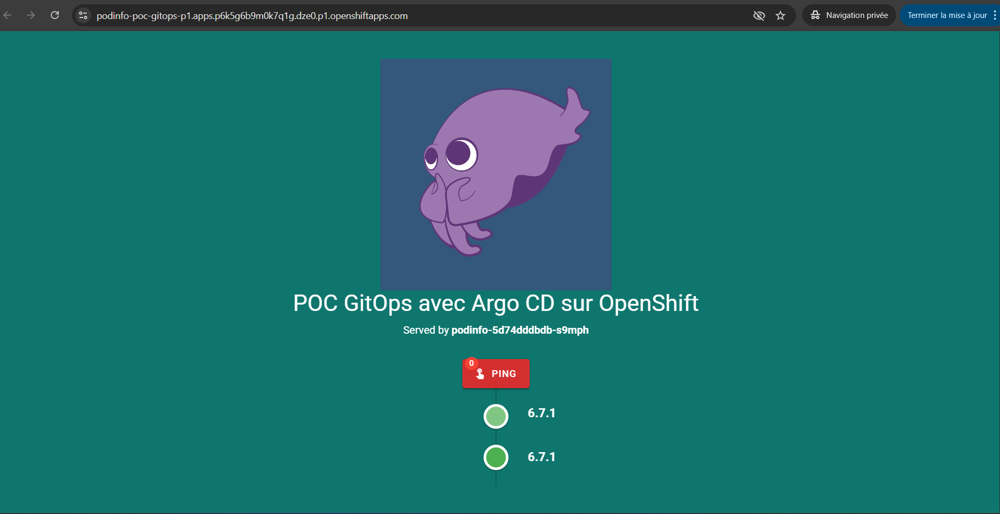

---

# Étape 8 - Tester une dérive manuelle

## Mission

Depuis la console OpenShift :

Modifier :

```text
podinfo replicas: 1 -> 3
```

Observer ensuite Argo CD.

Résultat attendu :

```text
OutOfSync
```

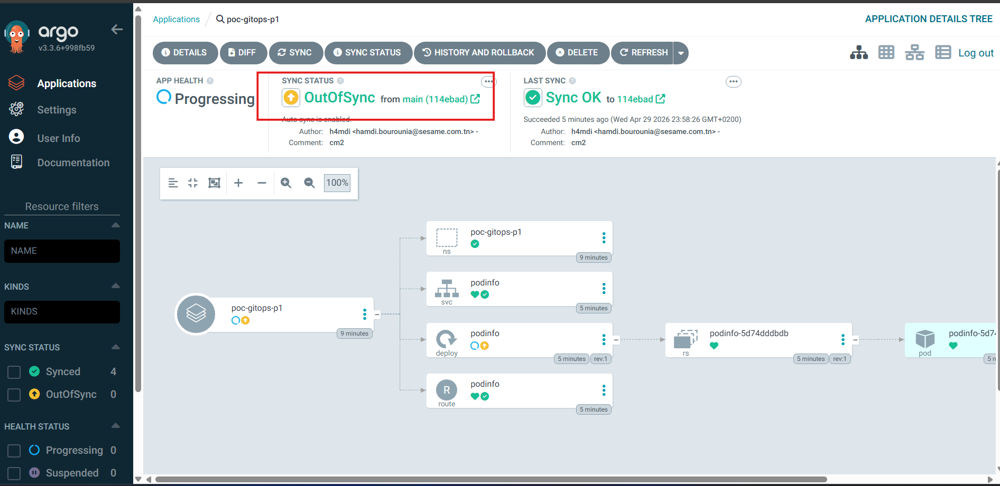

Puis Argo CD remet :

```text
replicas = 1
```

(si self-heal activé)

---

# Étape 9 - Modifier Git

Changer dans Git :

```yaml
replicas: 3
```
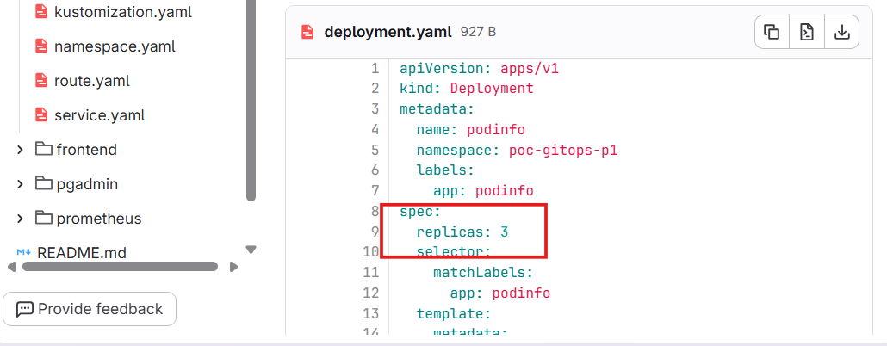


Commit + push.

Observer :

Argo CD détecte le changement puis applique :


puis 


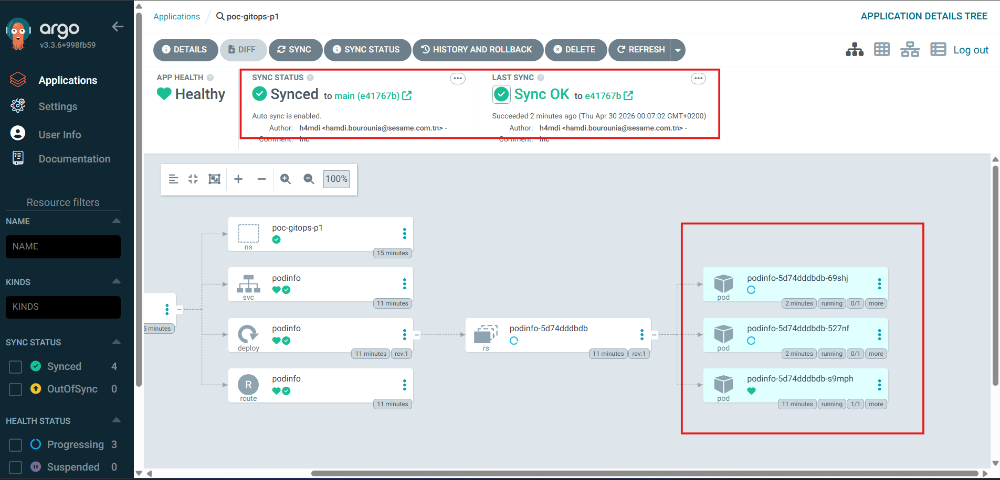

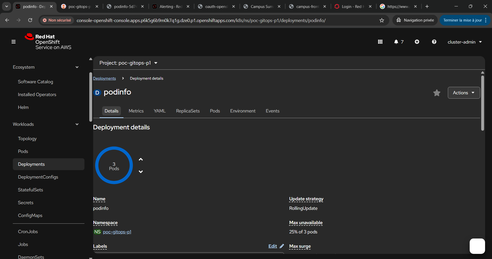


---

---

# Ce qu’il faut retenir

```text
OpenShift sait déployer.
Argo CD sait maintenir l’état attendu.
```

```text
Sans GitOps :
on applique des YAML

Avec GitOps :
Git applique l’infrastructure
```

---

# Bonus- Redéployer l'application campus avec ArgoCD ⭐
