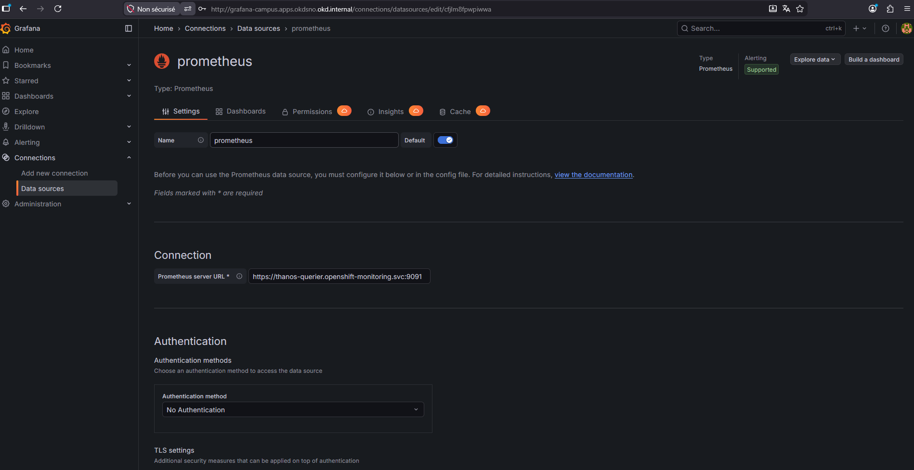
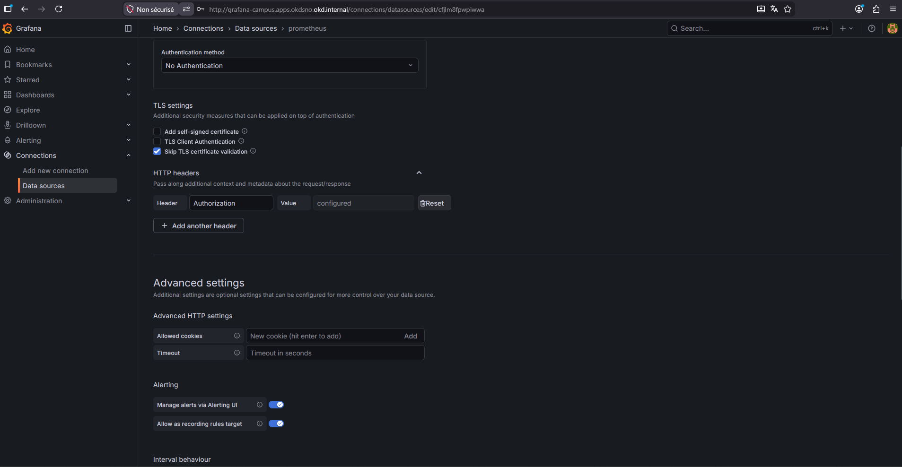
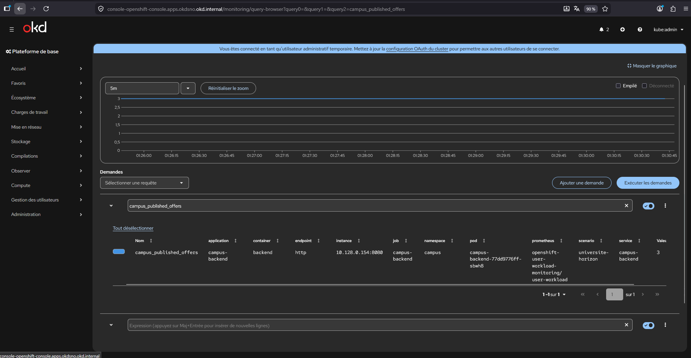
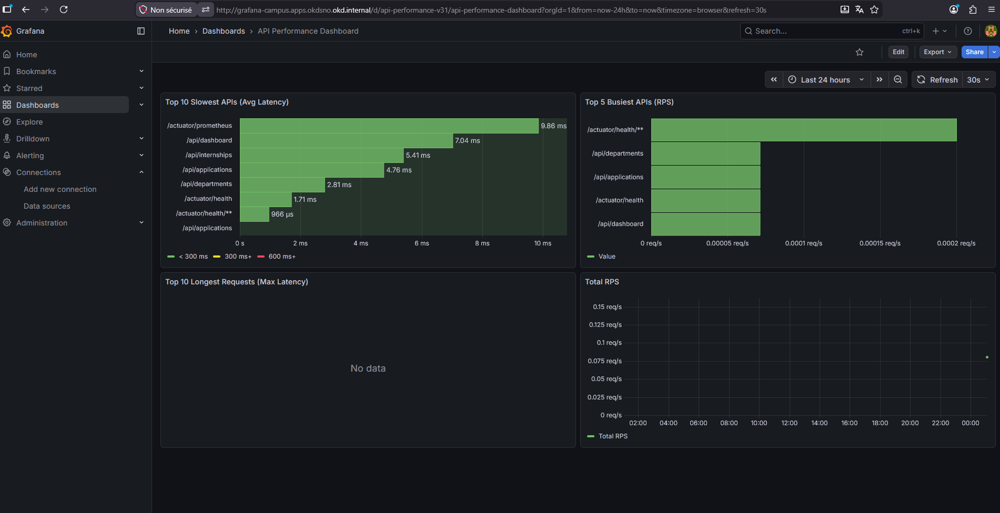

# Lab03 - Supervision avec Grafana

## Objectif

Dans ce lab, vous allez construire pas a pas une chaine simple et lisible :

- installer `Grafana Operator` depuis le Marketplace Openshift (OperatorHub) ;
- créer une instance `Grafana` dans le projet `campus` ;
- Configurer `Grafana` avec une datasource Prometheus ;
- importer un dashboard et exploiter les métriques. ;

## Ce que vous allez creer

Vous allez creer :

- un `ConfigMap` `cluster-monitoring-config` dans `openshift-monitoring` ;
- un `ServiceAccount` nomme `grafana-sa` ;
- une instance `Grafana` nommee `grafana` dans le namespace `campus` ;
- un `ServiceMonitor` `campus-backend` dans `campus` ;
- un `ClusterRoleBinding` pour autoriser la lecture des metriques cluster ;
- une `Route` vers le service `grafana-service` ;
- une datasource Grafana vers `thanos-querier` ;
- un dashboard `API Performance Dashboard` importe depuis Grafana.com.

## Prerequis

Avant de commencer :

- le cluster OKD single-node doit etre operationnel ;
- le projet `campus` doit exister ;
- l'application Campus doit deja etre deployee ;
- vous devez pouvoir ouvrir la console via Firefox et le proxy SOCKS ;
- `oc` doit etre disponible sur votre poste ou sur le bastion ;
- l'operateur `Grafana Operator` doit etre installable depuis `OperatorHub`.

Le backend Campus doit aussi exposer :

```text
/actuator/prometheus
```

## Etape 1 - Installer Grafana Operator

Dans la console :

1. ouvrez `Administrator > Operators > OperatorHub` ;
2. cherchez `Grafana Operator` ;
3. cliquez sur `Install` ;
4. gardez l'installation dans `openshift-operators` ;
5. attendez que le statut passe a `Succeeded`.

## Etape 2 - Activer le user workload monitoring

Sans cette étape, Prometheus ne scrape pas les applications du namespace `campus`.

Dans la console :

1. ouvrez `Administrator` ;
2. cliquez sur le `+` ;
3. choisissez `Import YAML` ;
4. collez ce `ConfigMap` ;
5. creez la ressource dans le namespace `openshift-monitoring`.

```yaml
apiVersion: v1
kind: ConfigMap
metadata:
  name: cluster-monitoring-config
  namespace: openshift-monitoring
data:
  config.yaml: |
    enableUserWorkload: true
```

Ensuite, attendez quelques minutes et verifiez :

- le namespace `openshift-user-workload-monitoring` est present ou reste present ;
- surtout, des pods y demarrent et passent en `Running`.

Point important :

- sur certaines versions, le namespace `openshift-user-workload-monitoring` existe deja avant l'activation ;

## Etape 3 - Creer le ServiceAccount Grafana

Dans `Importer un YAML`, creez ce `ServiceAccount` :

```yaml
apiVersion: v1
kind: ServiceAccount
metadata:
  name: grafana-sa
  namespace: campus
```

Pourquoi il est utile :

- il sera attache au pod Grafana ;
- il nous servira a generer un token propre pour acceder a `thanos-querier`.

## Etape 4 - Creer l'instance Grafana

Dans `Installed Operators > Grafana Operator > Grafana > Create instance`, utilisez la `Vue YAML` et collez :

```yaml
apiVersion: grafana.integreatly.org/v1beta1
kind: Grafana
metadata:
  name: grafana
  namespace: campus
spec:
  config:
    log:
      mode: console
    auth:
      disable_login_form: "false"
      disable_signout_menu: "false"
    security:
      admin_user: admin
      admin_password: admin123
  deployment:
    spec:
      template:
        spec:
          serviceAccountName: grafana-sa
          containers:
            - name: grafana
              resources:
                requests:
                  cpu: 100m
                  memory: 256Mi
                limits:
                  cpu: 300m
                  memory: 512Mi
```

Ensuite, verifiez :

- la ressource `Grafana` passe au statut `Ready` ;
- un pod Grafana est cree dans `campus` ;
- le service `grafana-service` apparait.

## Etape 5 - Autoriser Grafana a lire les metriques cluster

Dans `Importer un YAML`, creez ce `ClusterRoleBinding` :

```yaml
apiVersion: rbac.authorization.k8s.io/v1
kind: ClusterRoleBinding
metadata:
  name: grafana-sa-cluster-monitoring-view
roleRef:
  apiGroup: rbac.authorization.k8s.io
  kind: ClusterRole
  name: cluster-monitoring-view
subjects:
  - kind: ServiceAccount
    name: grafana-sa
    namespace: campus
```

### Pourquoi il est nécessaire :

* Grafana ne lit pas directement les métriques depuis Prometheus, mais passe par le composant `thanos-querier`, qui centralise et expose les métriques du cluster ;
* `thanos-querier` est accessible via le port `9091` et applique des règles de sécurité strictes basées sur les rôles Kubernetes ;
* l’accès en lecture aux métriques est protégé par le rôle `cluster-monitoring-view`, qui autorise uniquement la consultation des données de monitoring ;
* en liant ce rôle au `ServiceAccount` utilisé par Grafana (`grafana-sa`), on permet à Grafana d’interroger `thanos-querier` et de récupérer les métriques nécessaires à l’affichage des dashboards ;
* sans ce `ClusterRoleBinding`, les requêtes de Grafana vers `thanos-querier` sont refusées, ce qui empêche l’affichage des données dans les panels.

## Etape 6 - Creer le ServiceMonitor du backend Campus

Maintenant que le monitoring des user workloads est active, il faut indiquer quoi scraper.

Dans `Import YAML`, dans le namespace `campus`, collez :

```yaml
apiVersion: monitoring.coreos.com/v1
kind: ServiceMonitor
metadata:
  name: campus-backend
  namespace: campus
  labels:
    release: user-workload
spec:
  selector:
    matchLabels:
      app: campus-backend
  endpoints:
    - port: http
      interval: 30s
      path: /actuator/prometheus
```

Ce que fait ce `ServiceMonitor` :

- il cible le `Service` `campus-backend` ;
- il scrape le port `http` ;
- il lit le path `/actuator/prometheus` toutes les `30s`.

Point important :

- le `ServiceMonitor` seul ne suffit pas ;
- il faut aussi `enableUserWorkload: true`.

## Etape 7 - Verifier que les metriques applicatives sont visibles

Dans la console OpenShift :

1. ouvrez `Observe > Metrics` ;
2. gardez le projet `campus` ;
3. lancez une requete PromQL simple :

```promql
campus_published_offers
```

Puis testez aussi :

```promql
campus_pending_applications
```

Si vous n'avez encore aucune donnee :

- attendez 1 a 2 minutes ;
- verifiez les pods dans `openshift-user-workload-monitoring` ;
- verifiez que `campus-backend` repond toujours sur `/actuator/prometheus`.

## Etape 8 - Exposer Grafana avec une Route

Le service `grafana-service` est cree par l'operateur. Il faut maintenant creer une route.

Dans `Routes > Create Route` ou `Importer un YAML`, utilisez :

```yaml
apiVersion: route.openshift.io/v1
kind: Route
metadata:
  name: grafana
  namespace: campus
spec:
  to:
    kind: Service
    name: grafana-service
  port:
    targetPort: grafana
  tls:
    termination: edge
    insecureEdgeTerminationPolicy: Redirect
```

Point important :

- le `targetPort` doit etre **`grafana`** ;
- si vous mettez `http`, la route peut exister mais ne pointer vers aucun endpoint valide.

## Etape 9 - Ouvrir Grafana

Ouvrez ensuite l'URL de la route.

Exemple de forme attendue :

```text
https://grafana-campus.apps.okdsno.okd.internal
```

Connectez-vous avec :

- `username` : `admin`
- `password` : `admin123`

Si la route renvoie `Application is not available`, verifiez :

- que le pod Grafana est `Running` ;
- que `grafana-service` existe ;
- que la route pointe bien vers `targetPort: grafana`.

## Etape 10 - Generer le token de grafana-sa

La datasource va envoyer un header `Authorization: Bearer <token>` vers `thanos-querier`.

Generez le token avec :

```powershell
ssh -i "$env:USERPROFILE\.ssh\id_ed25519_okd" ec2-user@3.253.104.226 "KUBECONFIG=/home/ec2-user/okd-aws/install/okdsno/auth/kubeconfig oc create token grafana-sa -n campus"
```


Point important :

- le token doit etre colle sur **une seule ligne** ;
- ne copiez pas le token depuis un chat ou un document qui casse les lignes.

## Etape 11 - Configurer la datasource dans l'UI Grafana

Dans Grafana :

1. ouvrez `Connections` ;
2. cliquez `Add new connection` ;
3. cherchez `Prometheus` ;
4. cliquez `Add new data source`.





Remplissez ensuite les champs comme suit :

- `Name` : `openshift-thanos`
- `Prometheus server URL` :

```text
https://thanos-querier.openshift-monitoring.svc:9091
```

- `Authentication method` : `No Authentication`
- `Skip TLS certificate validation` : active

Dans `HTTP headers` :

- `Header` :

```text
Authorization
```

- `Value` :

```text
Bearer <TOKEN_GENERE_AVEC_OC_CREATE_TOKEN>
```

Ensuite, cliquez sur `Save & test`.

Ce que vous devez obtenir :

- un message de succes ;

## Etape 12 - Importer le dashboard API Performance Dashboard

Maintenant que la datasource fonctionne, vous pouvez importer un dashboard pret a l'emploi depuis le catalogue Grafana.

Dashboard a utiliser :

- `ID` : `23520`
- `Nom` : `API Performance Dashboard`
- `Lien` : [Grafana.com - API Performance Dashboard](https://grafana.com/grafana/dashboards/23520-api-performance-dashboard/)

Grafana Labs le presente comme un dashboard utilisant la datasource Prometheus et des panneaux `barchart` et `timeseries`.

Dans Grafana :

1. ouvrez `Dashboards` ;
2. cliquez `New` ;
3. cliquez `Import` ;
4. dans le champ d'import, saisissez :

```text
23520
```

5. cliquez `Load` ;
6. choisissez la datasource :

```text
openshift-thanos
```

7. cliquez `Import`.

## Etape 13 - Generer un peu de trafic applicatif

Pour que le dashboard soit parlant, il faut generer quelques requetes HTTP sur l'application.

Exemples simples :

- ouvrir le frontend Campus ;
- naviguer sur les ecrans de dashboard, stages, departements et candidatures ;
- recharger plusieurs fois la page ;
- appeler directement quelques endpoints backend si besoin.

L'objectif est de faire remonter des metriques basees sur :

```text
http_server_requests_seconds
```

## Etape 14 - Obtenir le rendu attendu

Apres quelques minutes, le dashboard importe doit montrer un resultat proche de :

- `Top 10 Slowest APIs (Avg Latency)` ;
- `Top 5 Busiest APIs (RPS)` ;
- `Top 10 Longest Requests (Max Latency)` ;
- `Total RPS`.

Le rendu final attendu est le type de vue visible dans votre capture :

- des bar charts sur les endpoints les plus lents ;
- des bar charts sur les endpoints les plus sollicites ;
- une courbe de debit global ;
- des donnees qui evoluent quand vous generez du trafic.

## Etape 15 - Option de secours si le dashboard importe ne montre rien

Si le dashboard `23520` s'importe mais reste vide :

1. verifiez d'abord que la datasource `openshift-thanos` est bien `OK` ;
2. verifiez ensuite dans `Explore` qu'une requete simple repond :

```promql
sum(rate(http_server_requests_seconds_count{application="campus-backend"}[5m]))
```

3. verifiez aussi :

```promql
rate(http_server_requests_seconds_sum{application="campus-backend"}[5m])
```

Si ces requetes retournent bien des series :

- le scrape est bon ;
- la datasource est bonne ;
- il faut alors surtout generer davantage de trafic ou ajuster la plage temporelle du dashboard.




