# Lab04 - Supervision avec Grafana

## Objectif

Dans ce lab, vous allez construire pas a pas une chaine simple et lisible :

- installer `Grafana Operator` depuis le Marketplace Openshift (Software Catalog) ;
- créer une instance `Grafana` dans le projet `campus-p1` ( ou `campus-p2` selon votre projet) ;
- Configurer `Grafana` avec une datasource Prometheus ;
- importer un dashboard et exploiter les métriques. ;

## Ce que vous allez créer

Vous allez créer :

- une instance `Grafana` nommée `grafana` dans le namespace `campus` ;
- un `ClusterRoleBinding` pour autoriser la lecture des métriques cluster ;
- une `Route` vers le service `grafana-service` ;
- une datasource Grafana vers `thanos-querier` ;
- un dashboard `API Performance Dashboard` importe depuis Grafana.com.

## Prérequis

Avant de commencer :

* un cluster opérationnel ;
* le projet `campus-p1` ( ou p2 ) doit exister ;
* ServiceMonitor configuré pour scraper le backend Campus;
* l'application Campus doit déjà être déployée ;
* `oc` doit être disponible sur votre poste ;
* l'opérateur Grafana Operator doit être installable depuis `Software Catalog`.

Le backend Campus doit aussi exposer :

```text
/actuator/prometheus
```

## Etape 1 - Installer Grafana Operator

Dans la console :

1. ouvrez `Software Catalog` ;
2. cherchez `Grafana Operator` ;
3. cliquez sur `Install` ;
4. gardez l'installation dans `openshift-operators` ;
5. ne changez pas les autres options d'installation recommandées ;
6. attendez que le statut passe a `Succeeded`.

## Etape 2 - Activer le user workload monitoring

Sans cette étape, Prometheus ne scrape pas les applications du namespace `campus`.

Dans la console :

1. ouvrez `Administrator` ;
2. cliquez sur le `+` ;
3. choisissez `Import YAML` ;
4. collez ce `ConfigMap` ;
5. créez la ressource dans le namespace `openshift-monitoring`.

## Etape 3 - Créer l'instance Grafana

Dans `Installed Operators > Grafana Operator > Grafana > Create instance`, utilisez la `Vue YAML` et collez :

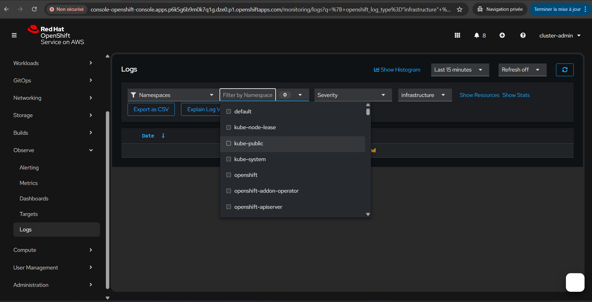

```yaml
apiVersion: grafana.integreatly.org/v1beta1
kind: Grafana
metadata:
  name: grafana
  namespace: campus-p1
spec:
  config:
    log:
      mode: console
    auth:
      disable_login_form: "false"
      disable_signout_menu: "false"
    security:
      admin_user: admin
      admin_password: admin123
  deployment:
    spec:
      template:
        spec:
          serviceAccountName: grafana-sa
          containers:
            - name: grafana
              resources:
                requests:
                  cpu: 100m
                  memory: 256Mi
                limits:
                  cpu: 300m
                  memory: 512Mi
```

Ensuite, vérifiez :

- la ressource `Grafana` passe au statut `Ready` ;
- un pod Grafana est créée dans `campus-p1` ;
- le service `grafana-service` apparait.

## Etape 5 - Autoriser Grafana à lire les métriques cluster

Dans `Importer un YAML`, créez ce `ClusterRoleBinding`.

```yaml
apiVersion: rbac.authorization.k8s.io/v1
kind: ClusterRoleBinding
metadata:
  name: grafana-sa-cluster-monitoring-view
roleRef:
  apiGroup: rbac.authorization.k8s.io
  kind: ClusterRole
  name: cluster-monitoring-view
subjects:
  - kind: ServiceAccount
    name: grafana-sa
    namespace: campus-p1
```

### Pourquoi il est nécessaire :

* Grafana ne lit pas directement les métriques depuis Prometheus, mais passe par le composant `thanos-querier`, qui centralise et expose les métriques du cluster ;
* `thanos-querier` est accessible via le port `9091` et applique des règles de sécurité strictes basées sur les rôles Kubernetes ;
* l’accès en lecture aux métriques est protégé par le rôle `cluster-monitoring-view`, qui autorise uniquement la consultation des données de monitoring ;
* en liant ce rôle au `ServiceAccount` utilisé par Grafana (`grafana-sa`), on permet à Grafana d’interroger `thanos-querier` et de récupérer les métriques nécessaires à l’affichage des dashboards ;
* sans ce `ClusterRoleBinding`, les requêtes de Grafana vers `thanos-querier` sont refusées, ce qui empêche l’affichage des données dans les panels.

## Etape 6 - Exposer Grafana avec une Route

Le service `grafana-service` est cree par l'opérateur. Il faut maintenant créer une route.

Dans `Routes > Create Route` ou `Importer un YAML`, utilisez :

```yaml
apiVersion: route.openshift.io/v1
kind: Route
metadata:
  name: grafana
  namespace: campus-p1
spec:
  to:
    kind: Service
    name: grafana-service
  port:
    targetPort: grafana
  tls:
    termination: edge
    insecureEdgeTerminationPolicy: Redirect
```

## Etape 7 - Ouvrir Grafana

Ouvrez ensuite l'URL de la route.

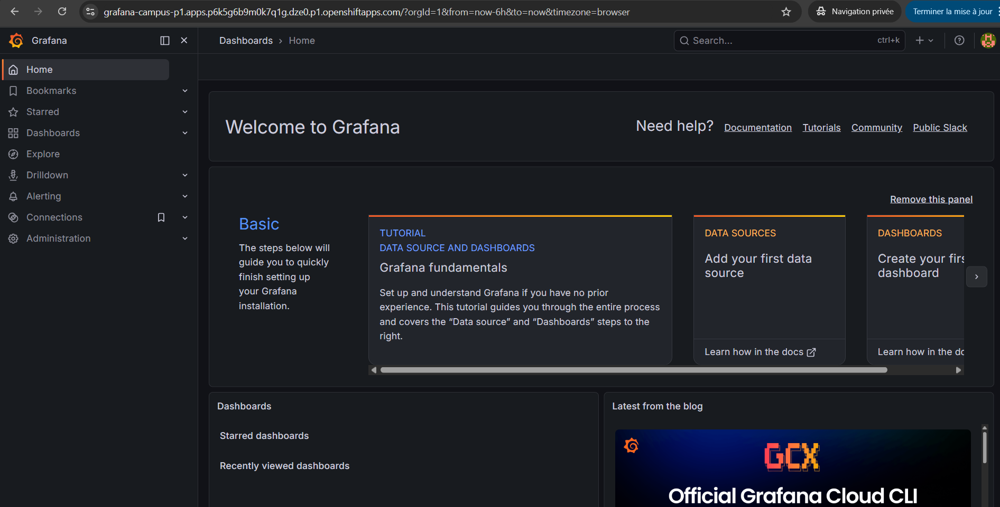

Connectez-vous avec :

- `username` : `admin`
- `password` : `admin123`


## Etape 8 - Générer le token de grafana-sa


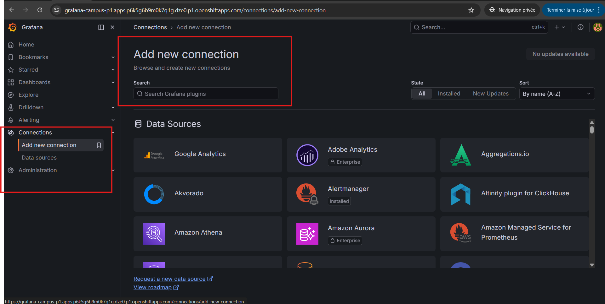

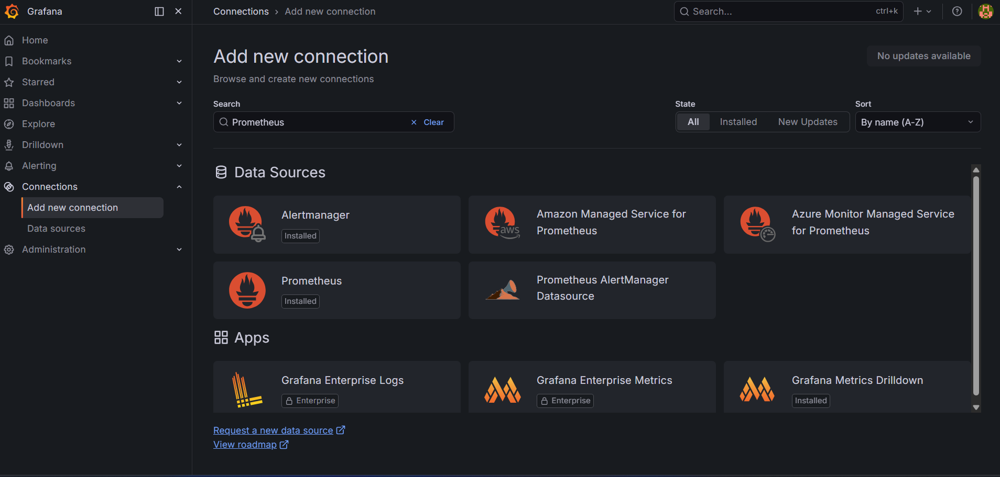

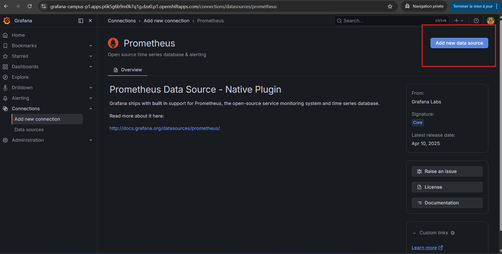


La datasource va envoyer un header `Authorization: Bearer <token>` vers `thanos-querier`.

Générez le token avec :

```powershell
oc create token grafana-sa -n campus-p1
```


Point important :

- le token doit etre colle sur **une seule ligne** ;
- ne copiez pas le token depuis un chat ou un document qui casse les lignes.

## Etape 9 - Configurer la datasource dans l'UI Grafana

Dans Grafana :

1. ouvrez `Connections` ;
2. cliquez `Add new connection` ;
3. cherchez `Prometheus` ;
4. cliquez `Add new data source`.


Remplissez ensuite les champs comme suit :

- `Name` : `prometheus-1`
- `Prometheus server URL` :

```text
https://thanos-querier.openshift-monitoring.svc:9091
```

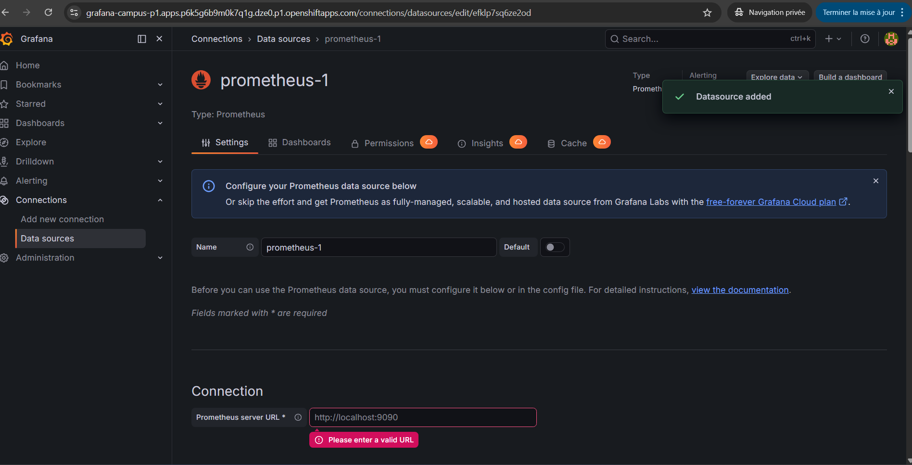

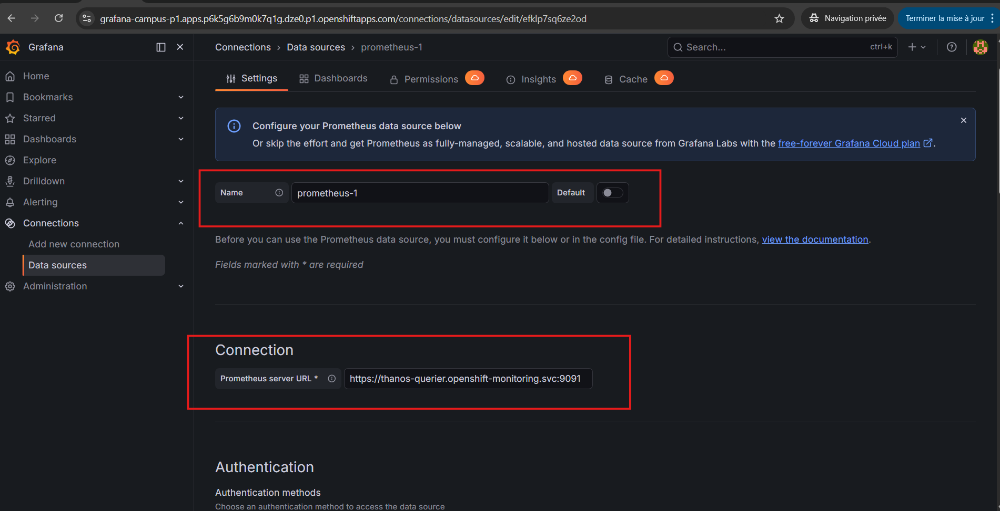

- `Authentication method` : `No Authentication`
- `Skip TLS certificate validation` : active

Dans `HTTP headers` :

- `Header` :

```text
Authorization
```

- `Value` :

```text
Bearer <TOKEN_GENERE_AVEC_OC_CREATE_TOKEN>
```
Exemple: Bearer eyJhbGciOiJSUzI1NiIsImtpZCI6IjE2ODg5ODQ0ODg3ODg4NDY.....

Ensuite, cliquez sur `Save & test`.

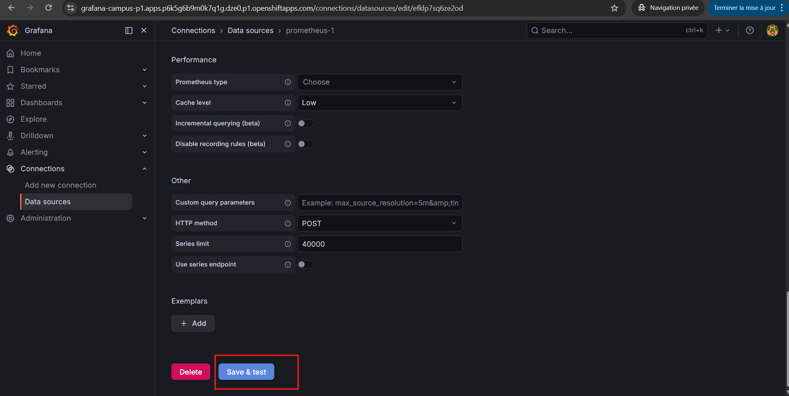

Ce que vous devez obtenir :

- un message de succès ;

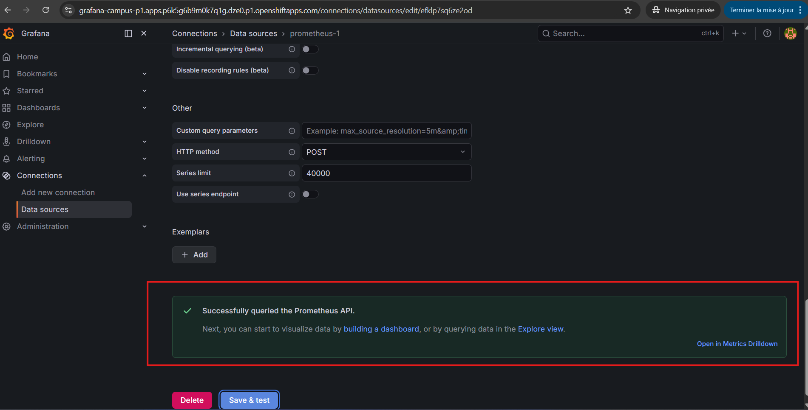

## Etape 10 - Importer le dashboard API Performance Dashboard

Maintenant que la datasource fonctionne, vous pouvez importer un dashboard pret a l'emploi depuis le catalogue Grafana.

1. ouvrez `Dashboards` ;
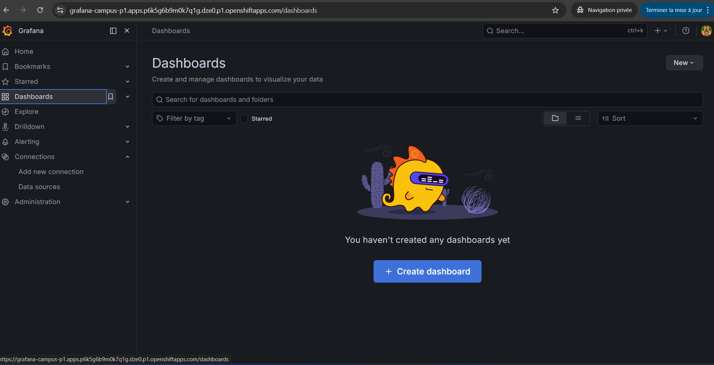
2. cliquez `Create dashboard` puis `Import a dashboard` ;
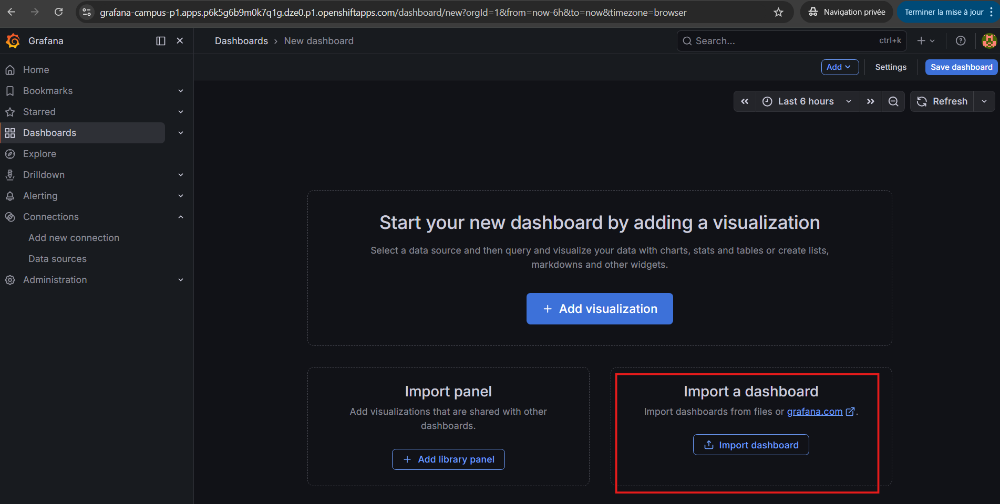


Dashboard a utiliser :

- `ID` : `23520`
- `Nom` : `API Performance Dashboard`
- `Lien` : [Grafana.com - API Performance Dashboard](https://grafana.com/grafana/dashboards/23520-api-performance-dashboard/)


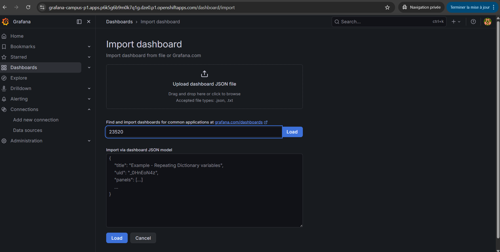


3. Choisissez la datasource `prometheus-1`

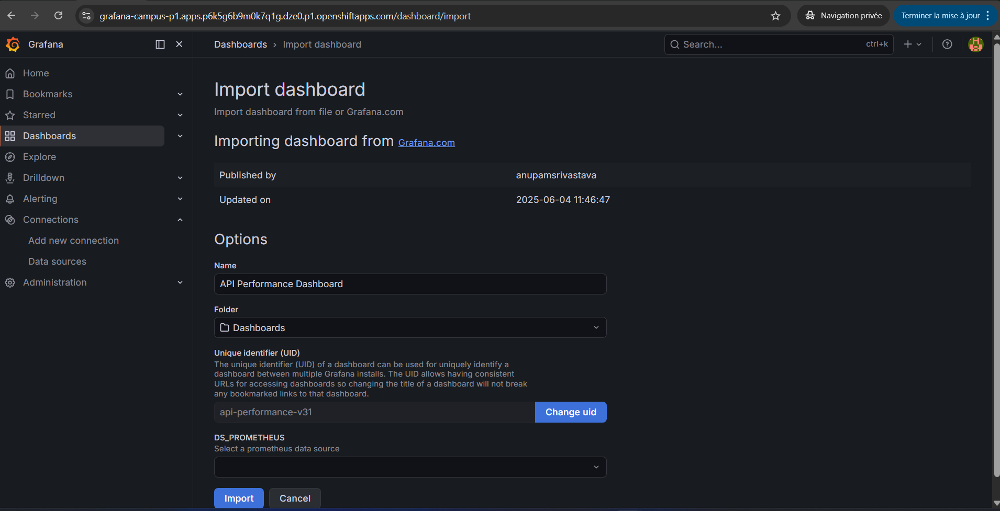


7. cliquez `Import`.

Apres l'import, vous devriez voir le dashboard dans la liste de vos dashboards.

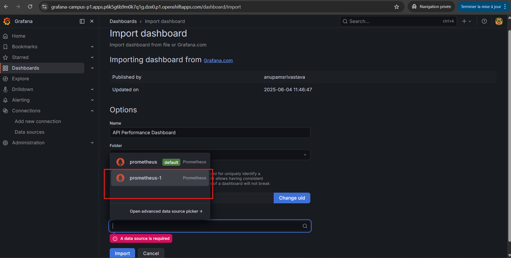


## Etape 11 - Générer un peu de trafic applicatif

Pour que le dashboard soit parlant, il faut générer quelques requetes HTTP sur l'application.

Exemples simples :

- ouvrir le frontend Campus ;
- naviguer sur les ecrans de dashboard, stages, departements et candidatures ;
- recharger plusieurs fois la page ;
- appeler directement quelques endpoints backend si besoin.

L'objectif est de faire remonter des metriques basees sur :

```text
http_server_requests_seconds
```

## Etape 12 - Obtenir le rendu attendu

Apres quelques minutes, le dashboard importe doit montrer un resultat proche de :

- `Top 10 Slowest APIs (Avg Latency)` ;
- `Top 5 Busiest APIs (RPS)` ;
- `Top 10 Longest Requests (Max Latency)` ;
- `Total RPS`.

Le rendu final attendu est le type de vue visible dans votre capture :

- des bar charts sur les endpoints les plus lents ;
- des bar charts sur les endpoints les plus sollicites ;
- une courbe de debit global ;
- des donnees qui evoluent quand vous generez du trafic.

## Etape 13 - Option de secours si le dashboard importe ne montre rien

Si le dashboard `23520` s'importe mais reste vide :

1. verifiez d'abord que la datasource `openshift-thanos` est bien `OK` ;
2. verifiez ensuite dans `Explore` qu'une requete simple repond :

```promql
sum(rate(http_server_requests_seconds_count{application="campus-backend"}[5m]))
```

3. verifiez aussi :

```promql
rate(http_server_requests_seconds_sum{application="campus-backend"}[5m])
```

Si ces requetes retournent bien des series :

- le scrape est bon ;
- la datasource est bonne ;
- il faut alors surtout generer davantage de trafic ou ajuster la plage temporelle du dashboard.


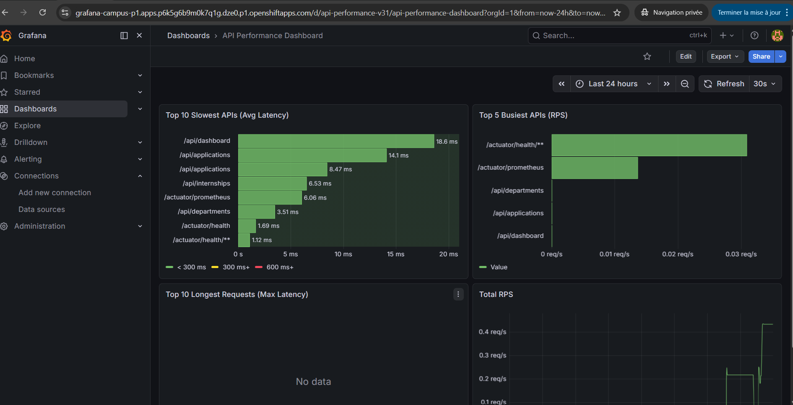
