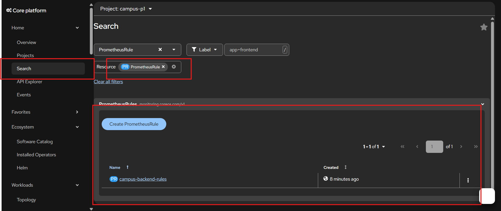
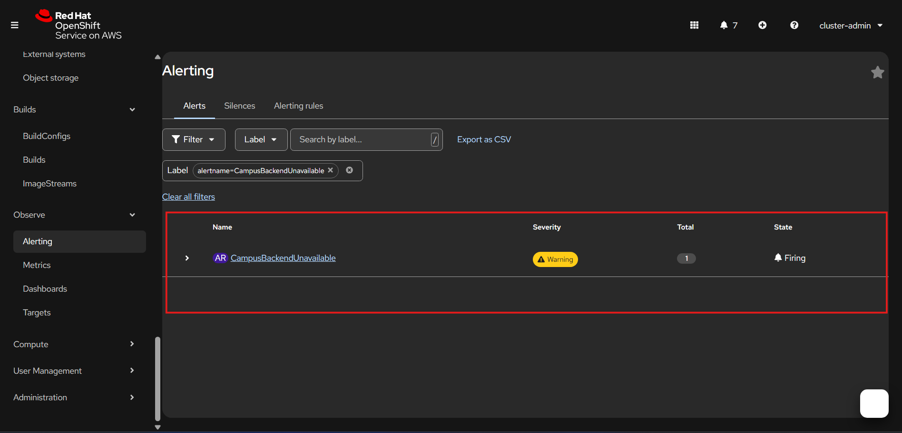
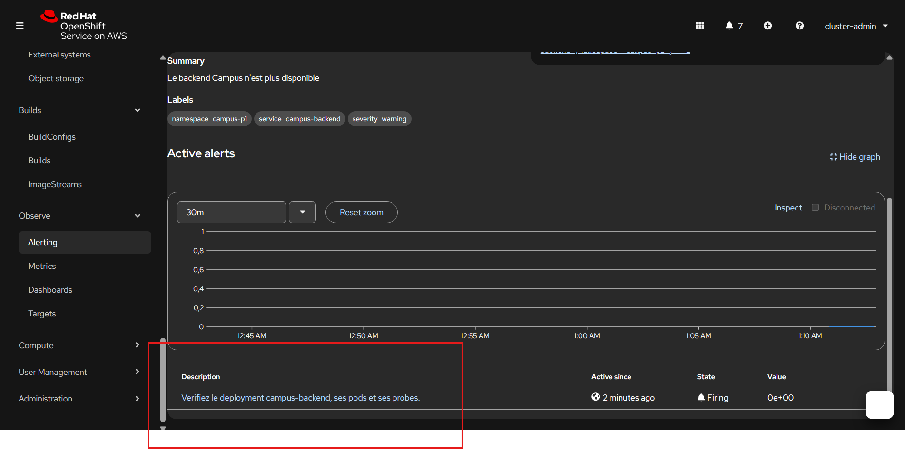
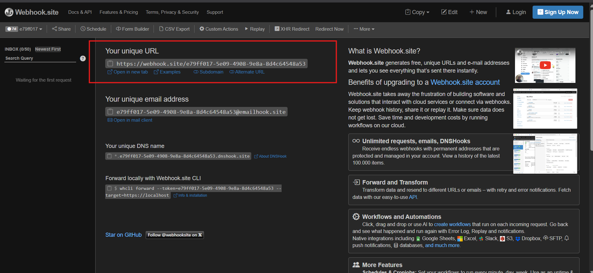
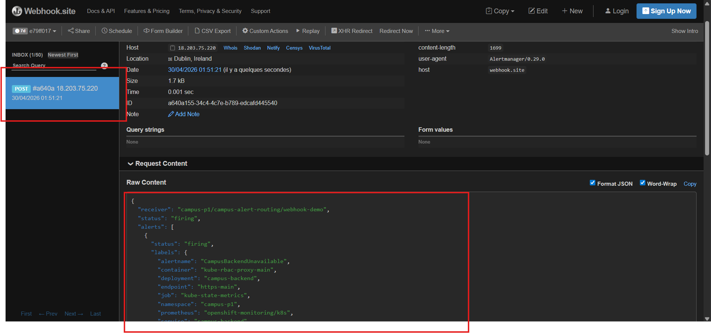
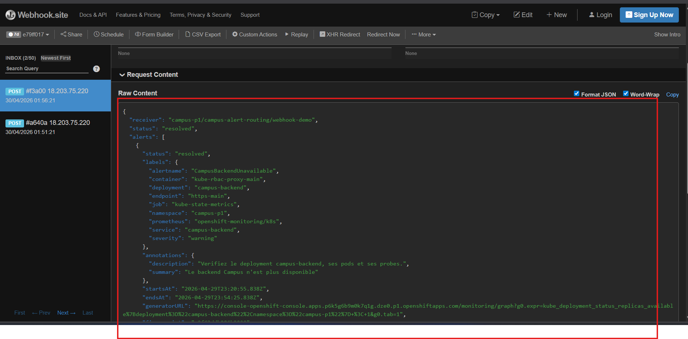

# Lab 5 - Déclencher une alerte OpenShift sur l'indisponibilité du backend Campus

## Objectif

Dans ce lab, vous allez découvrir le fonctionnement de l'**alerting** dans OpenShift.

Le but est de comprendre :

- ce qu'est une alerte ;
- à quoi sert une ressource `PrometheusRule` ;
- comment une alerte passe par les états `Pending`, `Firing`, puis `Resolved` ;
- comment OpenShift détecte une indisponibilité sur un composant applicatif.

Ici, vous allez créer une alerte simple sur le backend `campus-backend`.

Le scénario est le suivant :

- tant que le backend est disponible, l'alerte ne se déclenche pas ;
- si le backend devient indisponible, l'alerte apparaît ;
- quand le backend revient, l'alerte se résout.

## Ce qu'il faut comprendre avant de commencer

OpenShift collecte déjà des métriques de plateforme sur :

- les pods ;
- les deployments ;
- les replicas disponibles ;
- l'état général des workloads.

Une **alerte** ne collecte rien par elle-même.

Elle repose sur :

- une métrique déjà existante ;
- une condition ;
- une durée de validation.

Dans OpenShift, cette logique est portée par une ressource :

- `PrometheusRule`

Dans ce lab, l'idée est simple :

- si le deployment `campus-backend` n'a plus de replica disponible pendant `1 minute`,
- OpenShift doit créer une alerte.

## Prérequis

Avant de commencer :

- l'application Campus doit déjà être déployée dans votre projet ;
- vous devez avoir accès à la console OpenShift avec des droits administrateur ou équivalent pour votre projet ;
- vous devez voir le menu `Observe -> Alerting` ;
- vous devez connaître votre projet :
  - `campus-p1`
  - ou `campus-p2`

Vous devez retrouver au minimum :

- `campus-backend`
- `campus-frontend`
- `campus-db`

## Étape 1 - Ouvrir la vue Alerting

Dans la console OpenShift :

1. passez dans la perspective `Administrator` ;
2. ouvrez `Observe` ;
3. cliquez sur `Alerting` ;

Ce que vous devez retenir :

- `Metrics` sert à lire les métriques ;
- `Alerting` sert à lire les alertes déclenchées à partir de règles.

## Étape 2 - Créer une règle d'alerte

### Description de la règle

Dans cette étape, vous allez créer une règle d’alerte Prometheus afin de surveiller la disponibilité du backend Campus.

L’objectif est de détecter automatiquement lorsque le service backend n’est plus opérationnel.

### Fonctionnement

La règle repose sur la métrique :

```text
kube_deployment_status_replicas_available
````

Cette métrique indique le nombre de replicas disponibles pour un `Deployment`.

La règle vérifie :

```text
si le nombre de replicas disponibles du deployment campus-backend est inférieur à 1 pendant 1 minute
```

Dans ce cas :

* une alerte est déclenchée ;
* elle est classée avec un niveau `warning` ;
* elle est associée au service `campus-backend`.

### Ce que cela permet

* détecter une indisponibilité du backend ;
* anticiper les incidents applicatifs ;
* automatiser la supervision ;
* préparer l’intégration avec Alertmanager (notifications).

---

### Création de la règle

Depuis la console OpenShift :

```text
Administrator -> Workloads -> YAML
```

ou :

```text
+Add -> Import YAML
```

Puis collez le manifest suivant :

```yaml
apiVersion: monitoring.coreos.com/v1
kind: PrometheusRule
metadata:
  name: campus-backend-rules
  namespace: campus-p1
spec:
  groups:
    - name: campus-backend.rules
      rules:
        - alert: CampusBackendUnavailable
          expr: kube_deployment_status_replicas_available{namespace="campus-p1", deployment="campus-backend"} < 1
          for: 1m
          labels:
            severity: warning
            service: campus-backend
          annotations:
            summary: Le backend Campus n'est plus disponible
            description: Vérifiez le deployment campus-backend, ses pods et ses probes.
```

---

### Résultat attendu

Après création :

* la règle est prise en compte par Prometheus ;
* elle apparaît dans :

```text
Observe -> Alerting -> Alerting Rules
```

* elle passe à l’état `Firing` si le backend devient indisponible.

---

### À retenir

```text
PrometheusRule permet de définir des règles d’alerte basées sur des métriques.
```

```text
Une alerte = condition + durée + labels + annotations
```

Important :

- si vous travaillez dans `campus-p2`, remplacez `campus-p1` par `campus-p2` dans :
  - `metadata.namespace`
  - l'expression `expr`

## Étape 3 - Vérifier que la règle existe

Une fois la ressource créée, vérifiez dans la console :

- `Search -> Resources -> PrometheusRule`

ou dans les objets de votre projet si cette vue est disponible.

Vous devez retrouver :

- `campus-backend-rules`



À ce stade, l'alerte n'est pas encore active, car le backend fonctionne normalement.

## Étape 4 - Simuler une indisponibilité du backend

Depuis la console OpenShift :

1. ouvrez `Workloads -> Deployments` ;
2. ouvrez `campus-backend` ;
3. scalez le deployment à `0`.

Le but n'est pas ici de corriger une panne réelle, mais de provoquer volontairement une condition d'alerte facile à observer.

## Étape 5 - Observer le cycle de l'alerte

Revenez dans :

```text
Observe -> Alerting
```

Puis attendez un peu.

Le comportement attendu est :

1. l'alerte apparaît d'abord en `Pending` ;
2. après la durée `for: 1m`, elle passe en `Firing`.

Le nom attendu est :

```text
CampusBackendUnavailable
```






## Étape 6 - Résoudre l'alerte

Revenez sur le deployment `campus-backend` et remettez :

```text
replicas = 1
```

Attendez ensuite le retour du pod backend.

Quand le backend redevient disponible :

- l'alerte cesse de tirer ;
- elle passe ensuite en état résolu.

## Validation attendue

Le lab est réussi si vous montrez :

- une ressource `PrometheusRule` créée ;
- une alerte `CampusBackendUnavailable` visible dans OpenShift ;
- le passage en `Pending` puis `Firing` ;
- le retour à un état sain après remise du backend à `1` replica.

## Ce qu'il faut retenir

- une métrique mesure un état ;
- une alerte transforme une condition métier ou technique en signal exploitable ;
- `PrometheusRule` sert à déclarer cette logique ;
- OpenShift peut donc non seulement observer, mais aussi prévenir.


## Bonus - Voir une vraie notification sortir d'OpenShift

Dans ce lab, l'alerte est visible dans la console OpenShift.

En production, une alerte est généralement reliée à un vrai canal de notification, par exemple :

- email ;
- Slack ;
- Microsoft Teams ;
- webhook ;

Pour une demonstration simple, vous pouvez utiliser `webhook.site`.


> **Important**
>
> Pour que les `AlertmanagerConfig` crées dans les projets utilisateurs soient pris en compte, le cluster doit autoriser le routage des alertes utilisateur.
>
> Sans cette activation :
>
> - la `PrometheusRule` fonctionne ;
> - l'alerte apparait bien dans `Observe -> Alerting` ;
> - mais aucune notification n'est envoyée vers `webhook.site`, Slack, email ou autre receiver.
>
> L'administrateur du cluster doit alors activer cette option dans le ConfigMap `cluster-monitoring-config` du namespace `openshift-monitoring` :
>
> ```yaml
> alertmanagerMain:
>   enableUserAlertmanagerConfig: true
> ```
>
> Exemple de commande :
>
> ```powershell
> oc edit configmap cluster-monitoring-config -n openshift-monitoring
> ```
>
> Puis ajouter ce champ dans `data.config.yaml`, sous la section `alertmanagerMain`.
>
> Une fois cette option activée, les `AlertmanagerConfig` des namespaces applicatifs pourront etre utilises pour envoyer des notifications réelles.


Le principe est le suivant :

1. ouvrez [https://webhook.site](https://webhook.site) ;
2. copiez l'URL unique generee par le site ;
3. créez un `Secret` contenant cette URL ;
4. créez un `AlertmanagerConfig` dans le meme namespace que votre `PrometheusRule` ;
5. relancez le test d'indisponibilité du backend.

Récupérez l'URL unique de `webhook.site` et collez-la dans le `Secret` que vous allez créer.



Exemple pour `campus-p1` :

```yaml
apiVersion: v1
kind: Secret
metadata:
  name: alert-webhook
  namespace: campus-p1
type: Opaque
stringData:
  url: https://webhook.site/e79ff017-5e09-4908-9e8a-8d4c64548a53
---
apiVersion: monitoring.coreos.com/v1beta1
kind: AlertmanagerConfig
metadata:
  name: campus-alert-routing
  namespace: campus-p1
spec:
  route:
    receiver: webhook-demo
    groupBy:
      - alertname
      - namespace
      - severity
  receivers:
    - name: webhook-demo
      webhookConfigs:
        - urlSecret:
            name: alert-webhook
            key: url
          sendResolved: true
```

Important :

- remplacez `campus-p1` par `campus-p2` si besoin ;
- remplacez `REMPLACEZ-PAR-VOTRE-URL` par l'URL reelle fournie par `webhook.site` ;
- ce bonus suppose que le cluster autorise deja le routage des alertes utilisateur.

Résultat attendu :

- quand l'alerte passe en `Firing`, une requete HTTP est envoyee vers `webhook.site` ;



- quand l'alerte revient a l'état normal, une notification `Resolved` est également envoyée (environ 3 min)



