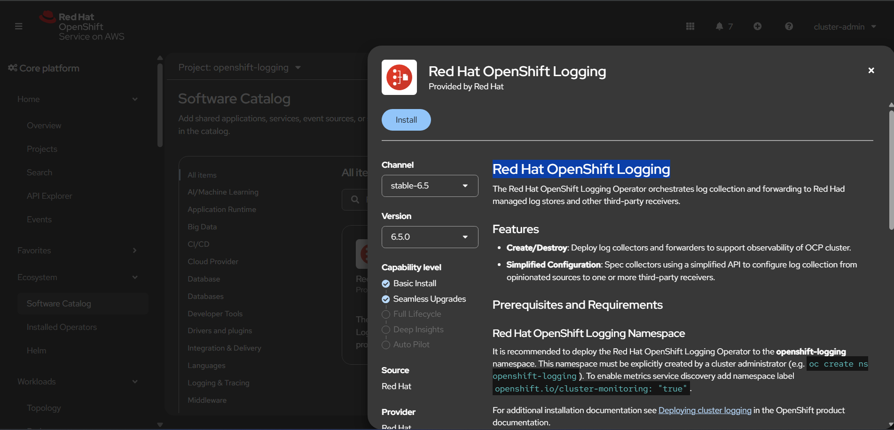
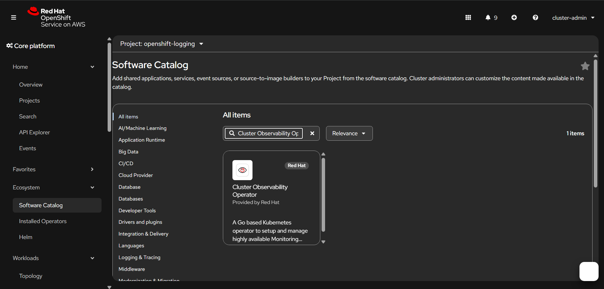
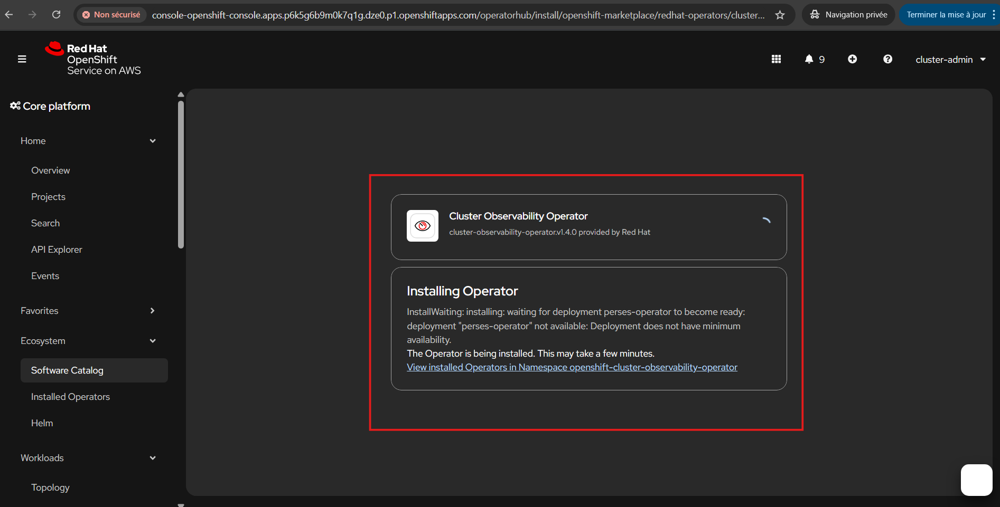
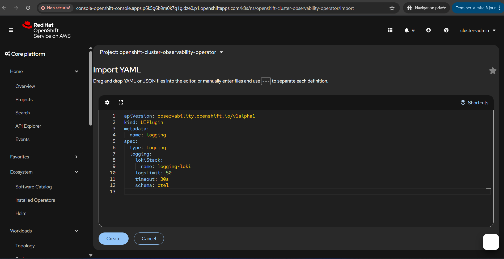
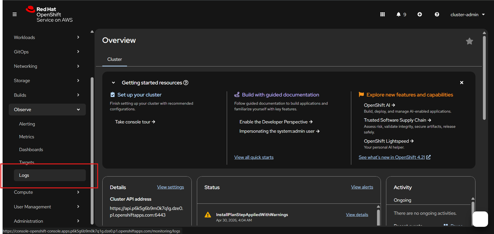
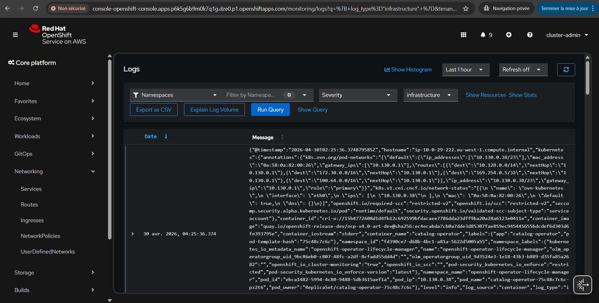
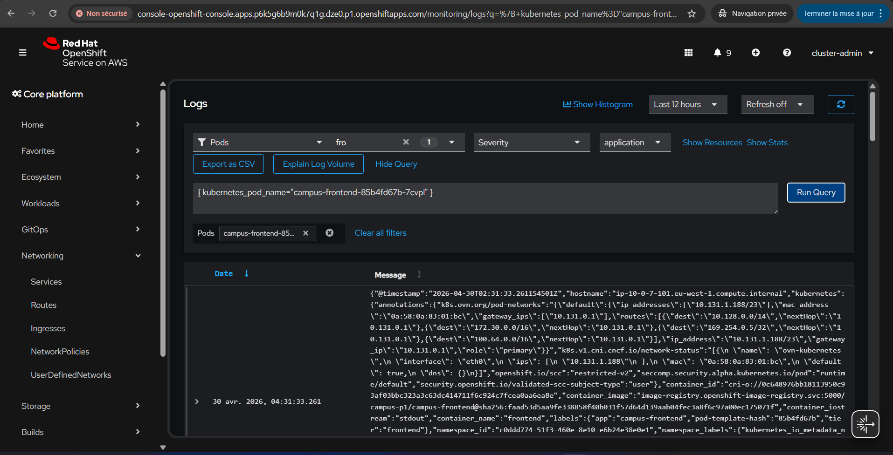

# Lab 6 - Installer Loki et centraliser les logs du cluster dans OpenShift

## Objectif 

Dans ce lab, vous allez mettre en place une pile de logs moderne sur OpenShift avec :

- `Loki Operator` pour gérer le log store ;
- `Red Hat OpenShift Logging Operator` pour collecter et forwarder les logs ;
- un `LokiStack` stocke sur AWS S3 ;
- un `ClusterLogForwarder` pour envoyer les logs application, infrastructure et audit.

Le but est de comprendre la chaine suivante :

```text
Pods du cluster -> collecteur -> LokiStack -> stockage S3
```

## Contexte

L'équipe plateforme souhaite disposer d'un stockage de logs centralise pour :

- diagnostiquer rapidement un incident ;
- retrouver les erreurs applicatives ;
- suivre les logs d'infrastructure ;
- éviter de dépendre uniquement de `oc logs`.

Dans ce POC, vous allez deployer Loki comme log store court terme sur le cluster OpenShift.

## Prerequis

Avant de commencer :

- vous avez les droits `cluster-admin` ;
- vous avez accès a la console OpenShift ;
- vous avez accès a un bucket S3 deja cree ;
- vous connaissez une `StorageClass` bloc disponible sur le cluster, par exemple `gp3-csi` sur AWS ;
- vous travaillez sur un cluster ou les opérateurs Red Hat sont disponibles dans OperatorHub.

### Note importante pour ROSA / STS

Si votre cluster utilise des credentials AWS courte duree, par exemple ROSA STS :

- l'installation du `Loki Operator` peut demander un `Role ARN` dedie ;
- ce role doit etre prepare pour Loki ;
- ne réutilisez pas le role ODF par defaut.

## Etape 1 - Installer le Loki Operator

Depuis la console OpenShift :

1. passez dans la perspective `Administrator` ;
2. ouvrez `Ecosystem -> Software Catalog` ;
3. recherchez `Loki Operator` ;
4. choisissez l'operateur Red Hat, pas la version Community ;
5. gardez le namespace recommande `openshift-operators-redhat` ;
6. Utiliser l'ARN: arn:aws:iam::809747278553:role/tf-rosa-classic/atelier-rosa-classic-loki-operator-role
6. gardez le canal `stable-x.y` ;
7. lancez l'installation.

Ce qu'il faut retenir :

- Loki Operator gere la ressource `LokiStack` ;
- c'est lui qui déploiera les composants Loki dans `openshift-logging`.


## Etape 3 - Préparer le secret S3 pour Loki

Dans ce lab, nous partons sur AWS S3.

Si votre cluster est en mode STS, utilisez un secret court terme de ce type :

```yaml
apiVersion: v1
kind: Secret
metadata:
  name: logging-loki-aws
  namespace: openshift-logging
type: Opaque
stringData:
  bucketnames: atelier-rosa-classic-loki-logs
  region: eu-west-1
  audience: openshift
```

## Etape 4 - Créer le LokiStack

Créez ensuite une instance `LokiStack` :

```yaml
apiVersion: loki.grafana.com/v1
kind: LokiStack
metadata:
  name: logging-loki
  namespace: openshift-logging
spec:
  managementState: Managed
  limits:
    global:
      retention:
        days: 3
  size: 1x.demo
  storage:
    schemas:
      - version: v13
        effectiveDate: "2024-10-01"
    secret:
      name: logging-loki-aws
      type: s3
      credentialMode: token-cco
  storageClassName: gp3-csi
  tenants:
    mode: openshift-logging
```
Voici les points importants de cette configuration :

- `name: logging-loki`
  - nom de l’instance Loki créée dans le namespace `openshift-logging`

- `retention.days: 3`
  - les logs seront conserves pendant `3 jours`

- `size: 1x.demo`
  - définit un dimensionnement adapte a un lab ou un POC
  - ce profil cree les composants Loki avec une taille raisonnable pour une demonstration

- `storage.schemas`
  - définit le schema de stockage utilise par Loki
  - ici, la version `v13` est utilisée a partir du `2024-10-01`

- `secret.name: logging-loki-aws`
  - Loki utilisera ce Secret pour connaitre :
    - le nom du bucket S3
    - la region AWS
    - l’audience STS

- `type: s3`
  - indique que le stockage objet utilise est Amazon S3

- `credentialMode: token-cco`
  - indique que Loki utilisera des credentials geres via le mecanisme STS/OpenShift Cloud Credential Operator
  - ce mode est adapte aux clusters ROSA configures avec AWS STS

- `storageClassName: gp3-csi`
  - classe de stockage utilisee pour les volumes persistants necessaires a certains composants Loki

- `tenants.mode: openshift-logging`
  - active le mode multi-tenant attendu par OpenShift Logging
  - les logs seront séparés selon les tenants OpenShift, par exemple `application`, `infrastructure` et `audit`


## Etape 5 - Installer le Red Hat OpenShift Logging Operator

Le Loki Operator permet de deployer et gérer l’infrastructure Loki elle-meme, c’est-a-dire la plateforme de stockage et de requetage des logs.

En revanche, pour que les logs du cluster soient effectivement collectes et envoyés vers Loki, il faut également installer Red Hat OpenShift Logging.

Cet operator apporte notamment :

- la gestion du ClusterLogForwarder ;
- le deploiement du collecteur de logs sur les noeuds ;
- la definition des flux de logs :
  - application
  - infrastructure
  - audit

l’envoi de ces logs vers une destination comme Loki.

Sans cet operator :

- Loki peut etre installe et operationnel ;
- mais aucun log du cluster n’est automatiquement collecte ni transmis.

Depuis la console OpenShift :

1. retournez dans `Ecosystem -> Software Catalog` ;
2. recherchez `Red Hat OpenShift Logging Operator` ;
3. installez-le dans `openshift-logging` ;
4. gardez le meme niveau de version que le `Loki Operator` ;
5. l'installation demande la creation d'un clusterlogforwarder, acceptez et créez une instance de `ClusterLogForwarder` ayant cette configuration de base :



La ressource ClusterLogForwarder définit comment les logs du cluster sont collectes puis envoyés vers une destination.

Dans ce lab, elle est utilisée pour transmettre les logs OpenShift vers l’instance Loki logging-loki.


```yaml
apiVersion: observability.openshift.io/v1
kind: ClusterLogForwarder
metadata:
  name: instance
  namespace: openshift-logging
spec:
  serviceAccount:
    name: logging-collector
  outputs:
    - name: lokistack-out
      type: lokiStack
      lokiStack:
        target:
          name: logging-loki
          namespace: openshift-logging
        authentication:
          token:
            from: serviceAccount
      tls:
        ca:
          key: service-ca.crt
          configMapName: openshift-service-ca.crt
  pipelines:
    - name: all-cluster-logs
      inputRefs:
        - application
        - infrastructure
        - audit
      outputRefs:
        - lokistack-out
```
5. attendez l'état `Succeeded`.


Ce qu'il faut retenir :

- Loki Operator gere le stockage ;
- Logging Operator gere la collecte et le forwarding.

## Etape 6 - Créer le service account et les droits de collecte

Le collecteur doit avoir les droits nécessaires pour lire les logs.
```yaml
apiVersion: v1
kind: ServiceAccount
metadata:
  name: logging-collector
  namespace: openshift-logging
---
apiVersion: rbac.authorization.k8s.io/v1
kind: ClusterRoleBinding
metadata:
  name: logging-collector-collect-application
roleRef:
  apiGroup: rbac.authorization.k8s.io
  kind: ClusterRole
  name: collect-application-logs
subjects:
  - kind: ServiceAccount
    name: logging-collector
    namespace: openshift-logging
---
apiVersion: rbac.authorization.k8s.io/v1
kind: ClusterRoleBinding
metadata:
  name: logging-collector-collect-infrastructure
roleRef:
  apiGroup: rbac.authorization.k8s.io
  kind: ClusterRole
  name: collect-infrastructure-logs
subjects:
  - kind: ServiceAccount
    name: logging-collector
    namespace: openshift-logging
---
apiVersion: rbac.authorization.k8s.io/v1
kind: ClusterRoleBinding
metadata:
  name: logging-collector-collect-audit
roleRef:
  apiGroup: rbac.authorization.k8s.io
  kind: ClusterRole
  name: collect-audit-logs
subjects:
  - kind: ServiceAccount
    name: logging-collector
    namespace: openshift-logging

---
apiVersion: rbac.authorization.k8s.io/v1
kind: ClusterRoleBinding
metadata:
  name: logging-collector-logs-writer
roleRef:
  apiGroup: rbac.authorization.k8s.io
  kind: ClusterRole
  name: logging-collector-logs-writer
subjects:
  - kind: ServiceAccount
    name: logging-collector
    namespace: openshift-logging
```

> collect-* = droit de lire les logs ;
> 
> logs-writer = droit d’envoyer les logs vers Loki.
## Etape 8 - Verification attendue

Vous devez verifier :

- le `Loki Operator` en `Succeeded` ;
- le `Red Hat OpenShift Logging Operator` en `Succeeded` ;
- le `LokiStack` `logging-loki` avec `Condition: Ready` ;
- le `ClusterLogForwarder` avec des conditions de type :
  - `Authorized`
  - `Valid`
  - `Ready`

Commandes utiles :

```powershell
oc get lokistack -n openshift-logging
oc describe lokistack logging-loki -n openshift-logging
oc get clusterlogforwarder -n openshift-logging
oc describe clusterlogforwarder instance -n openshift-logging
oc get pods -n openshift-logging
```

Dans `openshift-logging`, vous devez voir apparaitre des pods du type :

- `logging-loki-*`
- `instance-*`

## Etape 9 - Provoquer des logs de test

Pour produire des logs applicatifs, vous pouvez :

- ouvrir plusieurs fois la route du frontend Campus ;
- consulter les logs du frontend ;

Exemples :

```powershell
oc logs deployment/campus-backend -n campus-p1 --tail=20
oc rollout restart deployment/campus-backend -n campus-p1
```

Si votre cluster dispose deja du plugin de visualisation des logs, vous pouvez ensuite ouvrir :

```text
Observe -> Logs
```

Pour l’avoir, il faut :

installer Cluster Observability Operator depuis l’OperatorHub





Puis, créer le plugin de logs avec un manifest comme celui-ci :


### Explication du `UIPlugin`

Cette ressource active l’integration de visualisation des logs dans la console OpenShift.

Elle permet de faire apparaitre :

```text
Observe -> Logs
```

et de relier cette vue a l’instance Loki `logging-loki`.

Signification des champs :

- `name: logging`
  - nom du plugin UI

- `type: Logging`
  - indique qu’il s’agit du plugin de visualisation des logs

- `lokiStack.name: logging-loki`
  - designe l’instance Loki utilisee comme source de logs

- `logsLimit: 50`
  - limite le nombre de lignes chargees par requete dans l’interface

- `timeout: 30s`
  - delai maximal pour interroger Loki

- `schema: viaq`
  - indique a la console comment interpreter les logs stockes dans Loki


```yaml
apiVersion: observability.openshift.io/v1alpha1
kind: UIPlugin
metadata:
  name: logging
spec:
  type: Logging
  logging:
    lokiStack:
      name: logging-loki
    logsLimit: 50
    timeout: 30s
    schema: viaq
```
Après ça, la console doit faire apparaître Observe -> Logs.



Vous pouvez désormais consulter les logs du cluster, filtrer par namespace, workload, etc.


On filtre sur les logs infra pour voir les logs du collecteur et de Loki.


Ou bien on filtre sur les logs applicatifs pour le frontend pour voir les logs du frontend Campus.

